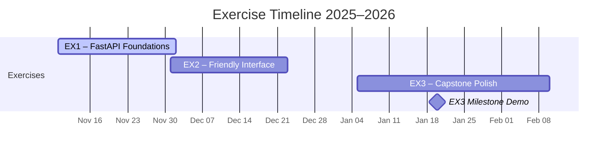

# Exercises Overview

Every assignment is intentionally small, runs on a single laptop (Linux, WSL, macOS, or other Unix-like environments), and focuses on getting something working without detours into security hardening or cloud deployment. Students may explore the deeper labs in the session notes, but the required deliverables stay simple and local.

## EX1 – FastAPI Foundations
- **Assigned:** Monday, Nov 10, 2025  
- **Due:** Tuesday, Dec 2, 2025 at 23:59 (Israel time)
- **Goal:** Ship a tiny movie catalogue API using **FastAPI**, **Pydantic**, and pytest. Keep the schema tight and the code easy to read; persistence starts in-memory and graduates to SQLite when you integrate Session 04’s guidance (mandatory before EX3, optional for the EX1 grading window).
- **Sessions to revisit:** [Session 02 – Introduction to HTTP and REST](sessions/session-02.md), [Session 03 – FastAPI Fundamentals](sessions/session-03.md), [Session 04 – Persisting the Movie Service](sessions/session-04.md) (use Session 04 as the stretch goal during EX1 and the required upgrade before EX3).
- **Required Features:**
  - Endpoints: `GET /movies`, `POST /movies`, `PUT /movies/{id}`, `DELETE /movies/{id}`. Optional extras (ratings, filters) belong in stretch goals, not the base grade.
  - Data layer may be in-memory (e.g., simple repository/dict) for the base grade. Plan to adopt Session 04’s SQLModel + SQLite implementation soon after—EX3 expects your backend to talk to a real persistence service with migrations/seeds instead of committing `.db` files.
  - Tests using `pytest` and FastAPI’s `TestClient` (cover happy-path listing and create/update/delete).
  - README explaining how to create the uv environment, run the API locally, and execute the tests.
> **Session guidance:** Session 03 is the canonical EX1 implementation (HTTP API, validators, pytest, Docker). Session 04 demonstrates how to layer SQLModel/SQLite under the same repository interface—treat it as a stretch for EX1 and required prep for EX3’s multi-service architecture.
- **Rubric (100 pts):** correctness 40, simplicity/readability 20, tests 20, documentation 20. Bonus (+5) for seeding the database with a handful of sample movies via a Typer CLI.

## EX2 – Friendly Interface
- **Assigned:** Monday, Dec 1, 2025  
- **Due:** Tuesday, Dec 23, 2025 at 23:59 (Israel time)
- **Heads-up:** This timeline intentionally overlaps with EX1’s submission window; you can finish EX1 and kick off EX2 planning on the same day.
- **Goal:** Build a lightweight interface that talks to the EX1 API. Pick either a **Streamlit dashboard** or a **Typer CLI**—both should emphasise clear flows over features.
- **Sessions to revisit:** [Session 05 – Persistence Refresh](sessions/session-05.md), [Session 06 – Interface Options](sessions/session-06.md).
- **Required Features:**
  - Reuse the EX1 API as-is; do not add authentication or security prompts.
  - Allow users to list movies and add a new movie in under a minute from launch.
  - Provide one small extra (e.g., mark a favourite, show average rating, or export to JSON/CSV).
  - Document how to run the API and the interface side-by-side on a local machine.
- **Rubric (100 pts):** working flows 40, user guidance (clear copy, prompts, or help text) 25, code clarity 20, documentation 15. Bonus (+5) if tests automate one interface workflow (e.g., calling the Typer command with `CliRunner` or snapshot testing a Streamlit script).

## EX3 – Capstone Polish (KISS)
- **Assigned:** Monday, Jan 5, 2026  
- **Milestone Check-in:** Tuesday, Jan 20, 2026 (rapid demo in class)  
- **Final Due:** Tuesday, Feb 10, 2026 at 23:59 (Israel time)
- **Goal:** Finish a tidy local product by joining the EX1 API, the dedicated persistence layer from Session 04, and the EX2 interface, then adding one meaningful improvement plus documentation you wish every teammate handed you. Everything must run with `uv run` or `python -m`—no Docker, cloud, or security features required.
- **Sessions to revisit:** [Session 07 – Testing and Diagnostics](sessions/session-07.md), [Session 08 – AI Pairing Tips](sessions/session-08.md), [Session 09 – Async (Optional) Ideas](sessions/session-09.md), [Session 10 – Compose Concepts (Optional)](sessions/session-10.md), [Session 11 – Security (Optional)](sessions/session-11.md), [Session 12 – Final Prep](sessions/session-12.md). Optional sessions are clearly marked; they are inspiration only.
- **Required Pieces:**
  - One Git repository containing at least three cooperating services: the FastAPI backend, a persistence layer (SQLite/SQLModel or equivalent), and a user-facing interface (Streamlit or Typer). Many teams also add a fourth service (AI helper, background worker, etc.). Document orchestration in `docs/EX3-notes.md`.
  - One enhancement that makes the product nicer without increasing complexity—examples: searchable movie list, weekly “what to watch” picks generated via a simple SQL query, a CSV import/export command, or a PDF/Markdown summary report.
  - Automated tests that cover the enhancement (unit tests, simple integration test, or Typer CLI exercise).
  - Local demo script: `uv run python -m app.demo` or `scripts/demo.sh` that walks graders through starting the API, launching the interface, and using the new feature.
- **Rubric (100 pts):** working integration 35, thoughtful enhancement 25, automation/tests 20, documentation/demo assets 20. Bonus (+5) for recording a ≤2 min screen capture showing the flow end-to-end (attach a local `.mp4` or shareable link).

> 🧭 **Scope guardrail:** If a feature smells like production security, massive data ingestion, or multi-service orchestration, it’s beyond scope. Keep it local, deterministic, and doable in a weekend.

## Submission Guidelines
1. Push code to the designated GitHub Classroom repository (single monorepo for EX1–EX3 is encouraged but not mandatory—clarify structure in your README).
2. Tag releases if requested (e.g., `ex1-final`). Use meaningful commit messages so instructors can review your progression.
3. Include an “AI Assistance” section in each README describing prompts/tools used and how outputs were verified locally.
4. Provide reproducible database setup via migrations or seed scripts; do not commit SQLite `.db` artifacts.
5. Late policy: 48-hour grace period with 10% deduction; communicate early if blockers appear.

## Support Channels
- Discord `#helpdesk` channel for quick questions (invite: https://discord.gg/EYjQrSmF7f).
- Weekly office hours (posted in class).
- Peer study sessions after select lectures (announced in Discord).
