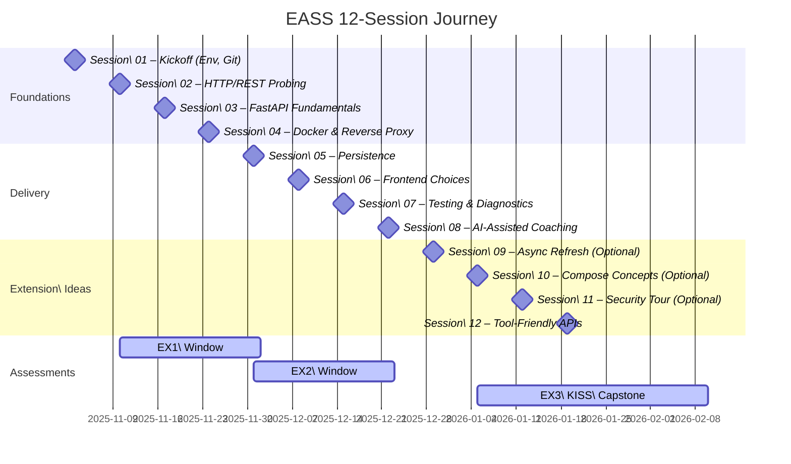

# EASS – Engineering of Advanced Software Solutions (12-Session Plan)

Welcome! This site hosts the 12-week plan for the EASS (Engineering of Advanced Software Solutions) course reboot. Everything is organized around short theory bursts followed by two hands-on blocks so undergrads can follow step by step.

- Classes meet on **Mondays** from Nov 3, 2025 through Jan 19, 2026.
- Each meeting has **45 min theory** + **45 min hands-on build** + **45 min practice/extension**.
- Exercises are assigned in class and always due on a **Tuesday** to give students time after the weekend.

> **Heads-up from Andrej Karpathy**  
> - Sleep beats all-nighters; aim for ~7½ hours before big work.  
> - Meet the material early and often—short sessions across days stick best.  
> - Try problems without notes so you know you can re-create the steps.  
> - Teach someone else what you learned; explaining makes it click.  
> - Visit office hours and sessions even if you only have small questions.  
> - Stop studying alone near the end—compare notes and fill gaps with peers.  
> - Never hand in early on tests; use every minute to check for silly misses.  
> - Grades matter, but real projects and references matter more—build things outside class.

## Quick Links
- [Course schedule by session](#course-schedule)
- [Exercise lineup and deadlines](exercises.md)
- [Optional MCP Workshop](sessions/optional/mcp.md)
- [Optional DuckDB Mini-Lakehouse Lab](sessions/optional/DuckDBMiniLakehouse.md)
- [Storage engine cheat sheet](sessions/session-05.md#part-a-–-theory-highlights) (SQLite ↔ Postgres ↔ Redis ↔ DuckDB guidance)
- [Legacy slide archives](https://github.com/EASS-HIT-PART-A-2025-CLASS-VIII/lecture-notes/tree/main/lectures/archive)
- [Troubleshooting tips](troubleshooting.md)
- [Team Topologies summary](sessions/optional/TeamTopologies.md)
- [DSPy + Pydantic AI agent lab](sessions/session-08.md#dspy-micro-lab)
- [Local llama.cpp fallback (Session 08)](sessions/session-08.md#local-llamacpp-fallback-gemma-3-270m)

## Visual Roadmap

## Course Schedule
1. [Session 01 – Kickoff and Environment Setup](sessions/session-01.md)
2. [Session 02 – Introduction to HTTP and REST](sessions/session-02.md)
3. [Session 03 – FastAPI Fundamentals](sessions/session-03.md)
4. [Session 04 – Docker Basics and Reverse Proxy Demo](sessions/session-04.md)
5. [Session 05 – Movie Service Persistence with SQLite](sessions/session-05.md)
6. [Session 06 – Movie Dashboards with Streamlit & React](sessions/session-06.md)
7. [Session 07 – Testing, Logging, and Profiling Basics](sessions/session-07.md)
8. [Session 08 – Working with AI Coding Assistants (LM Studio or vLLM)](sessions/session-08.md)
9. [Session 09 – Async Recommendation Refresh _(Optional exploration)_](sessions/session-09.md)
10. [Session 10 – Docker Compose, Redis, and Service Contracts _(Optional ideas)_](sessions/session-10.md)
11. [Session 11 – Security Foundations _(Optional vocabulary only)_](sessions/session-11.md)
12. [Session 12 – Tool-Friendly APIs and Final Prep](sessions/session-12.md)

**Optional add-ons:**  
- [MCP Workshop – Weather MCP Server](sessions/optional/mcp.md) for teams who want to ship MCP-compatible tools after Session 12.  
- [DuckDB Mini-Lakehouse Lab](sessions/optional/DuckDBMiniLakehouse.md) for students who want a local analytics sandbox that complements Session 05.

## Exercises at a Glance
- **EX1 – FastAPI Foundations**: assigned Mon Nov 10 · due Tue Dec 2, 2025. Build a tiny CRUD API with SQLModel + SQLite and tests.
- **EX2 – Friendly Interface**: assigned Mon Dec 1 · due Tue Dec 23, 2025. Add a Streamlit dashboard or Typer CLI that calls the EX1 API.
- **EX3 – Capstone Polish (KISS)**: assigned Mon Jan 5 · class check-in Tue Jan 20 · final Tue Feb 10, 2026. Integrate API + interface, add one small improvement, document the runbook. Everything stays local—no cloud, Docker, or security features required.
- Optional deep dives (Sessions 9–11) exist for curiosity and portfolio stretching; they do **not** add scope to the graded exercises.

## Teaching Philosophy
- Keep examples tiny and copy/paste friendly.
- Repeat concepts using the whiteboard sketches described in each session and the Natalie reference notes in `lectures/notes/`.
- Keep optional deep dives clearly labeled so students know graded work stays lightweight and local.
- Encourage question “warm-ups”: students share what they tried before asking for help.

Happy teaching!
