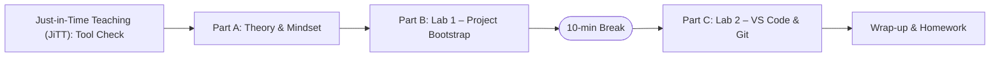

# Session 01 – Kickoff and Environment Setup

- **Date:** Monday, 02/03/2026
- **Theme:** Welcome everyone, set expectations, and make sure every student can create and run a Python project using uv, Git, and Visual Studio Code (VS Code).

## Learning Objectives
- Understand course structure, grading, and support channels.
- Install or verify core tools: uv, Git, Python 3.12+, VS Code, Docker Desktop.
- Create a minimal Python project with uv and run tests from the terminal.

**Guiding principles:** keep everything **KISS** (Keep It Simple, Students) and share questions using the **PARD** format (Problem → Action → Result → Desired) so we can move fast together. All commands assume macOS, Linux, or Windows Subsystem for Linux (WSL); no native Windows PowerShell steps are covered.

You are how you act: forget Rousseau's inner goodness—Franklin reminds us that habits win and you become what you repeatedly do. Even with "vibe coding" and artificial intelligence (AI) helpers at your side, your job is to own the repo, keep the tests green, and make sure the code stays explainable and scalable.

## Before Class – Equipment Check (Just-in-Time Teaching, JiTT)
Ask students to complete this 5-minute checklist the night before:
- Run `python3 --version` (or `py --version` on Windows), `uv --version`, `git --version`, and `code --version`. Paste the commands _and_ outputs in Discord `#helpdesk` using the **Problem → Action → Result → Desired** template (see below).
- Note any failures or missing commands so we can triage on arrival; do **not** spend hours debugging alone.
- If `uv` is missing, install it ahead of time with `curl -LsSf https://astral.sh/uv/install.sh | sh && exec "$SHELL" -l`.
- This just-in-time teaching checkpoint lets us spend class time on the fun parts instead of long installs.

## Agenda
| Segment | Duration | Format | Focus |
| --- | --- | --- | --- |
| **PART A – Theory & Motivation** | **45 min** | **Talk + Discussion** | **Course overview, tools landscape, mindset** |
| Warm welcome | 5 min | Discussion | Zoom breakouts: one-sentence intros + goals |
| Course overview | 15 min | Talk | Syllabus, grading (3 exercises), single monorepo (recommended) + Exercise 3 (EX3) local final project scope, expectations for collaboration and AI usage |
| Tool belt briefing | 25 min | Talk + quick demos | Why uv, how Git will be used, Visual Studio Code (VS Code) essentials, FastAPI for backends, Docker for deployment, large language models (LLMs) as coding assistants and in projects |
| **Break** | **10 min** | **—** | **Encourage movement – launch [10-minute timer](https://e.ggtimer.com/10minutes)** |
| **PART B – Hands-on Lab 1** | **45 min** | **Guided coding** | **Scaffold the starter project, run first test** |
| Environment setup | 10 min | Guided | Install verification, create project directory |
| uv project init | 15 min | Live code | Init project, create venv, add pytest |
| First test | 15 min | Live code | Write and run test_math.py |
| Git foundation | 5 min | Live code | Initialize repo, first commit |
| **Break** | **10 min** | **—** | **Encourage movement – launch [10-minute timer](https://e.ggtimer.com/10minutes)** |
| **PART C – Hands-on Lab 2** | **45 min** | **Guided coding** | **Explore VS Code, Git basics, README writing** |
| VS Code tour | 15 min | Guided | Open project, install extensions, test explorer |
| Terminal comfort | 15 min | Live code | Basic shell commands, file operations |
| Documentation | 10 min | Live code | Create README with run instructions |
| Git workflow | 5 min | Live code | Stage, commit, push (optional GitHub setup) |
| **Wrap-up** | **5 min** | **Discussion** | **Recap, homework reminder** |

### Session Flow at a Glance
1. **Part A – Theory & Motivation:** Kickoff, expectations, tooling overview, and legacy resources.
2. **Part B – Hands-on Lab 1:** Scaffold `hello-uv`, run tests, commit your work.
3. **Break – 10 Minutes:** Launch the shared [10-minute timer](https://e.ggtimer.com/10minutes) and reset.
4. **Part C – Hands-on Lab 2:** VS Code workflow, terminal practice, documentation, and Git basics.
5. **Wrap-up:** Recap key wins and outline homework.



## Lab Quick Reference (Printable)

Use these numbered steps when you call out B# (Part B) or C# (Part C). Unless otherwise stated, run tools with `uv run …` so you never leave the managed environment.

### Part B – Bootstrap `hello-uv`
- **B1** – _Create project_:  
  ```bash
  mkdir hello-uv && cd hello-uv
  ```
- **B2** – _Project scaffold (no activation needed):_  
  ```bash
  uv init -p 3.12
  uv venv --python 3.12
  uv add pytest
  uv run python --version  # should report 3.12.x
  ```
  If `uv` is missing, install it first with `curl -LsSf https://astral.sh/uv/install.sh | sh && exec "$SHELL" -l`.
- **B3** – _Write starter tests (editor of your choice):_  
  ```bash
  mkdir -p tests
  nano tests/test_math.py
  ```
  (Alternative: `code tests/test_math.py` or `vim tests/test_math.py`.) Paste exactly:  
  ```python
  def test_addition():
      assert 2 + 2 == 4

  def test_subtraction():
      assert 5 - 3 == 2

  def test_multiplication():
      assert 3 * 4 == 12
  ```
- **B4** – _Run tests:_  
  ```bash
  uv run pytest -q
  ```  
  Expect three dots followed by “3 passed”.
- **B5** – _Create `.gitignore` (KISS edition):_  
  ```bash
  cat > .gitignore <<'EOF'
  __pycache__/
  .pytest_cache/
  .venv/
  .uv/
  .env
  EOF
  ```
- **B6** – _Initial commit:_  
  ```bash
  git init
  git diff        # working tree check
  git add .
  git diff --staged
  git commit -m "chore: bootstrap hello-uv project"
  git log --oneline
  ```
  _Optional_: add a simple `pytest.ini` to keep output consistent: 
  ```bash
  cat > pytest.ini <<'EOF'
  [pytest]
  addopts = -q
  testpaths = tests
  EOF
  git add pytest.ini
  git commit -m "chore: add pytest config"
  ```

### Part C – Editor, Shell, Documentation
- **C1** – _Open VS Code & extensions:_  
  `code .` (or VS Code → **Open Folder**). Install Python, Pylance, GitLens, REST Client, Docker. Configure pytest discovery if prompted.
- **C2** – _Shell reps:_  
  ```bash
  pwd && ls -la && echo "Scratch pad" > notes.txt && git status && rm notes.txt
  ```
  (The same command works in macOS, Linux, and WSL.)
- **C3** – _README:_  
  `code README.md` (or `nano` / `notepad`). Use the provided template.
- **C4** – _Docs commit:_  
  ```bash
  git add README.md
  git commit -m "docs: add project README"
  ```
- **C5 (Optional)** – _Publish via GitHub CLI:_  
  ```bash
  git branch -M main
  gh auth status || gh auth login
  gh repo create EASS-HIT-PART-A-2025-CLASS-VIII/hello-uv-<handle> \
    --source=. --remote=origin --push --private
  ```
  If `gh` is unavailable, fall back to:
  ```bash
  git remote add origin git@github.com:EASS-HIT-PART-A-2025-CLASS-VIII/hello-uv-<handle>.git
  git push -u origin main
  ```

## Talking Script – Course Overview (First 45 Minutes)
1. **Introduce yourself and the course tone.** "This class is about learning by doing. You will see me live-code and you will copy/paste freely. Questions are always welcome. Trust the process—even if things feel unfamiliar at first, by the end you'll be building real web applications with modern tools."
2. **Set expectations for participation.** "We use Discord for day-to-day help. Post what you tried before asking. Pair up during labs so nobody gets stuck. Join using the Learning Management System (LMS) link (backup: https://go.eass.dev/discord) and use the `#helpdesk` channel for all technical questions."
3. **Explain grading.** “We have three large exercises. Each one is assigned on a Monday, and each deadline is set on a weekday that avoids Shabbat and official holiday closures. There are no surprise quizzes. Show up, code along, and you will earn the grade.”
4. **Call out the monorepo + KISS pledge.** "You’re welcome to keep all three exercises in one Git repo so EX2 naturally builds on EX1 and EX3 pulls everything together—but it’s not mandatory. What *is* required: keep every deliverable simple, local, and easy to demo on your laptop. No cloud accounts, no security audits, just clean FastAPI fundamentals that later grow into SQLModel persistence."
5. **Clarify AI policy.** "You may use AI tools like ChatGPT, Claude, Gemini, Cursor, Copilot, LM Studio, or Ollama. You must understand every line you submit, keep a lightweight spec (spec.md or a tessl.io export) in your repo, and when you ask for help share Problem → Action → Result → Desired."
6. **Outline the tool belt.** "Today we confirm Python 3.12+, uv for environments, Git for version control, VS Code for editing, and Docker Desktop for later sessions. Soon we'll add FastAPI for building web APIs and learn to use LLMs both as coding assistants (to help you write code faster) and as components inside your applications (like calling a local LLM endpoint)."
7. **Preview the three KISS exercises.** "You’ll ship three small deliverables: EX1 is a FastAPI CRUD API (SQLite layering comes soon after), EX2 is a friendly Streamlit dashboard or Typer CLI, and EX3 stitches them together—with a dedicated persistence service and one thoughtful improvement. Everything runs locally—no cloud or security gauntlets."
8. **Transition to Part B.** "Let's make sure every laptop can create a project. Follow along exactly; copy/paste saves time."

---

## PART A – Theory & Motivation (45 Minutes)

### Warm Welcome (5 Minutes)
**Instructor Actions:**
1. Offer a one-line intro (name + role) and share the session agenda at a glance.
2. Drop learners into small Zoom breakout rooms for two minutes; ask each person to introduce themselves with one sentence (name + current goal).
3. Pull everyone back and reinforce the "trust the process" philosophy: "Even if Git or Docker feel foreign now, by mid-semester you'll be deploying real applications."

**Student Actions:**
- In your breakout room: state your name and one project you'd like to tackle this semester (web app, API, automation tool, etc.).
- Listen for common interests; we'll use them to form lab buddies later.

### Course Overview (15 Minutes)
**Instructor Talking Points:**

1. **Course structure:**
   - 12 meetings (Mondays), each with theory + two hands-on labs.
   - Three major exercises (EX1, EX2, EX3) with weekday deadlines that avoid Shabbat.
   - KISS focus: every deliverable runs locally on Linux/WSL/macOS—no cloud hoops or security audits.

2. **Grading breakdown:**
   - EX1 (FastAPI foundations, backend): 30%
   - EX2 (Friendly interface): 30%
   - EX3 (Full-Stack Microservices Final Project): 40%
   - All components must be completed to pass the course.

3. **Collaboration & support:**
   - Discord server: see the LMS announcement for the latest invite (backup short link: https://go.eass.dev/discord).
   - Use the `#helpdesk` channel for all technical questions and general support.
   - When asking for help, follow the **Problem → Action → Result → Desired** pattern: “I tried X, saw result R, and I’m aiming for Y.” Screenshots alone are not enough—share the exact command and output.
   - Pair programming during labs is encouraged—nobody should be stuck alone.
   - Once you join Discord, share your GitHub username and email so I can send you the GitHub Classroom invitations.
   - Legacy study aids: clone the archived resources repo (see LMS link) and review `old-lecture-notes/notes/EASS-Complete-Natalie.pdf` (Hebrew) plus `old-lecture-notes/archive/all_slides.pdf` for historical context and solved exercises.

4. **AI policy (crucial):**
   - **You MAY use AI tools** (ChatGPT, Claude, Gemini, Cursor, GitHub Copilot, LM Studio, Ollama, etc.).
   - **You MUST understand** every line of code you submit and be ready to explain it during reviews.
   - Keep a lightweight specification in your repo (even a `spec.md` or a [tessl.io](https://tessl.io/) export) so both humans and AI helpers know the goal before you start coding. Update it as requirements evolve.
   - Cite AI-assisted changes in your pull requests or README changelog, and never commit secrets—store keys in `.env` (already gitignored).

5. **Learning philosophy:**
   - "This is a hands-on class. You'll see me type commands, and you'll type the same commands."
   - "Copy/paste is not cheating—it's efficient. But you must run the code and verify it works."
   - "Questions are always welcome. If you're confused, others probably are too."

**Student Actions:**
- Join Discord now if you have a device handy.
- Note the three exercise deadlines in your calendar.
- Ask any questions about grading or expectations.

### Tool Belt Briefing (25 Minutes)
**Instructor Talking Points:**

**The Five Pillars of Our Stack:**

1. **Python 3.12+** – Our main programming language.
   - Modern syntax (type hints, `match` statements).
   - Rich ecosystem for web development.
   - When to reach for it: every backend, scripting, and testing task in this course.

2. **uv** – Fast Python environment and dependency manager.
   - Replaces `pip` + `virtualenv` + `pip-tools` with one tool.
   - `uv init` creates `pyproject.toml` (project manifest); `uv add` / `uv sync` write `uv.lock` (exact versions).
   - Can specify Python version: `uv venv --python 3.12` (preferred) or `uv venv --python 3.13` when ready.
   - Tip: Pin the project's minimum Python with `uv init -p 3.12`; matching versions prevent `uv` from recreating your venv unexpectedly.
   - Why not just pip? uv is faster (written in Rust), handles lockfiles automatically, manages Python versions, and will be the industry standard soon.
   - Think of it as: cargo (Rust) or npm (Node.js) but for Python.
   - Quick demo: 
     ```bash
     uv init -p 3.12          # scaffolds pyproject (requires-python >=3.12)
     uv venv --python 3.12    # creates .venv with Python 3.12
     uv add pytest            # installs and locks dependency
     uv run pytest            # runs command in the environment
     uv run python --version  # check Python version in venv
     ```
    - When to reach for it: every time you install or run Python tooling—no more `pip install` in system Python.

3. **Git & GitHub** – Version control and collaboration.
   - Every project starts with `git init`.
   - Git tracks changes to your code over time—like "undo" on steroids.
   - You'll commit often: "Save early, save often."
   - We'll use GitHub Classroom for exercise submissions.
   - Basic workflow you'll learn today:
     ```bash
     git status         # what changed?
     git add .          # stage changes
     git commit -m "…"  # save snapshot with a message
     gh repo create ... # create/push via GitHub CLI
     ```
   - Example: if you break something, `git log` shows history and you can go back to any previous version.
   - When to reach for it: whenever you change code; push to GitHub for reviews and grading. We standardise on the GitHub CLI (`gh`) for authentication, repo creation, and pull requests.

4. **curl** – Command-line tool for HTTP requests.
   - Imagine a browser without the graphics: you type the request, it prints the response.
   - Use it before writing Python so you can see the raw data flowing over HTTP.
   - Quick demo:
     ```bash
     curl https://api.github.com/users/aws        # GET request
     curl -s https://api.github.com/users/aws | head -5
     ```
     - `curl` fetches data from the URL.
     - `-s` hides progress noise; piping to `head -5` keeps the output short.
   - We'll rely on `curl` to debug APIs all semester.
   - When to reach for it: smoke-test an endpoint before you write a client or suspect your code.

5. **VS Code** – Our code editor.
   - Extensions we'll install today: Python, Pylance, GitLens, Docker, REST Client.
   - Built-in terminal (no need to switch windows).
   - Test explorer (run tests with one click).
   - IntelliSense (autocomplete and hints as you type).
   - Why VS Code? Free, powerful, works the same on Mac/Windows/Linux, and has extensions for everything.
   - When to reach for it: daily editing, debugging, and test runs with visual feedback.

6. **FastAPI** – Modern web framework (coming in Meeting 3).
   - Build REST APIs with automatic validation and documentation.
   - Type-safe: catches bugs before they reach production.
   - Quick preview:
     ```python
     from fastapi import FastAPI
     app = FastAPI()
     
     @app.get("/")
     def read_root():
         return {"message": "Hello World"}
     ```
   - Why FastAPI? Fast (high performance), modern (uses Python type hints), has built-in OpenAPI docs, and is used by Netflix, Uber, and Microsoft.
   - We'll also use **httpx** (not requests) for making HTTP calls—it's modern, supports async, and is the recommended client for FastAPI.
   - When to reach for it: building APIs starting Meeting 3, plus anything that needs async/validation out of the box.

7. **Docker** – Package your app and its environment (Meeting 4).
   - "Works on my machine" → "Works everywhere."
   - One `Dockerfile` = reproducible deployment.
   - Docker Compose = run multiple services together (API + database + reverse proxy).
   - Think of it as: a lightweight virtual machine that packages your app with all its dependencies.
   - Why Docker? Consistent environments, easy deployment, industry standard, and makes collaboration easier.
   - Preview command: `docker run hello-world` (we'll verify this works today).
   - When to reach for it: packaging services for Exercise 3 and any time you need parity across machines.

8. **LLMs (Large Language Models)** – AI as tool and component.
   - **As coding assistant:** Use ChatGPT/Cursor to generate boilerplate, write tests, debug errors.
     - Example prompt: "Write a FastAPI endpoint that returns all items from a list."
     - You review, edit, and verify the code.
   - **Inside your projects:** Call LLMs via API (OpenAI) or locally (LM Studio).
     - Example: build a chatbot API that uses a local LLM for responses.
     - We'll cover this in Meetings 8 and 12.
   - **Key principle:** AI accelerates your work, but you stay in the driver's seat. You must understand every line of code.
   - When to reach for it: generating scaffolds, refactoring boilerplate, and building AI-powered features (Meetings 8+).

9. **pytest** – Testing framework (we'll use today).
   - Automatically discovers and runs test functions (functions starting with `test_`).
   - Simple assertions: `assert 2 + 2 == 4`
   - Why test? Catch bugs early, document expected behavior, enable refactoring with confidence.
   - Example:
     ```python
     def test_addition():
         result = 2 + 2
         assert result == 4  # test passes if True, fails if False
     ```

**Quick Demos (5 Minutes Each):**

1. **curl demo:**
   ```bash
   curl -s https://api.github.com/users/aws | uv run python -m json.tool | head -20
   ```
   - Confirms your network works, pretty-prints the JSON, and shows you the shape of the response quickly. Run it inside your project folder so `uv run` uses your 3.12+ environment.

2. **uv demo:**
   ```bash
   uv init -p 3.12
   uv venv --python 3.12
   uv add httpx
   uv run python --version
   uv run python -c "import httpx; print(httpx.get('https://api.github.com/users/aws').json()['followers'])"
   ```
   - `uv init` scaffolds a `pyproject.toml` so dependency commands work (set min Python to 3.12).
   - `uv venv` creates an isolated Python.
   - `uv add` installs a package and locks the version.
   - `uv run` executes commands inside that environment (activation is optional; keep using `uv run …` for consistency).

3. **Git demo:**
   ```bash
   git config --global user.name "Your Name"
   git config --global user.email "you@school.edu"
   git init
   echo "# Test Project" > README.md
   git add README.md
   git commit -m "Initial commit"
   git log --oneline
   ```
   - Configure your identity once, then initialize a repo, stage, and commit.
   - `git log --oneline` proves the commit is stored.

4. **VS Code demo:**
   - Open Command Palette (Cmd+Shift+P / Ctrl+Shift+P).
   - Install Python extension.
   - Show integrated terminal (Ctrl+`).
   - Show test explorer (beaker icon on left sidebar).

**What-If Troubleshooting Chat (5 Minutes):**
- Ask the room: "What if `uv --version` fails? What if `python3 --version` shows 3.9? What if `git status` is empty?" Collect answers and reinforce that the Troubleshooting Guide at the end lists the fixes.
- Goal: Normalize encountering errors and remind students to capture Problem → Action → Result → Desired when they ask for help.

**Mini Quiz (3 Minutes):**
- Rapid-fire questions: "Which command guarantees your tool runs inside the uv environment?", "What does `git add .` do?", "Why keep a spec file in the repo?" Let students answer verbally or via a quick poll to reinforce retention.

**Student Actions:**
- Verify you have a terminal open and can run basic commands.
- If you haven't already, install uv (we'll do this together in Part B if needed).
- Open VS Code and locate the terminal and extensions panels.

**Transition to Part B:**
"Now we're going to build a real project together. Open your terminal and follow along. If you get an error, raise your hand—we'll fix it together."

---

## BREAK (10 Minutes)
Encourage movement, grab water, and launch the shared [10-minute timer](https://e.ggtimer.com/10minutes) before diving into Part B.  
If the link fails, run `python -c "import time; time.sleep(600)"` or set a phone timer for 10 minutes.

---

## PART B – Hands-on Lab 1: Build Your First Python Project (45 Minutes)

**Goal:** By the end of this lab, every student will have a working Python project with a passing test, managed by uv and tracked with Git.

### Environment Setup (10 Minutes)

**Instructor Actions:**
1. Invite students to run **Quick Reference B1** (create project directory) and confirm they are inside it.
2. Walk through the uv installation check from **B2** step-by-step: verify `uv --version`, demonstrate the installer command if anyone is missing it, then show how restarting the shell surfaces the new binary.
3. Remind everyone to validate Git identity (`git config --global ...`) before moving on, modelling the Problem → Action → Result → Desired pattern if someone’s identity is unset.

**Student Checklist:**
- [ ] Terminal is open
- [ ] uv is installed (run `uv --version` to verify)
- [ ] Git is configured with your name and email

**Buddy Check (5 Minutes):**
- Pair up with the person next to you and confirm each checkbox together.
- If one of you is stuck, post in `#helpdesk` using the Problem → Action → Result → Desired format so an instructor or classmate can jump in.

### uv Project Initialization (15 Minutes)

**Instructor Live Coding (students follow along exactly):**
1. Execute **Quick Reference B2** together. Narrate what each command does: `uv init` scaffolds metadata, `uv venv` isolates Python, `uv add` pins dependencies.
2. If anyone activates the environment out of habit, point out the `(.venv)` prompt but emphasise that the class standard is to rely on `uv run ...` instead.
3. Close with a group `uv run pytest --version` to prove the dependency landed.

**Student Checkpoint:**
- Raise your hand if you see "pytest 8.x.x" or similar output.
- If you see an error, stop and ask for help.

### First Test (15 Minutes)

**Instructor Live Coding:**
1. Guide students through **Quick Reference B3-B5**. Narrate the vim keystrokes (insert, paste, `Esc :wq`) and explain pytest output symbols (`.` vs `F`).
2. After the intentional failure demo, debrief why red tracebacks are learning signals, not disasters. Encourage them to share PARD-formatted questions when they get stuck.

**Student Task Card:**
- Run `uv run pytest -q` and verify you see `3 passed`.
- If you see failures, check your code matches exactly.
- Raise your hand if tests don't pass.

### Micro Demos (Optional, 90 Seconds Each)
- **Red → Green:**
  ```bash
  printf 'def test_fail(): assert 2 + 2 == 5\n' > tests/test_fail.py
  uv run pytest -q
  sed -i.bak 's/5/4/' tests/test_fail.py  # macOS BSD sed; Linux users can drop .bak
  uv run pytest -q
  ```
  Use this to normalise fast iteration: fail, inspect, fix, rerun.
- **See the wire:**
  ```bash
  curl -s https://api.github.com/users/aws \
    | uv run python -m json.tool \
    | head -20
  ```
  Emphasise that we “look at the wire” before writing clients.

### Git Foundation (5 Minutes)

**Instructor Live Coding:**
1. Execute **Quick Reference B6** and pause after each sub-command to emphasise the why: `.gitignore` keeps noise out of history, `git add .` stages, the commit message documents intent.
2. Show `git log --oneline` and explain how it becomes the time machine for the project.

**Student Checkpoint:**
- Everyone should see one commit in `git log --oneline`.
- If you see an error about user.name or user.email, run the config commands from earlier.

### Part B Wrap-Up (2 Minutes)

**Instructor Summary:**
"You just created a Python project from scratch using modern tools. You have:
- A virtual environment (`.venv`)
- A project manifest (`pyproject.toml`)
- A lockfile (`uv.lock`)
- Automated tests (`tests/test_math.py`)
- Version control (`.git`)

This is the foundation for every project you'll build in this course."

**Student Success Criteria:**
- [ ] `uv run pytest -q` shows `3 passed`
- [ ] `git log --oneline` shows at least one commit
- [ ] You understand what each command does (if not, ask now!)

**Stretch Goal (Optional):**
- Create a new branch `feature/division-test`, add a division test that guards against zero division, commit it, and keep it ready for your first pull request next week.

---

## BREAK (10 Minutes)
Stand up, stretch, grab water. When we return, we'll explore VS Code and improve our project.  
Launch a shared [10-minute timer](https://e.ggtimer.com/10minutes) (or a local 10-minute timer if the link is blocked) so everyone returns on time.

---

## PART C – Hands-on Lab 2: VS Code, Git Workflow, and Documentation (45 Minutes)

**Goal:** Get comfortable with VS Code as your development environment, practice Git basics, and document your project professionally.

### VS Code Tour (15 Minutes)

**Instructor Live Demo (students follow along):**
1. Trigger **Quick Reference C1** to open VS Code (either `code .` or File → Open Folder). If the shell command is missing, demonstrate installing it via the Command Palette.
2. **Explorer sidebar (left side):**
   - Show the file tree
   - Expand/collapse folders
   - Create new files/folders by right-clicking
3. **Install essential extensions:**
   - Click Extensions icon (or Ctrl+Shift+X / Cmd+Shift+X)
   - Install these one by one:
     1. **Python** (Microsoft) – syntax highlighting, debugging
     2. **Pylance** (Microsoft) – type checking, IntelliSense
     3. **GitLens** – Git superpowers (blame, history)
     4. **REST Client** – test HTTP APIs (we'll use this in Meeting 2)
     5. **Docker** (Microsoft) – manage containers (we'll use this in Meeting 4)
4. **Open integrated terminal:**
   - Press Ctrl+` (backtick) or View → Terminal
   - You can have multiple terminal tabs
   - The terminal starts in your project directory automatically
5. **Test Explorer:**
   - Click the beaker icon on the left sidebar (Testing)
   - You should see `tests/test_math.py` with three tests
   - Click the green play button next to a test to run it
   - Click the play button at the top to run all tests
6. **Run a test from the explorer:**
   - Click the play button next to `test_addition`
   - See the checkmark when it passes
   - Click on the test to see the code

**Instructor Tips:**
- Walk around the room to verify everyone has VS Code open
- Help students who get stuck on extension installation
- Show how to split the editor (drag a file tab to the side)

**Student Checklist:**
- [ ] VS Code is open with your `hello-uv` project
- [ ] Python, Pylance, and GitLens extensions are installed
- [ ] Test Explorer shows your three tests
- [ ] You can run a test from the Test Explorer

### Terminal Comfort (15 Minutes)

**Instructor Live Coding (students type along):**
> Time check: if you’re running late, compress this block to the first command group (pwd + ls + file create/delete) and move the rest to homework.
1. Follow **Quick Reference C2** as a guided practice: run `pwd`, `ls -la`, create `notes.txt`, inspect it, then clean it up. Explain what each command reveals about the project.
2. Demonstrate `git log --oneline --graph` and optional aliases once the workspace is back to a clean state.

**Additional Terminal Commands to Demonstrate:**

```bash
# Count lines in a file:
wc -l tests/test_math.py

# Search for text in files:
grep "def test" tests/test_math.py

# Show disk usage:
du -sh .venv

# Show Python version:
python3 --version
uv run python --version

# Show environment info:
uv run python -c "import sys; print(sys.executable)"
```

Share a printed or PDF **terminal cheat sheet** (Mac shortcuts on the left, Windows/WSL on the right) so students can reference commands after class.

**Student Task:**
- Type each command and observe the output.
- Ask questions if anything is confusing.
- Experiment: create a file, read it, delete it.

### Documentation (10 Minutes)

**Instructor Live Coding:**
1. Execute **Quick Reference C3** and model the `vim` workflow again: insert mode, paste template, `Esc :wq`.
2. **Write documentation** (students copy this structure):

   ```markdown
   # Hello uv Project
   
   A minimal Python project demonstrating modern tooling with `uv`, `pytest`, and `Git`.
   
   ## Setup

   1. Clone this repository (or create a new project):
      ```bash
      git clone <your-repo-url>
      cd hello-uv
      ```

   2. Create the uv virtual environment (Python 3.12+; matches `pyproject.toml`'s `requires-python`) and install dependencies:
      ```bash
      uv venv --python 3.12
      uv sync
      ```

   ## How to Run Tests

   Run all tests (quiet mode):
   ```bash
   uv run pytest -q
   ```
   
   ## Project Structure
   
   ```
   hello-uv/
   ├── .venv/              # Virtual environment (not committed)
   ├── tests/              # Test files
   │   └── test_math.py
   ├── pyproject.toml      # Project manifest
   ├── uv.lock             # Locked dependencies
   └── README.md           # This file
   ```
   
   ## Tools Used
   
   - **uv**: Fast Python package manager and environment manager
   - **pytest**: Testing framework
   - **Git**: Version control
   
   ## Next Steps
   
   - Add more complex tests
   - Create application code in `app/` directory
   - Add FastAPI endpoints (Meeting 3)
   - Containerize with Docker (Meeting 4)
   
   ## Author
   
   Your Name - EASS Course, Semester B 2026
   ```

3. **Save the file** (Cmd+S / Ctrl+S).

**Instructor Explanation:**
"A good README answers three questions:
1. What is this project?
2. How do I set it up?
3. How do I use it?

Every project you submit must have a README. This is your first impression."

**Student Task:**
- Create your own `README.md` with at least:
  - Project title
  - Setup instructions
  - How to run tests
  - Your name

### Git Workflow (5 Minutes)

**Instructor Live Coding:**
1. Run **Quick Reference C4** to stage and commit `README.md`. Pause to highlight the difference between working tree, staging area, and commit history.
2. For teams ready to publish, follow **Quick Reference C5**. Show the live GitHub repo so students see the end-to-end flow (create repo under the organisation, add remote, push, verify).
   - Highlight the GitHub CLI flow: `gh auth login`, `gh repo create … --push`, and later `gh pr create` for reviews.

**Collaboration Preview (2 Minutes):**
- Explain that future exercises will use feature branches and pull requests (branch → commit → open PR → code review → merge).
- Show one slide or live GitHub screenshot so students see where comments and reviews will appear.

**Instructor Note:**
If students don't have GitHub accounts or SSH keys set up, make this optional homework. The important part is they understand local Git workflow.

**Student Checkpoint:**
- [ ] `README.md` exists and has content
- [ ] `git log --oneline` shows two commits
- [ ] (Optional) Project is pushed to GitHub

### Part C Wrap-Up (2 Minutes)

**Instructor Summary:**
"You now have a complete development workflow:
1. Write code in VS Code
2. Run tests to verify it works
3. Commit changes with Git
4. Document your work in README

This is the workflow you'll use for all three exercises."

**Student Success Criteria:**
- [ ] Comfortable opening projects in VS Code
- [ ] Can run tests from Test Explorer
- [ ] Can use basic terminal commands
- [ ] Have created a professional README
- [ ] Understand `git add`, `git commit`, `git status`

---

### Optional Preview: Typer, Pydantic, FastAPI, SQLModel
If you finish early, install a small bundle and explore what’s ahead:
```bash
uv add typer pydantic fastapi sqlmodel uvicorn
```
- **Typer (CLI skeleton):**
  ```python
  # cli.py
  import typer

  app = typer.Typer()

  @app.command()
  def greet(name: str = "world"):
      print(f"Hello, {name}!")

  if __name__ == "__main__":
      app()
  ```
  Run with `uv run python cli.py greet --name Alice`.
- **Pydantic (validated input):**
  ```python
  # validate.py
  from pydantic import BaseModel, ValidationError

  class Item(BaseModel):
      name: str
      price: float

  try:
      print(Item(name="pen", price="1.5").model_dump())
  except ValidationError as exc:
      print(exc)
  ```
- **FastAPI (10-line POST):**
  ```python
  # app.py
  from fastapi import FastAPI
  from pydantic import BaseModel

  app = FastAPI()

  class Item(BaseModel):
      name: str
      price: float

  @app.post("/items")
  def create(item: Item):
      return {"ok": True, "total": item.price}
  ```
  Start it with `uv run uvicorn app:app --reload --port 8000` and test via:
  ```bash
  curl -s -X POST localhost:8000/items \
    -H "content-type: application/json" \
    -d '{"name":"pen","price":1.5}' \
    | uv run python -m json.tool
  ```
- **SQLModel (typed rows in SQLite):**
  ```python
  # db_demo.py
  from sqlmodel import SQLModel, Field, Session, create_engine, select

  class Product(SQLModel, table=True):
      id: int | None = Field(default=None, primary_key=True)
      name: str
      price: float

  engine = create_engine("sqlite:///:memory:")
  SQLModel.metadata.create_all(engine)

  with Session(engine) as session:
      session.add(Product(name="pen", price=1.5))
      session.commit()
      print(session.exec(select(Product)).all())
  ```
Treat these as teasers—you’ll master them in later sessions.

---

## Wrap-Up Script (5 Minutes)

**Instructor Final Thoughts:**

1. **Celebrate progress:**
   "Today you built a working Python project from scratch and learned the tools you'll use all semester. That's a huge accomplishment!"

2. **Review what you accomplished:**
   - ✅ Created a Python project with `uv`
   - ✅ Wrote and ran automated tests with `pytest`
   - ✅ Tracked your work with `Git`
   - ✅ Documented your project with `README.md`
   - ✅ Set up VS Code as your development environment

3. **Homework and next steps:**
   - **Tonight:** 
     - Join Discord (LMS link or https://go.eass.dev/discord)
     - Share your GitHub username and email in `#helpdesk` so I can send you invitations
   - **This week:** 
     - Keep your `hello-uv` repo handy and re-run `uv run pytest -q` to stay sharp.
     - Jot down one improvement you want to add to the movie API once we build it next week.
     - (Optional) Push your `hello-uv` project to GitHub once you get the GitHub Classroom link.
   - **Before next class:**
     - Make sure Docker Desktop is installed and running
     - Run `docker run --rm hello-world` to verify Docker works
     - Review HTTP basics if you're rusty (we'll cover it in depth next week)

4. **Preview of Meeting 2:**
   "Next Monday we dive into HTTP and REST APIs. You'll learn how browsers and servers talk, and you'll build your first HTTP client using httpx. Bring your laptops charged and your `hello-uv` project ready."

5. **Q&A:**
   "Any questions about today's material, the exercises, or expectations?"

6. **Final reminder:**
   "Remember: trust the process. If something doesn't make sense today, it will make sense by Meeting 4. Keep coding, keep asking questions in `#helpdesk`, and help each other out on Discord."

7. **Resource wall:**
   "Snapshot these links—Discord, GitHub Classroom FAQ, Troubleshooting Guide, tessl.io spec template, and the terminal cheat sheet PDF—so you can reference them after class."

**Student Exit Ticket (Optional):**
Post in Discord `#helpdesk`:
- One thing you learned today
- One thing you're confused about
- One thing you're excited to build

---
## Materials Checklist (For Instructor)

### Before Class:
- [ ] Python 3.12+ installed on all lab machines
- [ ] uv installed (Astral installer or package manager; verify with `uv --version`)
- [ ] Git installed and verified
- [ ] VS Code installed with Python extension
- [ ] Docker Desktop installed (for verification only today)
- [ ] Discord invite link ready (see LMS or backup https://go.eass.dev/discord)
- [ ] Slides or talking points prepared for Part A
- [ ] Example `hello-uv` project on your machine for demo
- [ ] Lab Quick Reference + terminal cheat sheet shared (print or PDF)

### During Class:
- [ ] Share Discord link in chat/on board
- [ ] Remind students to share GitHub username and email in `#helpdesk`
- [ ] Walk around during hands-on labs to help students
- [ ] Take note of common errors for troubleshooting guide

### After Class:
- [ ] Post session recording (if recorded) to Canvas
- [ ] Share troubleshooting notes in Discord
- [ ] Send GitHub Classroom invitation links to students who shared their GitHub usernames
- [ ] Prepare starter code for Meeting 2 (HTTP client examples with httpx)

---

## Support Blocks (Run as Needed)

### Windows WSL Setup Guide (Self-Contained)
*Share with Windows participants who are still on PowerShell-only environments.*

1. In elevated PowerShell:
   ```powershell
   wsl --install
   wsl --set-default-version 2
   ```
2. Inside the new Ubuntu shell:
   ```bash
   sudo apt update && sudo apt -y upgrade
   sudo apt -y install build-essential curl git python3 python3-venv
   ```
3. Install the VS Code "Remote – WSL" extension, open the project inside WSL, and verify `/mnt/c` visibility so students know where Windows files live.

### Docker Sanity Check (5 Minutes)
Assign as homework once uv/Git are stable.

```bash
docker run --rm hello-world
```
Expect the success message; on Windows remind them to enable WSL Integration in Docker Desktop first.

---

### PARD Help Template (Copy/Paste into `#helpdesk`)
Pronounced “Pard”. Always include the exact output so we can help quickly.
```
**Problem:** <short description>
**Action(s):** <exact commands you ran>
**Result:** ```<full output / error>```
**Desired:** <what you expected or are trying to achieve>
```
Providing all four lines saves everyone time and gives you sharper answers.

---

## Troubleshooting Guide

### Issue: `uv: command not found`

**Solution:**
```bash
# Mac/Linux:
curl -LsSf https://astral.sh/uv/install.sh | sh
# (optional) Homebrew users: brew install uv

# After installing, restart your terminal or run:
exec "$SHELL" -l
```
If you still prefer `pip install uv`, do it inside a disposable virtual environment so the binary lands on your PATH predictably.

### Issue: `git commit` fails with "Please tell me who you are"

**Solution:**
```bash
git config --global user.name "Your Name"
git config --global user.email "you@school.edu"
```

### Issue: `uv venv` fails with permission or missing module errors

**Solution (macOS/Linux/WSL):**
```bash
python3 --version        # ensure 3.12.x
python3 -m ensurepip --upgrade
python3 -m pip install --upgrade pip
sudo apt install -y python3.12-venv  # Ubuntu/WSL only
uv venv --python 3.12
```
Most failures come from missing `python3.12-venv` or an older Python binary on the PATH.

### Issue: Python version is too old (< 3.12)

**Solution:**
- **macOS:** `brew install python@3.12` then ensure `python3 --version` reports 3.12 (`brew info python@3.12` for linking tips).
- **Ubuntu/Debian (including WSL):** `sudo apt update && sudo apt install -y python3.12 python3.12-venv`. If multiple versions exist, run `sudo update-alternatives --config python3` on lab machines.
- **Other distros:** install Python 3.12 via your package manager or pyenv; align all machines to 3.12 for this course.

### Issue: Tests don't run in VS Code Test Explorer

**Solution:**
1. Make sure Python extension is installed
2. Open Command Palette (Cmd+Shift+P / Ctrl+Shift+P)
3. Type "Python: Configure Tests"
4. Select "pytest"
5. Select "tests" as the test directory

### Issue: Docker Desktop + WSL integration pitfalls

**Solution:**
1. Verify WSL 2 is installed: `wsl --version`
2. In Docker Desktop → Settings → General, ensure "Use WSL 2 based engine" is checked
3. Under Resources → WSL Integration, enable your Linux distro
4. Restart Docker Desktop, then rerun `docker run --rm hello-world`

### Issue: `ModuleNotFoundError: No module named 'httpx'`

**Solution:**
```bash
# If you haven't initialized a project yet:
#   uv init -p 3.12
uv add httpx
uv run python -c "import httpx; client = httpx.Client(); print(client.get('https://api.github.com/users/zozo123').status_code)"
```
- Make sure you run the command inside the project directory so `uv run` picks up the virtual environment.
- If you already installed dependencies, run `uv sync` before retrying your `python -c` script.
- For multi-line scripts, pipe a here-doc into Python instead of packing everything into one line:
  ```bash
  uv run python - <<'PY'
  import httpx

  client = httpx.Client()
  n = p = 0
  while True:
      response = client.get(
          "https://api.github.com/users/zozo123/repos",
          params={"per_page": 100, "page": p + 1},
      ).json()
      if not response:
          break
      n += len(response)
      p += 1
  print(n)
  PY
  ```

### Issue: `uv add …` times out

**Solution:**
```bash
uv --network-timeout 60 add pytest
```
Raising the timeout usually resolves slow mirror responses. Persistent failures typically indicate a proxy/firewall configuration problem—capture it with PARD and escalate.

### Issue: Can't push to GitHub (permission denied)

**Solution for SSH:**
```bash
# Generate SSH key:
ssh-keygen -t ed25519 -C "you@school.edu"

# Start ssh-agent:
eval "$(ssh-agent -s)"

# Add key:
ssh-add ~/.ssh/id_ed25519

# Copy public key:
cat ~/.ssh/id_ed25519.pub
# Paste this into GitHub → Settings → SSH and GPG keys → New SSH key
```

**Solution for HTTPS:**
- Use a Personal Access Token instead of password
- GitHub → Settings → Developer settings → Personal access tokens → Generate new token
- Use the token as your password when pushing

### Issue: VS Code `code` command doesn't work

**Solution:**
- **macOS:** Open VS Code → Command Palette (Cmd+Shift+P) → "Shell Command: Install 'code' command in PATH"
- **Linux/WSL:** Add VS Code’s bin directory to your PATH, e.g. `export PATH="$PATH:/usr/share/code/bin"`

---

## Extension: Advanced Git Setup (Optional, for Fast Students)

If students finish early, guide them through:

### 1. Create a `.gitignore` file:

```bash
# Create .gitignore in project root:
cat > .gitignore << 'EOF'
# Python
__pycache__/
*.py[cod]
*$py.class
*.so
.Python

# Virtual environments
.venv/
venv/
ENV/

# IDE
.vscode/
.idea/
*.swp
*.swo

# Testing
.pytest_cache/
.coverage
htmlcov/

# OS
.DS_Store
Thumbs.db

# uv
.uv/
EOF

git add .gitignore
git commit -m "chore: add .gitignore for Python project"
```

### 2. Create a feature branch:

```bash
# Create and switch to a new branch:
git checkout -b feature/add-division-test

# Add a new test:
# (edit tests/test_math.py to add test_division)

git add tests/test_math.py
git commit -m "test: add division test"

# Switch back to main:
git checkout main

# Merge the feature:
git merge feature/add-division-test
```

### 3. View commit history with more detail:

```bash
git log --oneline --graph --decorate --all
git log --stat
git show HEAD
```

---

## Student Success Criteria (Final Checklist)

By the end of Session 01, every student should be able to:

- [ ] **Environment:** Create a Python virtual environment with `uv venv`
- [ ] **Dependencies:** Add packages with `uv add <package>`
- [ ] **Testing:** Write and run tests with `pytest`
- [ ] **Version Control:** Initialize a Git repo, stage files, and commit changes
- [ ] **IDE:** Open a project in VS Code and use the Test Explorer
- [ ] **Terminal:** Navigate directories, create/delete files, run commands
- [ ] **Documentation:** Create a README with setup and usage instructions
- [ ] **Troubleshooting:** Know where to ask for help (Discord `#helpdesk`)
- [ ] **Artifacts:** Project folder includes `.venv`, `pyproject.toml`, `README.md`, and `tests/test_math.py`

**If a student cannot do any of the above, schedule office hours before Meeting 2.**

---

## AI Prompt Kit (For Instructors and Students)

Use these prompts with ChatGPT/Cursor to generate additional content:

### For Instructors:

1. **Generate troubleshooting scenarios:**
   > "Create five common error scenarios students might encounter when setting up a Python project with uv and pytest on Windows, with detailed solutions."

2. **Create quiz questions:**
   > "Write ten multiple-choice questions testing understanding of Git basics (init, add, commit, status) appropriate for first-time users."

3. **Generate coding exercises:**
   > "Create three progressive coding exercises for students learning pytest: 1) basic assertions, 2) parameterized tests, 3) fixtures."
4. **Verify installations:**
   > "Write a numbered checklist for students to confirm uv, pytest, git, VS Code, and Docker Desktop are installed correctly on Windows with WSL."
5. **Welcome message template:**
   > "Draft a short Discord welcome message reminding students to post what they tried before asking for help."

### For Students:

1. **Understand an error message:**
   > "I got this error when running `uv add pytest`: [paste error]. What does it mean and how do I fix it?"

2. **Learn a command:**
   > "Explain what `git commit -m 'message'` does, and why the `-m` flag is important. Give me three example commit messages."

3. **Debug code:**
   > "My pytest test is failing with this error: [paste error]. Here's my code: [paste code]. What's wrong?"

4. **Generate boilerplate:**
   > "Write a pytest test function that checks if a string is a palindrome. Include docstring and edge cases."

---

## Quick Reference (External Resources)

**For quick lookups during class:**

### Google searches:
- `uv python package manager tutorial`
- `pytest getting started guide`
- `git basics cheat sheet`
- `VS Code Python tutorial`
- `install WSL 2 Windows 11 step by step`

### Official documentation:
- uv: https://github.com/astral-sh/uv
- pytest: https://docs.pytest.org/
- Git: https://git-scm.com/doc
- VS Code Python: https://code.visualstudio.com/docs/python/python-tutorial

### Video resources:
- "Git explained in 100 seconds" (Fireship on YouTube)
- "Python virtual environments explained" (Corey Schafer)
- "VS Code setup for Python" (Microsoft)

### ChatGPT prompt:
- “Create a five-point checklist to confirm uv, pytest, git, and Docker Desktop are installed correctly on a student laptop.”

---

**End of Session 01 Guide**
