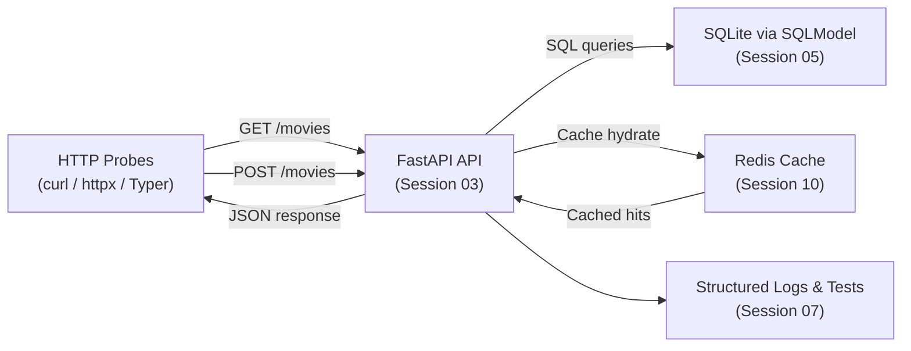

# Session 02 – Introduction to Hypertext Transfer Protocol (HTTP) and Representational State Transfer (REST)

- **Date:** Monday, Nov 10, 2025
- **Theme:** Demystify Hypertext Transfer Protocol (HTTP) request/response flows and capture reusable probes that will shape Exercise 1 (EX1).

## Learning Objectives
- Break down every component of an HTTP request and response (method, path, query, headers, cookies, body, status code).
- Contrast “resource-first” REST patterns with ad-hoc remote procedure call (RPC) flows so students can spot good application programming interface (API) design.
- Call public APIs with `httpx`, `curl`, and the Visual Studio Code (VS Code) REST Client, piping outputs through `python -m json.tool` for fast inspection.
- Automate exploratory requests behind a Typer command-line interface (CLI) so EX1 debugging is repeatable.
- Document baseline contracts (`.http` files + error format checklist) that evolve into EX1 tests.

## Before Class – REST Warm-Up (Just-in-Time Teaching, JiTT)
- In your `hello-uv` workspace run: 
  ```bash
  uv add "httpx==0.*" "pydantic==2.*" "typer==0.*"
  ```
  Post the command output in Discord `#helpdesk` using **Problem → Action → Result → Desired** if anything fails.
- Install the VS Code **REST Client** extension and run:
  ```bash
  curl https://httpbin.org/get?ping=preflight | python -m json.tool
  ```
  Share the pretty-printed JavaScript Object Notation (JSON) screenshot in your lab thread so everyone confirms the tooling.
- Complete the **Amazon Web Services (AWS) Academy Cloud Foundations – Compute** module by **Tue Nov 25**; flag blockers early.
- Re-run `uv run pytest -q` in `hello-uv` so the testing muscle stays warm.

## Agenda
| Segment | Duration | Format | Focus |
| --- | --- | --- | --- |
| Recap & AWS checkpoint | 5 min | Guided discussion | Round-robin: what automation/aliases did you add after Session 01? Confirm Amazon Web Services (AWS) Compute module progress. |
| HTTP dissection & tooling | 18 min | Talk + board + developer tools | Methods, status codes, headers, caching, authentication, and where Cross-Origin Resource Sharing (CORS)/rate limiting appear. |
| Micro demo: `curl → json.tool` | 2 min | Live demo (≤120 s) | Show CLI piping raw JSON into `python -m json.tool` and highlight why we log every request. |
| REST design patterns | 20 min | Talk + whiteboard | Resource naming, idempotency, error normalization, OpenAPI examples, and upcoming `slowapi` rate limiting. |
| **Part B – Lab 1** | **45 min** | **Guided coding** | **Build a reusable HTTP probe with `httpx` + Typer CLI.** |
| Break | 10 min | — | Launch the shared [10-minute timer](https://e.ggtimer.com/10minutes) and stretch. |
| **Part C – Lab 2** | **45 min** | **Guided practice** | **Capture `.http` recipes, validate JSON, prep contract-test inputs.** |
| EX1 briefing & backlog | 10 min | Talk + Questions and Answers (Q&A) | Scope reminder, backlog items (pagination, rate limiting, Schemathesis). |

## Part A – Theory & Micro Demo (45 Minutes)
1. **Board sketch:** Browser → FastAPI (Session 03) → SQLite (Session 05) → Redis (Session 10). Label each hop with verbs (`GET`, `POST`) and metadata (headers, trace identifiers (IDs), content-type).
2. **Status code ladder:** 2xx success, 3xx redirects, 4xx client errors, 5xx server errors. Stress that EX1 must never leak stack traces—only structured JSON errors.
3. **Header callouts:** `Accept`, `Content-Type`, `Authorization`, `X-Trace-Id`, `Retry-After`. Explain how we will inject a trace ID even before full observability tooling.
4. **Micro demo (≤120 s):**
   ```bash
   curl -s https://httpbin.org/get?city=Haifa \
     -H "Accept: application/json" \
   | uv run python -m json.tool
   ```
   Ask: “What are the headers? Where would you stash correlation IDs?”
5. **REST heuristics:** Use nouns (`/movies`, `/movies/{movie_id}/ratings`), keep verbs in query/body, make `PUT` idempotent, and document error shapes.
6. **Preview EX1 contract requirements:** health endpoint, create/read/update/delete (CRUD), predictable error payloads, coverage reports (Session 07), Docker packaging (Session 04).
7. **AWS Academy checkpoint:** Ask each table, “Have you enrolled in Amazon Web Services (AWS) Academy Cloud Foundations and started the Compute module? What’s your target wrap-up date (before Nov 25)?” Capture blockers immediately.



## Part B – Hands-on Lab 1 (45 Minutes)

### Lab timeline
- **Minutes 0–5** – Scaffold folders and install packages.
- **Minutes 5–20** – Implement the reusable HTTP client and discuss trace IDs.
- **Minutes 20–35** – Wrap the client with Typer commands and experiment with parameters.
- **Minutes 35–45** – Optional pytest smoke test plus log review.

### 1. Setup commands

If you're starting a fresh library (recommended so Session 02 artifacts stay focused):

```bash
mkdir -p http-probes
cd http-probes
uv init -p 3.12 --package   # run once; creates pyproject/lock scaffold
uv venv --python 3.12       # creates .venv pinned to 3.12
uv sync                     # materialises lock into the environment
uv run python --version     # sanity-check the managed interpreter (expect 3.12.x)
```

If you prefer to keep everything inside `hello-uv`, `cd` into that folder instead and skip the `uv init` step if the project already exists.

Install the HTTP tooling and scaffold the package:

```bash
uv add "httpx==0.*" "pydantic==2.*" "typer==0.*"
# (Later machines can run `uv sync` to recreate the environment from `uv.lock`.)
mkdir -p app
touch app/__init__.py app/http_client.py app/cli.py
```

### 2. Implement `app/http_client.py`
```python
from __future__ import annotations

import logging
import uuid
from typing import Any

import httpx
from pydantic import BaseModel

logger = logging.getLogger(__name__)


class PingResponse(BaseModel):
    args: dict[str, Any]
    headers: dict[str, Any]
    url: str
    origin: str


def ping(city: str = "Haifa") -> PingResponse:
    """Call httpbin with a trace header and validate the JSON response."""
    trace_id = uuid.uuid4().hex[:8]
    with httpx.Client(timeout=httpx.Timeout(10.0)) as client:
        response = client.get(
            "https://httpbin.org/get",
            params={"city": city},
            headers={
                "Accept": "application/json",
                "X-Trace-Id": trace_id,
            },
        )
        response.raise_for_status()
        payload = PingResponse.model_validate(response.json())
        logger.info(
            "httpbin echo",
            extra={"trace_id": trace_id, "status_code": response.status_code},
        )
        return payload
```

### 3. Wire a Typer CLI (`app/cli.py`)
```python
import json
import logging
from typing import Optional

import typer

from .http_client import ping

logging.basicConfig(level=logging.INFO, format="%(levelname)s %(message)s")

app = typer.Typer(help="HTTP probes for EX1 preflight")


@app.command()
def echo(city: str = typer.Argument("Haifa"), pretty: bool = True) -> None:
    """Call httpbin with optional pretty JSON output."""
    response = ping(city=city)
    if pretty:
        typer.echo(json.dumps(response.model_dump(), indent=2))
    else:
        typer.echo(response.model_dump_json())


@app.command()
def headers(city: str = "Haifa") -> None:
    """Print the normalized headers we receive back."""
    response = ping(city=city)
    for key, value in response.headers.items():
        typer.echo(f"{key}: {value}")


def main(argv: Optional[list[str]] = None) -> None:
    app(standalone_mode=True)


if __name__ == "__main__":
    main()
```

### 4. Run the probe
```bash
uv run python -m app.cli echo --city Tel-Aviv
uv run python -m app.cli headers --city London
```
Ask students to highlight the `X-Trace-Id` header in the output and explain why we will propagate it into FastAPI logs next week.

> 🎉 **Quick win:** Seeing `Server echoed our args` in the terminal confirms your Typer CLI can talk to live HTTP services without needing a browser.

### 5. Optional extension – quick pytest
```bash
mkdir -p tests
cat <<'PY' > tests/test_ping.py
from app.http_client import ping


def test_ping_default_city():
    response = ping()
    assert response.args["city"] == "Haifa"
    assert response.url.startswith("https://httpbin.org")
PY

uv run pytest -q
```
Encourage students to keep the test even if httpbin occasionally flakes—later we will replace it with a mocked contract.

## Part C – Hands-on Lab 2 (45 Minutes)

### Lab timeline
- **Minutes 0–10** – Capture GET/POST examples in `.http`.
- **Minutes 10–25** – Normalize error envelopes and map them to EX1 requirements.
- **Minutes 25–35** – Explore Schemathesis stretch goal and discuss contract testing.
- **Minutes 35–45** – Document decisions and share findings in Discord thread.

### 1. Create reusable `.http` scripts
`requests.http`:
```
### GET echo
GET https://httpbin.org/get?city=Haifa
Accept: application/json
X-Trace-Id: demo-1234

### POST form example
POST https://httpbin.org/post
Content-Type: application/x-www-form-urlencoded
X-Trace-Id: demo-5678

name=EASS
cohort=2025

### HEAD request for metadata
HEAD https://httpbin.org/get
Accept: application/json
```
Demonstrate sending each block from VS Code (Cmd/Ctrl+Alt+R) and show the response panel. Save useful responses for EX1 debugging.

### 2. Normalize error payloads
Draft `docs/contracts/http-errors.md` with a minimal template:
```markdown
## Standard Error Envelope
- `status`: HTTP status code (int)
- `error`: machine-readable string (e.g., `resource_not_found`)
- `detail`: human explanation
- `trace_id`: echo the inbound `X-Trace-Id`
```
Explain how this document becomes a checklist when students implement `/movies`.

### 3. Stretch: Schemathesis smoke test
Schemathesis is an OpenAPI-aware fuzz tester that generates edge-case requests for you; run it locally to catch contract bugs before students do.
```bash
uv add "schemathesis==3.*"
urql="https://httpbin.org/spec.json"  # replace with EX1 OpenAPI once available
uv run schemathesis run "$urql" --checks status_code_conformance
```
Reinforce that contract tests are optional now but required for excellence submissions.

## EX1 Briefing & Backlog Hit List
- Link to the full brief in [docs/exercises.md](../exercises.md#ex1--fastapi-foundations). Highlight rubric sections students must satisfy for a baseline pass vs. excellence.
- Deliverable: FastAPI CRUD for `/movies`, deterministic JSON errors, 80% branch coverage, Docker image (Session 04) by **Tue Dec 2**.
- **Backlog ideas:** feature flags for beta endpoints, pagination & filtering conventions, rate limiting (`slowapi`, the FastAPI-compatible rate-limiter we’ll formalize in Session 10) with a 429 test, OpenAPI examples for happy/sad paths, ETag/`If-None-Match` demo for caching.
- Encourage journaling any stretch goals so we can fold them into Sessions 07–10.

### Common pitfalls
- **Forgetting to activate the uv environment** – run `source .venv/bin/activate` (or `uv run ...`) before executing scripts so imports resolve.
- **Typer command exits immediately** – ensure `if __name__ == "__main__":` block calls `main()`.
- **HTTP timeout** – add `timeout=httpx.Timeout(30.0)` while diagnosing network hiccups; verify campus virtual private network (VPN)/proxy settings if failures persist.
- **REST Client 401s** – double check you copied the `X-Trace-Id` header; some APIs reject requests without it later in the course.

## Troubleshooting Notes
- `urllib3` Secure Sockets Layer (SSL) errors: run `export SSL_CERT_FILE=$(python -m certifi)` on macOS if needed.
- `httpx.ConnectTimeout`: demonstrate adding `timeout=httpx.Timeout(30.0)` and retrying later with `async` client in Session 09.
- VS Code REST Client not installed? Use `uv run python -m http.client` as a backup but fix the extension before EX1.

## Student Success Criteria

By the end of Session 02, every student should be able to:

- [ ] Capture and explain each component of an HTTP request/response using real traffic from `httpbin.org`.
- [ ] Automate exploratory requests through a Typer CLI that prints validated JSON and trace IDs.
- [ ] Produce a `.http` collection and error-envelope checklist that will seed EX1 tests.

**If a student cannot check any box above, schedule an office-hours pairing before Session 03.**

## AI Prompt Seeds
- “Explain like I’m a TA how to surface `X-Trace-Id` headers from `httpx` responses in logs.”
- “Generate Typer commands that wrap a reusable FastAPI probe with pretty JSON output.”
- “Draft a JSON error envelope spec that keeps parity between 400-level and 500-level responses.”
