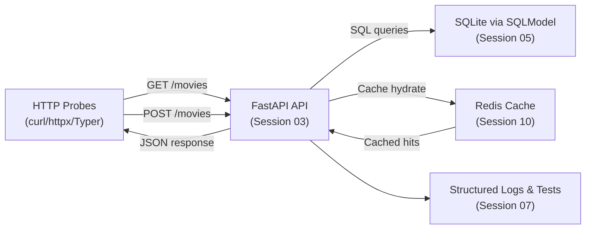

# Session 02 – Introduction to Hypertext Transfer Protocol (HTTP) and Representational State Transfer (REST)

- **Date:** Monday, Nov 10, 2025
- **Theme:** Demystify HTTP request/response flows and capture reusable probes that will shape Exercise 1 (EX1).

## Learning Objectives
- Break down every component of an HTTP request and response (method, path, query, headers, cookies, body, status code).
- Contrast "resource-first" REST patterns with ad-hoc remote procedure call (RPC) flows so students can spot good API design.
- Call public APIs with `httpx`, `curl`, and the VS Code REST Client, piping outputs through `python -m json.tool` for fast inspection.
- Automate exploratory requests behind a Typer CLI so EX1 debugging is repeatable.
- Document baseline contracts (`.http` files + error format checklist) that evolve into EX1 tests.

## Before Class – REST Warm-Up (JiTT)
**Complete these steps in your existing `hello-uv` workspace from Session 01:**

```bash
cd ~/repos/hello-uv  # or wherever you created it in Session 01
uv add "httpx==0.*" "pydantic==2.*" "typer==0.*"
```

Post the command output in Discord `#helpdesk` using **Problem → Action → Result → Desired** if anything fails.

Install the VS Code **REST Client** extension and verify connectivity:

```bash
curl https://httpbin.org/get?ping=preflight | python -m json.tool
```

Share the pretty-printed JSON screenshot in your lab thread so everyone confirms the tooling.

**AWS Academy:** Complete the **Cloud Foundations – Compute** module by **Tue Nov 25**; flag blockers early.

**Sanity check:** Re-run `uv run pytest -q` in `hello-uv` so the testing muscle stays warm.

## Admin & Homework Checkpoints
- **Roster sync:** Post your GitHub username **and** best contact email in the Discord `#roster-sync` channel before Session 02 ends so we can add you to the GitHub org, Classroom repos, and mailing list without delays.
- **AWS Academy – Cloud Foundations (Compute):** due **Tue Nov 25**; log blockers in `#helpdesk` immediately.
- **EX1 – FastAPI Foundations:** due **Tue Dec 2**. Revisit the [rubric](../exercises.md#ex1--fastapi-foundations) while you build the Typer probes in this session.
- **EX2 – Friendly Interface:** opens **Mon Dec 1**, due **Tue Dec 23**. Skim the [brief](../exercises.md#ex2--friendly-interface) now so today’s HTTP probes feed directly into your UI/CLI plan.
- **EX3 – Capstone Polish (KISS):** kicks off **Mon Jan 5**, demo/upload window closes **Tue Feb 10**. Keep a running log in your repo for the [capstone checklist](../exercises.md#ex3--capstone-polish-kiss).

## Agenda
| Segment | Duration | Format | Focus |
| --- | --- | --- | --- |
| Part A – Recap & AWS checkpoint | 5 min | Guided discussion | Round-robin: automation/aliases from Session 01? AWS Compute module progress? |
| Part A – HTTP dissection & tooling | 20 min | Talk + board + devtools | Methods, status codes, headers, caching, auth, CORS/rate limiting. |
| Part A – REST design patterns | 15 min | Talk + whiteboard | Resource naming, idempotency, error normalization, OpenAPI hints. |
| Part A – Micro demo: curl pipeline | 5 min | Live demo (≤300 s) | Show CLI piping raw JSON into `python -m json.tool` and explain trace IDs. |
| **Part B – Lab 1** | **45 min** | **Guided coding** | **Build reusable HTTP probe with `httpx` + Typer CLI.** |
| Break | 10 min | — | Launch [10-minute timer](https://e.ggtimer.com/10minutes) and stretch. |
| **Part C – Lab 2** | **45 min** | **Guided practice** | **Capture `.http` recipes, validate JSON, prep contract-test inputs.** |
| EX1 briefing & backlog | 10 min | Talk + Q&A | Scope reminder, backlog items (pagination, rate limiting, Schemathesis). |

## Part A – Theory & Micro Demo (45 Minutes)

### 1. Board sketch (5 min)
Draw: Browser → FastAPI (Session 03) → SQLite (Session 05) → Redis (Session 10). Label each hop with verbs (`GET`, `POST`) and metadata (headers, trace IDs, content-type).

### 2. HTTP dissection (15 min)
- **Status code ladder:** 2xx success, 3xx redirects, 4xx client errors, 5xx server errors. Stress that EX1 must never leak stack traces—only structured JSON errors.
- **Header callouts:** `Accept`, `Content-Type`, `Authorization`, `X-Trace-Id`, `Retry-After`. Explain how we will inject a trace ID even before full observability tooling.
- **Methods:** GET (safe, idempotent), POST (creates), PUT (idempotent update), PATCH (partial), DELETE.

### 3. REST heuristics (10 min)
- Use nouns (`/movies`, `/movies/{movie_id}/ratings`)
- Keep verbs in query/body
- Make `PUT` idempotent
- Document error shapes consistently

### 4. Micro demo (5 min)
```bash
curl -s https://httpbin.org/get?city=Haifa \
  -H "Accept: application/json" \
  -H "X-Trace-Id: demo-$(date +%s)" \
| python -m json.tool
```

**Ask class:** "What are the headers? Where would you stash correlation IDs?"

### 4.5 Optional Docker MCP gateway teaser (5 min)
- Tie HTTP debugging to the container mindset we will formalize in Session 04 by running a lightweight MCP (Model Context Protocol) gateway inside Docker. Stress that the goal is exposure, not depth.
- Live-drive the following condensed sequence and call out how `docker mcp` exposes reusable tools (`search`, `fetch_content`) that behave like the HTTP probes from Part B:
  ```bash
  # 1. Pull + enable DuckDuckGo MCP server (idempotent).
  docker pull mcp/duckduckgo
  docker mcp server enable duckduckgo

  # 2. Keep the gateway running in the foreground for live tooling.
  docker mcp gateway run --servers=duckduckgo

  # 3. In a second terminal, list tools and run a quick search:
  docker mcp tools ls
  docker mcp tools call search query="Yossi Eliaz" max_results=5
  ```
- Close the loop by pointing back to Part B’s Typer probes: both flows standardize HTTP calls, but Docker gives us isolation plus repeatable tooling—perfect prep for reverse proxy work in Session 04.

### 5. Preview EX1 contract requirements (5 min)
Health endpoint, CRUD, predictable error payloads, coverage reports (Session 07), Docker packaging (Session 04).



## Part B – Hands-on Lab 1 (45 Minutes)

### Lab timeline
- **0–5 min** – Scaffold folders in `hello-uv/app/`.
- **5–25 min** – Implement reusable HTTP client and discuss trace IDs.
- **25–40 min** – Wrap client with Typer commands and experiment with parameters.
- **40–45 min** – Quick pytest smoke test plus log review.

### 1. Scaffold inside hello-uv

**We're extending the existing `hello-uv` workspace from Session 01—do NOT create a new project.**

```bash
cd ~/repos/hello-uv
uv sync
uv run python --version  # sanity-check interpreter
mkdir -p app
touch app/http_client.py app/cli.py
```

If the JiTT install hiccupped, rerun:

```bash
uv add "httpx==0.*" "pydantic==2.*" "typer==0.*"
```

### 2. Implement `app/http_client.py`
```python
# filepath: app/http_client.py
from __future__ import annotations

import logging
import uuid
from typing import Any

import httpx
from pydantic import BaseModel

logger = logging.getLogger(__name__)


class PingResponse(BaseModel):
    args: dict[str, Any]
    headers: dict[str, Any]
    url: str
    origin: str


def ping(city: str = "Haifa") -> PingResponse:
    """Call httpbin.org with a trace header and validate the JSON response."""
    trace_id = uuid.uuid4().hex[:8]
    with httpx.Client(timeout=httpx.Timeout(10.0)) as client:
        response = client.get(
            "https://httpbin.org/get",
            params={"city": city},
            headers={
                "Accept": "application/json",
                "X-Trace-Id": trace_id,
            },
        )
        response.raise_for_status()
        payload = PingResponse.model_validate(response.json())
        logger.info(
            "httpbin echo",
            extra={"trace_id": trace_id, "status_code": response.status_code},
        )
        return payload
```

**Discussion point:** Why do we generate a short trace ID instead of a full UUID? (Answer: Easier to grep logs during debugging.)

### 3. Wire a Typer CLI (`app/cli.py`)
```python
# filepath: app/cli.py
import json
import logging
from typing import Optional

import typer

from .http_client import ping

logging.basicConfig(level=logging.INFO, format="%(levelname)s %(message)s")

app = typer.Typer(help="HTTP probes for EX1 preflight")


@app.command()
def echo(city: str = typer.Argument("Haifa"), pretty: bool = True) -> None:
    """Call httpbin.org with optional pretty JSON output."""
    response = ping(city=city)
    if pretty:
        typer.echo(json.dumps(response.model_dump(), indent=2))
    else:
        typer.echo(response.model_dump_json())


@app.command()
def headers(city: str = "Haifa") -> None:
    """Print the normalized headers we receive back."""
    response = ping(city=city)
    for key, value in response.headers.items():
        typer.echo(f"{key}: {value}")


def main(argv: Optional[list[str]] = None) -> None:
    app(standalone_mode=True)


if __name__ == "__main__":
    main()
```

### 4. Run the probe
```bash
uv run python -m app.cli echo --city Tel-Aviv
uv run python -m app.cli headers --city London
```

Ask students to highlight the `X-Trace-Id` header in the output and explain why we will propagate it into FastAPI logs next week.

> 🎉 **Quick win:** Seeing structured JSON confirms your Typer CLI can talk to live HTTP services without a browser.

### 5. Optional pytest extension
```bash
mkdir -p tests
cat <<'PY' > tests/test_ping.py
# filepath: tests/test_ping.py
from app.http_client import ping


def test_ping_default_city():
    response = ping()
    assert response.args["city"] == "Haifa"
    assert response.url.startswith("https://httpbin.org")
PY

uv run pytest -q
```

Encourage students to keep the test even if httpbin.org occasionally flakes—later we will replace it with a mocked contract.

## Part C – Hands-on Lab 2 (45 Minutes)

### Lab timeline
- **0–10 min** – Capture GET/POST examples in `.http`.
- **10–25 min** – Normalize error envelopes and map them to EX1 requirements.
- **25–40 min** – Explore Schemathesis stretch goal and discuss contract testing.
- **40–45 min** – Document decisions and share findings in Discord thread.

### 1. Create reusable `.http` scripts

Create `requests.http` in your `hello-uv` root:

```http
<!-- filepath: requests.http -->
### GET echo
GET https://httpbin.org/get?city=Haifa
Accept: application/json
X-Trace-Id: demo-1234

### POST form example
POST https://httpbin.org/post
Content-Type: application/x-www-form-urlencoded
X-Trace-Id: demo-5678

name=EASS
cohort=2025

### HEAD request for metadata
HEAD https://httpbin.org/get
Accept: application/json
```

Demonstrate sending each block from VS Code (Cmd/Ctrl+Alt+R) and show the response panel. Save useful responses for EX1 debugging.

### 2. Normalize error payloads

Create `docs/contracts/http-errors.md`:

```markdown
<!-- filepath: docs/contracts/http-errors.md -->
## Standard Error Envelope
All EX1 error responses must follow this structure:

- `status`: HTTP status code (int)
- `error`: machine-readable string (e.g., `resource_not_found`)
- `detail`: human explanation
- `trace_id`: echo the inbound `X-Trace-Id` header

Example 404:
\`\`\`json
{
  "status": 404,
  "error": "resource_not_found",
  "detail": "Movie with ID 42 does not exist",
  "trace_id": "demo-1234"
}
\`\`\`
```

Explain how this document becomes a checklist when students implement `/movies`.

### 3. Stretch: Schemathesis smoke test

Schemathesis is an OpenAPI-aware fuzz tester that generates edge-case requests:

```bash
uv add "schemathesis==3.*"
# Replace with EX1 OpenAPI URL once available:
uv run schemathesis run https://httpbin.org/spec.json --checks status_code_conformance
```

Reinforce that contract tests are optional now but required for excellence submissions.

### 4. Document and share

Have each student post in their Discord lab thread:
- One `.http` snippet they found useful
- One edge case they want to handle in EX1 (e.g., 429 rate limit response)

## EX1 Briefing & Backlog Hit List

Link to the full brief in [docs/exercises.md](../exercises.md#ex1--fastapi-foundations). Highlight rubric sections students must satisfy for a baseline pass vs. excellence.

**Deliverable:** FastAPI CRUD for `/movies`, deterministic JSON errors, 80% branch coverage, Docker image (Session 04) by **Tue Dec 2, 2025**.

**Backlog ideas:**
- Feature flags for beta endpoints
- Pagination & filtering conventions
- Rate limiting (`slowapi`) with 429 test
- OpenAPI examples for happy/sad paths
- ETag/`If-None-Match` demo for caching

Encourage journaling any stretch goals so we can fold them into Sessions 07–10.

## Common Pitfalls

- **Forgetting to activate the uv environment** – run `source .venv/bin/activate` (or `uv run ...`) before executing scripts.
- **Typer command exits immediately** – ensure `if __name__ == "__main__":` block calls `main()`.
- **HTTP timeout** – add `timeout=httpx.Timeout(30.0)` while diagnosing network hiccups; verify campus VPN/proxy settings if failures persist.
- **REST Client 401s** – double check you copied the `X-Trace-Id` header; some APIs reject requests without it.

## Troubleshooting Notes

- **urllib3 SSL errors:** run `export SSL_CERT_FILE=$(python -m certifi)` on macOS if needed.
- **httpx.ConnectTimeout:** demonstrate adding `timeout=httpx.Timeout(30.0)` and retrying later with async client in Session 09.
- **VS Code REST Client not installed?** Use `uv run python -m http.client` as backup but fix the extension before EX1.

## Student Success Criteria

By the end of Session 02, every student should be able to:

- [ ] Capture and explain each component of an HTTP request/response using real traffic from httpbin.org.
- [ ] Automate exploratory requests through a Typer CLI that prints validated JSON and trace IDs.
- [ ] Produce a `.http` collection and error-envelope checklist that will seed EX1 tests.

**If a student cannot check any box above, schedule an office-hours pairing before Session 03.**

## AI Prompt Seeds

- "Explain like I'm a TA how to surface `X-Trace-Id` headers from `httpx` responses in logs."
- "Generate Typer commands that wrap a reusable FastAPI probe with pretty JSON output."
- "Draft a JSON error envelope spec that keeps parity between 400-level and 500-level responses."
