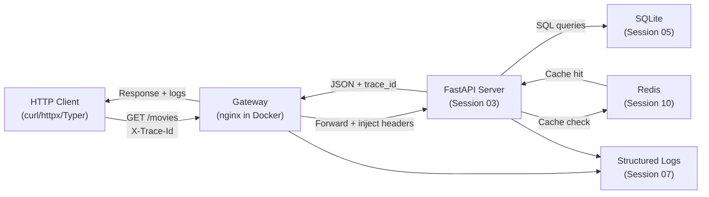

# Session 02 – Introduction to Hypertext Transfer Protocol (HTTP) and Representational State Transfer (REST)

- **Date:** Monday, Nov 10, 2025
- **Theme:** Demystify HTTP request/response flows and capture reusable probes that will shape Exercise 1 (EX1).

## Core Concepts (Own These by End of Session)

### 1. Client–Server Over HTTP
- **Client** initiates (browser, curl, httpx, your Typer CLI). **Server** listens and responds (FastAPI `/movies`).
- **Daily life**: You order food (client), kitchen cooks only when asked (server).
- **Test yourself**: Point at code and say "this is client" / "this is server" without hesitation.

### 2. Request–Response Cycle
Every HTTP exchange is:
```
Request  = method + URL (path + query) + headers + optional body
Response = status code + headers + optional body
```

**Anchor example:**
```http
GET /movies?limit=10 HTTP/1.1
X-Trace-Id: 123abc

200 OK
X-Trace-Id: 123abc
[{"id": 1, "title": "Alien"}]
```
**Goal**: Read raw HTTP and label every part without help.

### 3. Stateless Server
- Each request carries everything the server needs (auth token, params).
- Server forgets you between requests unless you give it a token.
- **Why it matters**: Easier scaling, simpler debugging.

### 4. REST: Resource-First (Not RPC)
- **Nouns** in paths (`/movies`, `/movies/42`), **verbs** in HTTP methods.
- **Good**: `GET /movies`, `POST /movies`, `DELETE /movies/42`
- **Smelly**: `POST /createMovie`, `GET /getAllMovies`
- **Test**: Hide methods and look only at URLs. Do they look like *things* (✅) or *actions* (❌)?

### 5. CRUD ↔ HTTP Verbs + Idempotency

| Action | Verb | Idempotent? | Example |
|--------|------|-------------|---------|
| Create | `POST /movies` | No (retry creates duplicate) | Body: `{"title": "Alien"}` |
| Read | `GET /movies`, `GET /movies/42` | Yes (safe, cacheable) | No body |
| Update (replace) | `PUT /movies/42` | Yes (retry safe) | Body: full object |
| Update (partial) | `PATCH /movies/42` | Sometimes | Body: `{"year": 2011}` |
| Delete | `DELETE /movies/42` | Yes (repeat = same end state) | Returns `204` even if already gone |

**Idempotent** = doing it twice gives same result. Think of a simple math function:

- `f(x) = |x|` (absolute value) is idempotent because once the number is positive, applying `f` again keeps it the same: `f(f(-3)) = f(3) = 3`.
- `f(x) = x + 1` is **not** idempotent because `f(f(x)) = x + 2`.

In HTTP terms, calling `PUT /movies/42` twice leaves the resource in the same state (like `f(x) = 1`), but calling `POST /movies` twice creates two records (like `f(x) = x + 1`).  
**Safe** = doesn't change data (e.g., GET); **idempotent** = same end state even if repeated (e.g., PUT, DELETE).

### 6. Gateway (Reverse Proxy)
- Sits **in front of** app servers (nginx before FastAPI).
- Routes traffic, adds headers, terminates SSL, rate-limits, logs.
- **Does NOT own business logic** (that's the server's job).
- **Daily life**: Reception desk logs visitors and directs them, but doesn't do the actual work.
- **Your stack**: `curl/Typer → nginx → FastAPI`

### 7. Trace ID (Observability First-Class Citizen)
- **Rule**: Every request carries `X-Trace-Id`. Gateway and server propagate it. Logs and errors include it.
- **Daily life**: Package tracking number used at every hop.
- **EX1 contract**:
```json
{
  "status": 404,
  "error": "resource_not_found",
  "detail": "Movie 42 not found",
  "trace_id": "123abc"
}
```

### 8. Status Code Vocabulary (Must Own)
- `200` OK, `201` Created, `204` No Content
- `400` Bad Request, `404` Not Found, `422` Validation Failed, `429` Too Many Requests
- `500+` Server error (never leak stack traces)

Link every EX1 error path to one of these.

### 9. Tools = Same Concept, Different Ergonomics
- **curl**: raw, scriptable, shows HTTP anatomy
- **VS Code REST Client**: visual, good for `.http` recipes
- **httpx + Typer**: programmable, testable, becomes EX1 test harness

Same mental model: client crafts request, reads response.

---

## Learning Objectives
- Explain client-server architecture and the gateway pattern using nginx and Docker MCP as concrete examples.
- Break down every component of an HTTP request and response (method, path, query, headers, cookies, body, status code).
- Map CRUD (Create, Read, Update, Delete) operations to HTTP verbs using the `/movies` resource you'll ship in EX1.
- Contrast "resource-first" REST patterns with ad-hoc remote procedure call (RPC) flows so students can spot good API design.
- Call public APIs with `httpx`, `curl`, and the VS Code REST Client, piping outputs through `python -m json.tool` for fast inspection.
- Automate exploratory requests behind a Typer CLI so EX1 debugging is repeatable.
- Document baseline contracts (`.http` files + error format checklist) that evolve into EX1 tests.

## Concept Jumpstart (Explain Like I'm New)

**Core architecture (read these in order):**
- **Client:** Anything that starts the conversation (browser tab, `curl`, `httpx`, Typer CLI). It crafts the HTTP request and decides what to do with the response.
- **Server:** The program waiting for requests (FastAPI in EX1). It listens on a port, runs business logic, and sends responses.
- **HTTP:** The simple language both sides speak—verbs (GET/POST/PUT/DELETE), paths (`/movies`), headers (`Accept`, `X-Trace-Id`), and optional body JSON.
- **Gateway (reverse proxy):** Sits between clients and servers to handle cross-cutting concerns (logging, SSL, caching, rate limiting) without changing app code. Nginx is our gateway.

**REST fundamentals:**
- **Resources:** REST says "treat everything like a noun." `/movies/42` is a resource; the HTTP verb describes the action.
- **CRUD mapping:** Create → POST, Read → GET, Update → PUT/PATCH, Delete → DELETE. We'll drill this into muscle memory before EX1.
- **Idempotency:** Safe to retry. `GET` and `PUT` are idempotent; `POST` usually isn't (retry creates duplicate resources).

**Observability:**
- **Trace ID:** A short ID the client generates so every hop (client → gateway → server → database) can log the same value. It's our "package tracking number."

**Tooling landscape:**
- **`curl`:** One-off command-line requests, great for spot-checks and shell scripts.
- **VS Code REST Client:** GUI helper for visually constructing requests and sharing `.http` snippets.
- **`httpx` + Typer:** Python client we can wrap in a CLI, add tests to, and reuse across EX1 debugging.

**Proxy taxonomy:**
- **Forward proxy:** Hides clients (e.g., corporate proxy that anonymizes your laptop when browsing).
- **Reverse proxy (gateway):** Hides servers (e.g., nginx in front of FastAPI that routes traffic and adds headers).
- **Mental model:** Forward = "I represent you to the world." Reverse = "I represent your app to the world."

## Before Class – REST Warm-Up (JiTT)
**Complete these steps in your existing `hello-uv` workspace from Session 01:**

```bash
cd ~/repos/hello-uv  # or wherever you created it in Session 01
uv add httpx pydantic typer
```

Post the command output in Discord `#helpdesk` using **Problem → Action → Result → Desired** if anything fails.

Install the VS Code **REST Client** extension and verify connectivity:

```bash
curl https://httpbin.org/get?ping=preflight | python -m json.tool
```

Share the pretty-printed JSON screenshot in your lab thread so everyone confirms the tooling.

**AWS Academy:** Complete the **Cloud Foundations – Compute** module by **Tue Nov 25**; flag blockers early.

**Sanity check:** Re-run `uv run pytest -q` in `hello-uv` so the testing muscle stays warm.

## Admin & Homework Checkpoints
- **Roster sync:** Post your GitHub username **and** best contact email in the Discord `#roster-sync` channel before Session 02 ends so we can add you to the GitHub org, Classroom repos, and mailing list without delays.
- **AWS Academy – Cloud Foundations (Compute):** due **Tue Nov 25**; log blockers in `#helpdesk` immediately.
- **EX1 – FastAPI Foundations:** due **Tue Dec 2**. Revisit the [rubric](../exercises.md#ex1--fastapi-foundations) while you build the Typer probes in this session.
- **EX2 – Friendly Interface:** opens **Mon Dec 1**, due **Tue Dec 23**. Skim the [brief](../exercises.md#ex2--friendly-interface) now so today's HTTP probes feed directly into your UI/CLI plan.
- **EX3 – Capstone Polish (KISS):** kicks off **Mon Jan 5**, demo/upload window closes **Tue Feb 10**. Keep a running log in your repo for the [capstone checklist](../exercises.md#ex3--capstone-polish-kiss).

## Agenda
| Segment | Duration | Format | Focus |
| --- | --- | --- | --- |
| Part A – Recap & AWS checkpoint | 5 min | Guided discussion | Round-robin: automation/aliases from Session 01? AWS Compute module progress? |
| Part A – Client-server & gateway concepts | 10 min | Talk + board | Architecture fundamentals: client, server, gateway roles. |
| Part A – nginx+Docker gateway demo | 10 min | Live demo | Run nginx as reverse proxy, observe request/response flow. |
| Part A – HTTP mechanics, status codes, and error design | 15 min | Talk + whiteboard | Methods, status codes, headers, trace IDs, resource naming, idempotency. |
| Part A – Docker MCP gateway example | 5 min | Live demo | Show MCP tooling pattern that mirrors HTTP client design. |
| **Part B – Lab 1** | **45 min** | **Guided coding** | **Build reusable HTTP client with `httpx` + Typer CLI.** |
| Break | 10 min | — | Launch [10-minute timer](https://e.ggtimer.com/10minutes) and stretch. |
| **Part C – Lab 2** | **45 min** | **Guided practice** | **Capture `.http` recipes, validate error contracts, prep Schemathesis.** |
| EX1 briefing & backlog | 10 min | Talk + Q&A | Scope reminder, backlog items (pagination, rate limiting, Schemathesis). |

## Part A – Theory & Live Demos (45 Minutes)

### 1. Recap & AWS checkpoint (5 min)
Round-robin: automation/aliases from Session 01? AWS Compute module progress?

### 2. Client-server architecture fundamentals (10 min)

Kick off with an everyday analogy: the diner (client) reads the menu and places an order, the waiter (gateway) relays orders and checks IDs, and the kitchen (server) prepares food. Same idea with HTTP—clients send requests, gateways clean them up, servers cook the response.

**Draw on board:**
```
┌─────────┐      HTTP Request      ┌─────────┐      ┌──────────┐
│ Client  │ ───────────────────────>│ Gateway │─────>│  Server  │
│ (curl)  │                         │ (nginx) │      │ (FastAPI)│
└─────────┘<─ ─ ─ ─ ─ ─ ─ ─ ─ ─ ─ ─└─────────┘<─────└──────────┘
             HTTP Response
```

**Client responsibilities:**
- Initiates requests (browser, curl, httpx, mobile app)
- Constructs HTTP request (method, path, headers, body)
- Handles responses (parse JSON, retry on errors, cache)

**Server responsibilities:**
- Listens on port (80/443 for HTTP/HTTPS)
- Routes requests to handlers (FastAPI endpoints in EX1)
- Generates responses (status code, headers, JSON body)

**Gateway/Reverse Proxy responsibilities:**
- Sits between clients and servers
- Load balancing (distribute traffic across multiple servers)
- SSL termination (decrypt HTTPS, forward HTTP internally)
- Request routing (path-based: `/api/*` → FastAPI, `/static/*` → file server)
- Caching (store frequently accessed responses)
- Rate limiting (throttle abusive clients)
- Header injection (add `X-Forwarded-For`, `X-Trace-Id`)

**Key insight:** In EX1, your Typer CLI is the **client**. FastAPI is the **server**. In Session 04, we'll add nginx as a **gateway** for health checks and request logging before traffic reaches FastAPI.

### 3. nginx+Docker gateway demo (10 min)

**Goal:** Show HTTP request/response flow through a real gateway before students build their own client.

Create temporary demo directory:
```bash
mkdir -p ~/demo-nginx && cd ~/demo-nginx
```

**Create nginx config that proxies httpbin.org:**
```nginx
# filepath: ~/demo-nginx/nginx.conf
events {}

http {
    server {
        listen 8080;
        
        location / {
            # Gateway behavior: forward requests to upstream server
            proxy_pass https://httpbin.org;
            
            # Inject trace ID for observability
            proxy_set_header X-Gateway-Trace $request_id;
            
            # Preserve original client info
            proxy_set_header X-Forwarded-For $remote_addr;
            proxy_set_header Host httpbin.org;
        }
    }
}
```

**Run nginx in Docker:**

Make sure Docker Desktop (or dockerd) is running before you execute the container commands. If Docker is stopped, start it now so the following steps succeed.

```bash
docker run --rm -d \
  --name demo-gateway \
  -p 8080:8080 \
  -v $(pwd)/nginx.conf:/etc/nginx/nginx.conf:ro \
  nginx:alpine

# Wait for startup
sleep 2

# Test gateway: your request → nginx:8080 → httpbin.org
curl http://localhost:8080/get?gateway=demo | python -m json.tool

# Check nginx logs to see request flow
docker logs demo-gateway

# Cleanup
docker stop demo-gateway
```

**Ask class while reviewing output:**
- "Where does the request originate?" (curl client)
- "What does nginx do?" (forwards to httpbin.org, adds headers)
- "Why would we use a gateway in EX1?" (centralize logging, SSL, rate limiting)

**Connection to EX1:** In Session 04, nginx will sit in front of FastAPI for health checks and structured logging before requests hit your application code.

**Forward vs reverse proxy cheat sheet:**
- **Forward proxy:** Lives near the client. Example: corporate proxy that hides every developer's laptop IP when browsing the public internet.
- **Reverse proxy (gateway):** Lives near the server. Example: nginx in front of FastAPI that hides the app containers and decides which one should receive the request.
- **Mental model:** If the proxy represents you (the client) to the world, it's forward. If it represents your app (the server) to the world, it's reverse.

**Use-case checklist for gateways/reverse proxies:**
- Add headers (`X-Trace-Id`, `X-Forwarded-For`) without changing app code.
- Retry or circuit-break misbehaving backends.
- Terminate SSL once, then send plain HTTP on your private network.
- Serve `/static/*` locally while forwarding `/api/*` to FastAPI.

### 4. HTTP mechanics, status codes, and error design (15 min)

**Draw full stack with trace propagation:**
```
Browser → nginx (gateway) → FastAPI (Session 03) → SQLite (Session 05) → Redis (Session 10)
   ↓         ↓                    ↓                     ↓                    ↓
trace_id  trace_id            trace_id              trace_id             trace_id
```

**Status codes:**
- 2xx: success (200 OK, 201 Created, 204 No Content)
- 3xx: redirects (301 Moved Permanently, 304 Not Modified)
- 4xx: client errors (400 Bad Request, 401 Unauthorized, 404 Not Found, 422 Validation, 429 Too Many Requests)
- 5xx: server errors (500 Internal Server Error, 503 Service Unavailable)

**Critical headers:**
- `Accept`, `Content-Type`: content negotiation (JSON vs XML)
- `Authorization`: auth tokens (Session 06)
- `X-Trace-Id`: correlation across services (inject now, visualize in Session 07)
- `X-Forwarded-For`: original client IP (gateway adds this)
- `Retry-After`: rate limiting (429 responses)

**Standard error envelope for EX1 (introduce now, implement in Session 03):**

Every error response must include these four fields:
```json
{
  "status": 404,
  "error": "resource_not_found",
  "detail": "Movie with ID 42 does not exist",
  "trace_id": "demo-1234"
}
```

**Why this structure?**
- `status`: Mirrors HTTP code for consistency
- `error`: Machine-readable identifier for programmatic handling
- `detail`: Human-friendly explanation for debugging
- `trace_id`: Links error to logs across all services

**Anti-pattern:** Leaking stack traces or framework exceptions in production responses. All 5xx errors must sanitize internal details.

**HTTP Methods:**
- GET: safe, idempotent, cacheable (fetch resources)
- POST: creates resources (not idempotent—retry creates duplicates)
- PUT: idempotent update (safe to retry)
- PATCH: partial update
- DELETE: removes resource

**CRUD ↔ HTTP verbs (anchor everything to `/movies`):**

| CRUD action | HTTP verb | Example request | Expected response | Notes |
| --- | --- | --- | --- | --- |
| Create | `POST /movies` | Body: `{"title": "Inception", "year": 2010}` | `201 Created` + `Location: /movies/42` | Server generates ID. |
| Read (list) | `GET /movies?limit=10` | No body | `200 OK` + array | Safe to repeat; caches well. |
| Read (single) | `GET /movies/42` | No body | `200 OK` + object, or `404` | Must return error envelope on 404. |
| Update/Replace | `PUT /movies/42` | Body: full movie object | `200 OK` or `204 No Content` | Idempotent—retry safe. |
| Update/Patch | `PATCH /movies/42` | Body: `{"year": 2011}` | `200 OK` | Only changed fields. Not always idempotent. |
| Delete | `DELETE /movies/42` | No body | `204 No Content` | Should return 204 even if called twice (idempotent). |

**REST resource naming:**
- ✅ `/movies` (collection), `/movies/{id}` (item), `/movies/{id}/ratings` (sub-resource)
- ❌ `/getMovie`, `/createMovie` (RPC smell—verbs belong in HTTP method, not path)
- ✅ `PUT /movies/{id}` is idempotent (same request twice = same result)
- ❌ `POST /movies/{id}` breaks REST conventions (POST to item is create, not update)

**REST vs RPC with `/movies` example:**

**REST approach:**
```http
GET /movies/42          # Read
POST /movies            # Create
PUT /movies/42          # Update
DELETE /movies/42       # Delete
```

**RPC approach (avoid):**
```http
POST /getMovie          # Everything is POST
POST /createMovie
POST /updateMovie
POST /deleteMovie
```

**REST wins because:**
- Clients learn pattern once, predict new endpoints (`/ratings`, `/users`)
- HTTP caching works (browsers cache GET, not POST)
- Gateway knows which verbs to rate-limit (POST/PUT/DELETE are write ops)

**Discussion point:** Every request in EX1 must generate or accept a trace ID so we can correlate logs, errors, and cache hits across all layers.

### 5. Docker MCP gateway pattern (5 min)

This is a stretch demo—skip if time is tight or Docker MCP tooling isn't installed. The core client/server/gateway lessons are already covered by nginx.

**Goal:** Show how gateway pattern applies to AI tooling, reinforcing the client-server-gateway mental model.

Docker MCP (Model Context Protocol) exposes AI tools through a gateway that multiple clients can call:

```bash
# Pull DuckDuckGo search tool (MCP server)
docker pull mcp/duckduckgo

# Enable it in gateway
docker mcp server enable duckduckgo

# Run gateway (like nginx, but for AI tools)
docker mcp gateway run --servers=duckduckgo &

# Client calls gateway to list available tools
docker mcp tools ls

# Client calls search tool through gateway
docker mcp tools call search query="Yossi Eliaz" max_results=3
```

**Analogy breakdown:**
- **Client:** `docker mcp tools call` (like curl/httpx in Lab 1)
- **Gateway:** `docker mcp gateway` (like nginx, routes requests to correct tool)
- **Server:** `duckduckgo` MCP server (like FastAPI, implements business logic)

**Connection to EX1:** Your Typer CLI in Part B is the client. FastAPI is the server. In Session 04, nginx becomes the gateway. Same architecture pattern at different scales.

### 6. Preview EX1 architecture (5 min)



**Contract:** Every component must accept and propagate `X-Trace-Id` for end-to-end observability.

**Next session bridge:** In Session 03, you'll build the FastAPI **server** that your Typer client calls. We'll implement the `/movies` CRUD endpoints from the table above and ensure every error matches the envelope structure. The gateway (nginx) joins in Session 04.

## Part B – Hands-on Lab 1 (45 Minutes)

**Goal:** Build an HTTP client that demonstrates client-side responsibilities from the architecture diagram.

**Flow for the lab:**
1. **Observe:** Re-run `curl https://httpbin.org/get` and highlight method (GET), path (/get), headers (Accept), response status (200).
2. **Translate:** Replace curl with `httpx` in Python so we can add Pydantic validation and pytest.
3. **Automate:** Wrap `httpx` in Typer so `uv run python -m app.cli echo` becomes your reusable CRUD probe.
4. **Test:** Write one pytest that verifies the client handles the server's JSON contract correctly.

### Scaffold inside hello-uv

**We're extending the existing `hello-uv` workspace from Session 01—do NOT create a new project.**

```bash
cd ~/repos/hello-uv
uv sync
mkdir -p app tests
touch app/__init__.py app/http_client.py app/cli.py
```

If dependencies are missing:
```bash
uv add httpx pydantic typer
```

### Implement `app/http_client.py`

Create the HTTP client with trace ID generation:

```python
# filepath: app/http_client.py
from __future__ import annotations

import logging
import uuid
from typing import Any

import httpx
from pydantic import BaseModel

logger = logging.getLogger(__name__)


class PingResponse(BaseModel):
    """Validate httpbin.org echo response.
    
    This models the server's response format—Pydantic ensures
    the server contract matches our expectations.
    """
    args: dict[str, Any]
    headers: dict[str, Any]
    url: str
    origin: str


def ping(city: str = "Haifa") -> PingResponse:
    """HTTP client that calls httpbin.org with trace header.
    
    Client responsibilities demonstrated:
    - Generate trace ID for observability
    - Construct HTTP request (method, URL, headers, params)
    - Handle response (validate JSON, check status, log)
    - Propagate errors with context
    
    Args:
        city: Query parameter to echo back
        
    Returns:
        Validated response model
        
    Raises:
        httpx.HTTPStatusError: On 4xx/5xx responses
        httpx.TimeoutException: On network timeout
    """
    trace_id = uuid.uuid4().hex[:8]
    
    # httpx.Client is the HTTP client component
    with httpx.Client(timeout=httpx.Timeout(10.0)) as client:
        response = client.get(
            "https://httpbin.org/get",  # Server endpoint
            params={"city": city},
            headers={
                "Accept": "application/json",
                "X-Trace-Id": trace_id,  # Client-generated trace ID
            },
        )
        response.raise_for_status()  # Fail fast on errors
        
        # Validate server response matches expected contract
        payload = PingResponse.model_validate(response.json())
        
        logger.info(
            "httpbin echo",
            extra={"trace_id": trace_id, "status_code": response.status_code},
        )
        return payload
```

**Discussion checkpoint:**
- "What happens if httpbin.org returns 500?" (raise_for_status throws exception)
- "Why short trace ID?" (easier to grep logs during debugging)
- "How does Pydantic help?" (catches contract violations before they reach application logic)

### Wire Typer CLI (`app/cli.py`)

```python
# filepath: app/cli.py
import json
import logging
from typing import Optional

import typer

from .http_client import ping

logging.basicConfig(level=logging.INFO, format="%(levelname)s %(message)s")

app = typer.Typer(help="HTTP client probes for EX1 preflight")


@app.command()
def echo(city: str = typer.Argument("Haifa"), pretty: bool = True) -> None:
    """Call httpbin.org and print validated JSON.
    
    Examples:
        uv run python -m app.cli echo
        uv run python -m app.cli echo Tel-Aviv --no-pretty
    """
    response = ping(city=city)
    if pretty:
        typer.echo(json.dumps(response.model_dump(), indent=2))
    else:
        typer.echo(response.model_dump_json())


@app.command()
def headers(city: str = "Haifa") -> None:
    """Print headers echoed back by httpbin.org.
    
    Check for X-Trace-Id in output to confirm trace propagation.
    """
    response = ping(city=city)
    for key, value in response.headers.items():
        typer.echo(f"{key}: {value}")


def main(argv: Optional[list[str]] = None) -> None:
    app(standalone_mode=True)


if __name__ == "__main__":
    main()
```

### Run and verify client behavior

```bash
uv run python -m app.cli echo --city Tel-Aviv
uv run python -m app.cli headers --city London
```

**Ask class to identify:**
- Where is the client? (Typer CLI wrapping httpx)
- Where is the server? (httpbin.org)
- Where would a gateway fit? (between client and httpbin, like nginx demo)

**Check:** Highlight `X-Trace-Id` in headers output. Ask: "How would you propagate this to FastAPI logs in Session 03?"

> 🎉 **Quick win:** Structured JSON output with trace IDs confirms your client can drive HTTP servers repeatably.

**Map to CRUD:** Today's `echo` command is the "Read" action (GET). In Session 03, you'll add commands for:
- `create` → `POST /movies` with JSON body
- `list` → `GET /movies` with optional filters
- `update` → `PUT /movies/{id}` with full object
- `delete` → `DELETE /movies/{id}` and verify 204 response

Same `httpx` client, just different verbs and paths.

### Add pytest smoke test

```python
# filepath: tests/test_ping.py
from app.http_client import ping


def test_ping_default_city():
    """Verify httpbin.org connectivity and response contract.
    
    This is a client-side test: validates our client correctly
    handles the server's response format.
    """
    response = ping()
    assert response.args["city"] == "Haifa"
    assert response.url.startswith("https://httpbin.org")
    # In Session 07, we'll mock this to avoid flaky network tests
```

```bash
uv run pytest -q tests/test_ping.py
```

## Part C – Hands-on Lab 2 (45 Minutes)

**Goal:** Capture reusable request patterns and validate the error envelope contract you'll implement in Session 03.

### Create `.http` request collection

```http
<!-- filepath: requests.http -->
### GET with trace ID (client → server)
GET https://httpbin.org/get?city=Haifa
Accept: application/json
X-Trace-Id: demo-1234

### POST form data (client sends payload to server)
POST https://httpbin.org/post
Content-Type: application/x-www-form-urlencoded
X-Trace-Id: demo-5678

name=EASS
cohort=2025

### HEAD for metadata only (client asks for headers, no body)
HEAD https://httpbin.org/get
Accept: application/json

### Trigger 404 error (server error response)
GET https://httpbin.org/status/404
Accept: application/json
X-Trace-Id: demo-404

###
```

**Walkthrough:** Send each request from VS Code (Cmd/Ctrl+Alt+R). Point out client role (constructing request) vs server role (generating response).

### Validate error envelope contract

**Goal:** Create test cases that your FastAPI server must pass in Session 03.

```markdown
<!-- filepath: docs/contracts/http-errors.md -->
## Standard Error Envelope (Server-Side Contract)

All EX1 error responses must follow this structure so clients can parse errors programmatically:

```json
{
  "status": <HTTP status code>,
  "error": "<machine_readable_identifier>",
  "detail": "<human explanation>",
  "trace_id": "<echo inbound X-Trace-Id or generate new>"
}
```

### Test Cases for Session 03

**404 Resource Not Found:**
```http
GET http://localhost:8000/movies/99999
X-Trace-Id: test-404

# Expected response:
# Status: 404
# Body:
{
  "status": 404,
  "error": "resource_not_found",
  "detail": "Movie with ID 99999 does not exist",
  "trace_id": "test-404"
}
```

**422 Validation Error:**
```http
POST http://localhost:8000/movies
Content-Type: application/json
X-Trace-Id: test-422

{
  "year": 2010
}

# Expected response (missing required field 'title'):
# Status: 422
# Body:
{
  "status": 422,
  "error": "validation_failed",
  "detail": "Field 'title' is required",
  "trace_id": "test-422"
}
```

**500 Internal Server Error:**
```http
GET http://localhost:8000/movies?trigger_error=true
X-Trace-Id: test-500

# Expected response (sanitized, no stack trace):
# Status: 500
# Body:
{
  "status": 500,
  "error": "internal_error",
  "detail": "An unexpected error occurred. Check logs with trace_id.",
  "trace_id": "test-500"
}
```

### Server Implementation Checklist

- [ ] All 4xx and 5xx responses follow envelope structure
- [ ] Never leak stack traces or framework internals in `detail`
- [ ] Echo `X-Trace-Id` from request header (or generate if missing)
- [ ] Log trace_id with every error for correlation
- [ ] Include status code in both HTTP response and JSON body
- [ ] FastAPI exception handlers catch all errors and format consistently
```

**Discussion:** Save these `.http` snippets. In Session 03, you'll run them against your FastAPI server to verify error handling before submitting EX1.

### Prepare Schemathesis for contract testing

Schemathesis acts as an adversarial client that tries to break your server's contract:

```bash
uv add schemathesis
```

**Motivation:** In EX1, you'll define OpenAPI schemas for `/movies` endpoints. Schemathesis generates edge-case requests (empty strings, negative IDs, oversized payloads) that stress-test your server's validation.

**Demo (optional if time permits):**
```bash
# Once EX1 is running, you'll run:
# uv run schemathesis run http://localhost:8000/openapi.json \
#   --checks status_code_conformance \
#   --hypothesis-max-examples=50
```

Reinforce: This is optional for baseline EX1 but required for excellence submissions. Start with manual `.http` client tests, add Schemathesis after CRUD works.

### Document and share findings

Have each student post in their Discord lab thread:
- One `.http` snippet from the error envelope test cases they want to implement first
- One edge case they discovered (e.g., negative movie ID, missing trace header)
- One question about client-server-gateway architecture

## Before You Leave – Quick Verification

Run these commands to confirm your setup for Session 03:

```bash
# 1. Client works
uv run python -m app.cli echo --city Haifa

# 2. Tests pass
uv run pytest -q tests/test_ping.py

# 3. REST Client installed
code --list-extensions | grep humao.rest-client

# 4. Error contract document exists
cat docs/contracts/http-errors.md | head -n 5
```

If the `code` CLI isn't on your PATH, open VS Code → Extensions and confirm **REST Client** is installed manually, then return to the terminal for the other checks.

**Post a screenshot of all four succeeding in your Discord thread.** If any fail, ask in `#helpdesk` before leaving.

## EX1 Briefing & Backlog (10 Minutes)

Link to full brief: [docs/exercises.md](../exercises.md#ex1--fastapi-foundations)

**Core deliverables (due Tue Dec 2):**
- FastAPI server with CRUD for `/movies` and health endpoint
- nginx gateway container for request logging (Session 04)
- Error responses match `docs/contracts/http-errors.md`
- 80% branch coverage with pytest (Session 07)

**Backlog items (prioritize for excellence):**
- Pagination & filtering (`?limit=10&offset=20`)
- Rate limiting with `slowapi` (429 responses with `Retry-After` header)
- OpenAPI examples for happy/sad paths
- Schemathesis integration for fuzz testing
- ETag/`If-None-Match` caching demo

**Architecture reminder:** Your Typer client from today becomes the test harness. FastAPI is the server. nginx is the gateway. All three must propagate trace IDs.

**Next session preview:** You'll implement the FastAPI **server** that responds to your Typer client. We'll build `/movies` CRUD endpoints, ensure errors match `docs/contracts/http-errors.md`, and add trace ID middleware. Bring questions about FastAPI routing and dependency injection.

## Common Pitfalls

- **Confusing client vs server responsibilities** – client initiates requests and handles responses; server listens, routes, and generates responses.
- **Forgetting gateway role** – gateways don't implement business logic, they route/transform/log requests between clients and servers.
- **Missing trace ID propagation** – every component (client, gateway, server) must accept and forward trace IDs for observability.
- **CRUD verb mix-ups** – using `POST /movies/{id}` for updates (should be PUT), or forgetting DELETE should return 204 even when item doesn't exist.
- **Leaking stack traces** – 500 errors must return sanitized error envelope, not raw exceptions.
- **Typer command exits immediately** – ensure `if __name__ == "__main__":` block calls `main()`.

## Troubleshooting Notes

- **nginx container won't start:** check `docker logs demo-gateway` for config syntax errors.
- **httpx.ConnectTimeout:** verify campus VPN/proxy settings; demonstrate adding longer timeout.
- **VS Code REST Client 401s:** some APIs require specific headers—check extension docs for auth setup.

## Student Success Criteria

By the end of Session 02, every student should be able to:

- [ ] Explain client-server-gateway architecture and draw a request/response flow diagram.
- [ ] Map CRUD verbs to the `/movies` API and choose the correct HTTP method for each action.
- [ ] Run nginx as a gateway and trace an HTTP request through docker logs.
- [ ] Build an HTTP client with httpx that generates trace IDs and validates responses.
- [ ] Capture `.http` request patterns and document server-side error contracts for EX1.

**If a student cannot check any box above, schedule an office-hours pairing before Session 03.**

## AI Prompt Seeds

- "Explain the difference between HTTP client responsibilities and server responsibilities with code examples."
- "Generate nginx config that acts as a gateway: adds X-Trace-Id header and forwards to FastAPI backend."
- "Draft a Typer CLI that wraps httpx requests and propagates trace IDs for observability."
