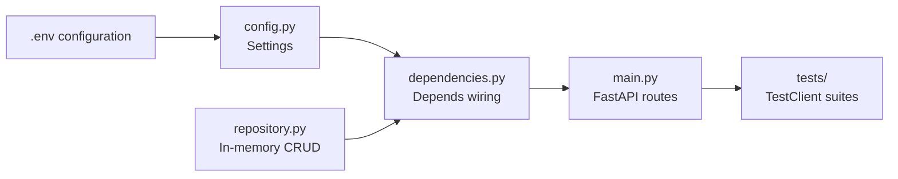

# Session 03 – FastAPI Fundamentals (Movie Service v0)

- **Date:** Monday, Nov 17, 2025
- **Theme:** Stand up the first FastAPI version of the movie service with dependency injection, validation, and reproducible tests.

## Learning Objectives
- Map Hypertext Transfer Protocol (HTTP) verbs to FastAPI path operations and enforce validation with Pydantic v2 (`model_validate`, `model_dump`, validators).
- Use FastAPI dependency injection to share settings and in-memory repositories safely between requests.
- Propagate `X-Trace-Id` trace identifier (ID) headers from clients (Session 02) through responses and logs to pave the way for observability.
- Practice red→green testing with `pytest` and `TestClient`, covering both happy-path and error responses.

## Before Class – FastAPI Preflight (Just-in-Time Teaching, JiTT)
- In `hello-uv`, install the core stack:
  ```bash
  uv add fastapi uvicorn pydantic pydantic-settings httpx pytest
  ```
  Post any failures in Discord `#helpdesk` using **Problem → Action → Result → Desired**.
- Create `.env.example` (keep real secrets out of Git):
  ```ini
  MOVIE_APP_NAME="Movie Service"
  MOVIE_DEFAULT_PAGE_SIZE=20
  MOVIE_FEATURE_PREVIEW=false
  ```
- Watch the FastAPI “path operations” video (link in LMS) and write down two validation questions for discussion.

## Agenda
| Segment | Duration | Format | Focus |
| --- | --- | --- | --- |
| Recap & intent setting | 7 min | Discussion | Share wins from the Session 02 Typer probe; surface `.env` questions. |
| FastAPI anatomy & dependency injection (DI) | 18 min | Talk + live coding | Path operations, dependency injection (`Depends`), settings, repositories. |
| Micro demo: pytest red→green | 3 min | Live demo (≤120 s) | Start from a failing test, make it pass, rerun the suite. |
| Validation & trace propagation | 17 min | Talk + whiteboard | Pydantic v2 features, 422 errors, `X-Trace-Id` middleware, OpenAPI docs. |
| **Part B – Lab 1** | **45 min** | **Guided coding** | **Scaffold FastAPI app with settings + repository dependency injection (DI).** |
| Break | 10 min | — | Launch the shared [10-minute timer](https://e.ggtimer.com/10minutes). |
| **Part C – Lab 2** | **45 min** | **Guided testing** | **TestClient suite, red→green workflow, contract assertions.** |
| Wrap-up & Exercise 1 (EX1) checklist | 10 min | Questions and Answers (Q&A) | Reinforce deliverables + backlog (pagination, OpenAPI examples, feature flags). |

## Part A – Theory Highlights
1. **Request flow sketch:** Client (Typer CLI) → FastAPI router → dependency graph → repository → response. Highlight where validation triggers and where trace IDs enter logs.
2. **Dependency injection primer:** `Depends(get_settings)` returns a singleton `Settings` instance; `Depends(get_repository)` shares the in-memory repo while remaining swappable for SQLite in Session 05.
3. **Validation vocabulary:** `model_validate`, `model_dump`, `field_validator`, `model_config`. Emphasize descriptive errors (never stack traces).
4. **Micro demo (≤120 s):**
   ```bash
   uv run pytest tests/test_movies.py::test_create_movie_returns_201 -q  # expect red
   uv run pytest -q                                                     # turn it green
   ```
   Call out how quick feedback guides implementation.
5. **Trace propagation:** If the client sends `X-Trace-Id`, echo it back. Otherwise generate and log it. Preview how Logfire—a hosted structured-logging service from the Pydantic team—will hook into the same context in Session 07 so every request has searchable metadata.



## Part B – Hands-on Lab 1 (45 Minutes)

### Lab timeline
- **Minutes 0–10** – Create `Settings` and repository scaffolding.
- **Minutes 10–25** – Wire FastAPI routes with dependency injection.
- **Minutes 25–35** – Add trace-ID middleware and logging.
- **Minutes 35–45** – Smoke-test endpoints via Swagger user interface (UI) and `curl`.
### 1. Create `app/config.py`
```python
from pydantic_settings import BaseSettings, SettingsConfigDict


class Settings(BaseSettings):
    app_name: str = "Movie Service"
    default_page_size: int = 20
    feature_preview: bool = False

    model_config = SettingsConfigDict(
        env_file=".env",
        env_prefix="MOVIE_",
        extra="ignore",
    )
```

### 2. Create `app/repository.py`
```python
from __future__ import annotations

from typing import Dict, Iterable

from pydantic import BaseModel, Field, model_validator


class Movie(BaseModel):
    id: int
    title: str
    year: int = Field(ge=1900, le=2100)
    genre: str


class MovieCreate(BaseModel):
    title: str
    year: int = Field(ge=1900, le=2100)
    genre: str

    @model_validator(mode="after")
    def normalize_genre(cls, values):
        values.genre = values.genre.title()
        return values


class MovieRepository:
    def __init__(self) -> None:
        self._items: Dict[int, Movie] = {}
        self._next_id = 1

    def list(self) -> Iterable[Movie]:
        return self._items.values()

    def create(self, payload: MovieCreate) -> Movie:
        movie = Movie(id=self._next_id, **payload.model_dump())
        self._items[movie.id] = movie
        self._next_id += 1
        return movie

    def get(self, movie_id: int) -> Movie | None:
        return self._items.get(movie_id)

    def delete(self, movie_id: int) -> None:
        self._items.pop(movie_id, None)
```

### 3. Create `app/dependencies.py`
```python
from collections.abc import Generator
from typing import Annotated

from fastapi import Depends

from .config import Settings
from .repository import MovieRepository

_settings = Settings()
_repository = MovieRepository()


def get_settings() -> Settings:
    return _settings


def get_repository() -> Generator[MovieRepository, None, None]:
    yield _repository

SettingsDep = Annotated[Settings, Depends(get_settings)]
RepositoryDep = Annotated[MovieRepository, Depends(get_repository)]
```

### 4. Build `app/main.py`
```python
from __future__ import annotations

import logging
import uuid

from fastapi import Depends, FastAPI, HTTPException, Request, status

from .dependencies import RepositoryDep, SettingsDep
from .repository import Movie, MovieCreate

logger = logging.getLogger("movie-service")
logging.basicConfig(level=logging.INFO, format="%(levelname)s %(message)s")

app = FastAPI(title="Movie Service", version="0.1.0")


@app.middleware("http")
async def add_trace_id(request: Request, call_next):
    trace_id = request.headers.get("X-Trace-Id", uuid.uuid4().hex[:8])
    request.state.trace_id = trace_id
    response = await call_next(request)
    response.headers["X-Trace-Id"] = trace_id
    return response


@app.get("/health", tags=["diagnostics"])
def health(settings: SettingsDep) -> dict[str, str]:
    return {"status": "ok", "app": settings.app_name}


@app.get("/movies", response_model=list[Movie], tags=["movies"])
def list_movies(repository: RepositoryDep) -> list[Movie]:
    return [movie for movie in repository.list()]


@app.post(
    "/movies",
    response_model=Movie,
    status_code=status.HTTP_201_CREATED,
    tags=["movies"],
)
def create_movie(
    payload: MovieCreate,
    repository: RepositoryDep,
    request: Request,
) -> Movie:
    movie = repository.create(payload)
    logger.info(
        "movie.created",
        extra={"movie_id": movie.id, "trace_id": request.state.trace_id},
    )
    return movie


@app.get("/movies/{movie_id}", response_model=Movie, tags=["movies"])
def read_movie(movie_id: int, repository: RepositoryDep) -> Movie:
    movie = repository.get(movie_id)
    if movie is None:
        raise HTTPException(
            status_code=status.HTTP_404_NOT_FOUND,
            detail="Movie not found",
        )
    return movie


@app.delete(
    "/movies/{movie_id}",
    status_code=status.HTTP_204_NO_CONTENT,
    tags=["movies"],
)
def delete_movie(movie_id: int, repository: RepositoryDep, request: Request) -> None:
    if repository.get(movie_id) is None:
        raise HTTPException(
            status_code=status.HTTP_404_NOT_FOUND,
            detail="Movie not found",
        )
    repository.delete(movie_id)
    logger.info(
        "movie.deleted",
        extra={"movie_id": movie_id, "trace_id": request.state.trace_id},
    )
```

### 5. Run the service
```bash
uv run uvicorn app.main:app --reload
```
Navigate to `http://localhost:8000/docs` and show how the OpenAPI schema reflects response models and error codes. Point out the `X-Trace-Id` header in the Response tab.

> 🎉 **Quick win:** Seeing `/health` return `{"status": "ok", "app": "Movie Service"}` confirms your DI wiring and middleware are behaving.

### 6. Optional: seed feature-preview data
Add `scripts/seed.py`:
```python
from app.dependencies import get_repository, get_settings
from app.repository import MovieCreate

settings = get_settings()
repo = next(get_repository())

if settings.feature_preview:
    repo.create(MovieCreate(title="Interstellar", year=2014, genre="sci-fi"))
    repo.create(MovieCreate(title="Arrival", year=2016, genre="sci-fi"))
    print("Seeded preview movies")
else:
    print("Feature preview disabled")
```
Run `uv run python scripts/seed.py` after toggling `MOVIE_FEATURE_PREVIEW=true` in `.env` to demo feature flags.

## Part C – Hands-on Lab 2 (45 Minutes)

### Lab timeline
- **Minutes 0–10** – Configure `TestClient` and baseline tests.
- **Minutes 10–25** – Add 201/404/validation cases with headers.
- **Minutes 25–35** – Practice red→green by breaking/restoring validation logic.
- **Minutes 35–45** – Export OpenAPI schema and discuss contract testing.
### 1. Create tests with `TestClient`
`tests/test_movies.py`:
```python
from fastapi.testclient import TestClient

from app.main import app

client = TestClient(app)


def test_health_includes_app_name():
    response = client.get("/health")
    assert response.status_code == 200
    assert response.json() == {"status": "ok", "app": "Movie Service"}


def test_create_movie_returns_201_and_trace_id():
    response = client.post(
        "/movies",
        json={"title": "The Matrix", "year": 1999, "genre": "sci-fi"},
        headers={"X-Trace-Id": "demo-1234"},
    )
    assert response.status_code == 201
    payload = response.json()
    assert payload["genre"] == "Sci-Fi"
    assert response.headers["X-Trace-Id"] == "demo-1234"


def test_missing_movie_returns_404():
    response = client.get("/movies/4242")
    assert response.status_code == 404
    assert response.json()["detail"] == "Movie not found"
```
Run `uv run pytest -q` and celebrate the green dots.

> 🎉 **Quick win:** Green dots mean your API contract survived a full test run—commit the suite before moving to migrations.

### 2. Red→green ritual
- Comment out the `normalize_genre` validator → rerun tests (expect failure) → restore it.
- Capture a screenshot of the failing assertion to emphasize evidence-based debugging.

### 3. Export API contract
```bash
uv run python - <<'PY'
from pathlib import Path
from fastapi.encoders import jsonable_encoder
from fastapi.openapi.utils import get_openapi

from app.main import app

schema = get_openapi(title=app.title, version=app.version, routes=app.routes)
Path("docs/contracts/openapi.json").write_text(jsonable_encoder(schema, by_alias=True))
print("Wrote docs/contracts/openapi.json")
PY
```
Share that Schemathesis (Session 02 stretch) can now target the real schema.

## Wrap-up & EX1 Checklist
- ✅ FastAPI CRUD skeleton with DI, settings, trace propagation, and tests.
- Add before next week: `PUT /movies/{id}`, pagination parameters (`skip`, `limit` defaults from `Settings`), error normalization matching Session 02 spec, and README updates.
- Remind students to log AI usage, keep `.env.example` updated, and push often.
- Point everyone to the full brief in [docs/exercises.md](../exercises.md#ex1--fastapi-foundations) to double-check rubric expectations.

## Troubleshooting
- **ImportError for `BaseSettings`:** verify `pydantic-settings` is installed; rerun `uv add pydantic-settings` if needed.
- **State bleeding between tests:** temporarily call cleanup methods in tests; Session 07 introduces fixtures for isolation.
- **OpenAPI docs not reloading:** ensure `uvicorn` is running with `--reload` and refresh the browser.

### Common pitfalls
- **Global state leaks** – avoid mutating module-level dictionaries in tests; create fixtures to reset state.
- **Trace-ID missing in responses** – middleware must run before routes; double-check it’s added near app definition.
- **Validation errors hard to read** – use `response.json()` in tests to assert `detail` values explicitly.

## Student Success Criteria

By the end of Session 03, every student should be able to:

- [ ] Configure FastAPI with dependency-injected settings and repositories.
- [ ] Expose CRUD endpoints that propagate `X-Trace-Id` headers.
- [ ] Run pytest suites covering happy paths and 404/422 error paths.

**If any box remains unchecked, schedule a mentor session before Session 04.**

## AI Prompt Seeds
- “Generate FastAPI endpoints that use dependency injection for settings and in-memory repositories.”
- “Write a Pydantic v2 validator that title-cases a genre field.”
- “Add middleware that reads an `X-Trace-Id` header, propagates it, and logs the value.”
