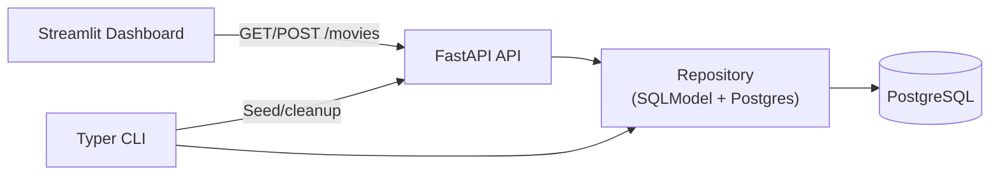

# Session 06 – Streamlit Dashboards + JavaScript Preview

- **Date:** Monday, Dec 8, 2025
- **Theme:** Build a Streamlit + Typer interface on top of the Postgres-backed FastAPI API, then preview the JavaScript/TypeScript concepts that power Session 07’s Vite/React stretch.

## Session Story
With Session 05’s PostgreSQL upgrade complete, the backend is durable enough to support real interfaces. Session 06 gives every team a demoable UI: a Streamlit dashboard for quick wins, cached API calls, forms that mutate data, and Typer/Rich helpers for operators. We close with a JavaScript/TypeScript primer so students walk into Session 07 ready to tackle Vite/React without feeling rusty.

## Learning Objectives
- Consume the FastAPI API from Streamlit using typed `httpx` clients, shared env vars, and cache invalidation.
- Build dashboards, filters, and forms that POST back to FastAPI while honoring trace identifiers (IDs).
- Automate seed/reset workflows with Typer + Rich on top of the Postgres repository.
- Preview key JavaScript/TypeScript concepts (modules, fetch, async/await, typing) that underpin next session’s Vite lab.

## What You’ll Build
- `frontend/client.py` – typed `httpx` helpers (`list_movies`, `create_movie`, `delete_movie`) with cached responses.
- `frontend/dashboard.py` – Streamlit UI that renders KPIs, tables, filters, charts, and creation forms.
- `scripts/ui.py` – Typer CLI for seeding, wiping, and exporting movies with Rich progress bars.
- `docs/runbooks/streamlit.md` – optional runbook snippet describing concurrent FastAPI + Streamlit workflows.

## Prerequisites
1. Session 05’s PostgreSQL setup must be running (`docker compose up -d db`) and `uv run pytest` should pass against Postgres.
2. Ensure `.env` contains `MOVIE_DATABASE_URL` and `MOVIE_API_BASE_URL=http://localhost:8000` (used by Streamlit client).
3. Install UI dependencies:
   ```bash
   uv add streamlit rich typer httpx python-dotenv pandas
   ```
4. Confirm FastAPI server runs locally (`uv run uvicorn movie_service.app.main:app --reload`).

### Pre-class Setup (JiTT)
1. Create a `frontend/` package with `client.py` + `__init__.py`.
2. Copy the Streamlit “hello world” snippet from the LMS, run `uv run streamlit run frontend/dashboard.py`, and verify the placeholder renders.
3. Pull the latest movies from Postgres (`SELECT COUNT(*) FROM movie;`) so you can confirm the dashboard is reading real data.
4. Skim the JavaScript primer slide deck; jot down one question to discuss during the preview section.

## Toolkit Snapshot
- **Streamlit** – Python-first UI framework for data dashboards and forms.
- **httpx** – typed HTTP client reused by Streamlit and Typer flows.
- **Typer + Rich** – CLI + terminal UX combo for seed/reset tasks.
- **PostgreSQL** – data source from Session 05; Streamlit only talks to FastAPI, not the DB directly.
- **Python-dotenv** – shares env vars between FastAPI, Streamlit, and Typer commands.
- **JavaScript/TypeScript primer** – short module to prep for Session 07’s Vite/React build.

## Agenda
| Segment | Duration | Format | Focus |
| --- | --- | --- | --- |
| Recap & intent | 10 min | Discussion | Why Postgres unlocks real UIs + EX2 expectations. |
| Streamlit + API primer | 20 min | Talk + live demo | Typed clients, caching, trace IDs, CORS. |
| **Part B – Lab 1** | **45 min** | **Guided coding** | **Client helpers + dashboard list view.** |
| Break | 10 min | — | Encourage cache questions, share Typer/Rich ideas. |
| **Part C – Lab 2** | **45 min** | **Guided build** | **Forms, admin CLI, README/run-book updates.** |
| Part D – JS/TS preview | 15 min | Talk + mini-demo | Syntax walkthrough + “hello fetch” bridging to Session 07. |
| Wrap-up & Vite runway | 10 min | Q&A | Checklist + next-session prep. |

## Part A – Theory Highlights
1. **Architecture reminder:** Streamlit communicates with FastAPI → repository → Postgres. No direct DB calls so we preserve tests and logging from earlier sessions.
2. **Typed clients reduce UI drift:** centralize headers (`X-Trace-Id`), base URLs, and response parsing. When the API changes, you update `frontend/client.py` once.
3. **Caching trade-offs:** pair Streamlit's `st.cache_data` with explicit invalidation after POST/DELETE requests.
4. **Trace identifiers (IDs):** Session 05 added X-Trace-Id middleware to FastAPI. Carry these IDs from Streamlit forms and Typer commands so you can correlate UI actions with backend logs. Session 07 will wire Logfire to visualize these traces.



### FastAPI CORS and Trace ID Setup

**Already configured in Session 05!** Your `main.py` should already have:
- CORS middleware allowing `localhost:8501` (Streamlit) and `localhost:5173` (Vite)
- X-Trace-Id middleware that preserves or generates trace IDs

If you skipped Session 05 or need to verify, check that `movie_service/app/main.py` includes:
```python
# CORS middleware
app.add_middleware(CORSMiddleware, allow_origins=["http://localhost:8501", "http://localhost:5173"], ...)

# Trace ID middleware
@app.middleware("http")
async def add_trace_id(request: Request, call_next): ...
```

## Part B – Lab 1: Typed client + dashboard (45 minutes)
Goal: ship a Streamlit page that lists Postgres-backed movies, shows KPIs, and caches API calls.

### Step 0 – Confirm API and database are ready

**Verify FastAPI is running with CORS and trace middleware** (added in Session 05):
```bash
# Keep this running in a separate terminal
uv run uvicorn movie_service.app.main:app --reload

# Test CORS headers:
curl -H "Origin: http://localhost:8501" \
     -H "Access-Control-Request-Method: GET" \
     -H "Access-Control-Request-Headers: X-Trace-Id" \
     -X OPTIONS http://localhost:8000/movies -v
# Should see Access-Control-Allow-Origin in response

# Test trace ID propagation:
curl -H "X-Trace-Id: streamlit-test" http://localhost:8000/healthz -v
# Should see X-Trace-Id: streamlit-test echoed back
```

### Step 1 – Confirm database has data
Keep FastAPI running via `uv run uvicorn movie_service.app.main:app --reload` in one terminal.

In another terminal, verify you have movies in Postgres:
```bash
# If no movies exist, seed some:
uv run python scripts/db.py bootstrap --sample 5

# Verify via API:
curl http://localhost:8000/movies
```

### Step 2 – Build the typed client (`frontend/client.py`)
```python
from __future__ import annotations

from functools import lru_cache
from typing import Any

import httpx
from pydantic_settings import BaseSettings, SettingsConfigDict


class UISettings(BaseSettings):
    api_base_url: str = "http://localhost:8000"

    model_config = SettingsConfigDict(env_prefix="MOVIE_", env_file=".env", extra="ignore")


settings = UISettings()


@lru_cache(maxsize=1)
def _client() -> httpx.Client:
    return httpx.Client(
        base_url=settings.api_base_url,
        headers={"X-Trace-Id": "ui-streamlit"},
        timeout=5.0,
    )


def list_movies(*, genre: str | None = None) -> list[dict[str, Any]]:
    params = {"genre": genre} if genre else None
    response = _client().get("/movies", params=params)
    response.raise_for_status()
    return response.json()
```
> Tip: expose genre filtering parameters now so Session 07's React client can reuse the same API contract.

### Step 3 – First Streamlit view (`frontend/dashboard.py`)
```python
import streamlit as st

from frontend.client import list_movies

st.set_page_config(page_title="Movie Pulse", layout="wide")
st.title("Movie Service Dashboard")
st.caption("Data source: FastAPI + PostgreSQL")

with st.spinner("Fetching movies..."):
    movies = list_movies()

if not movies:
    st.info("No movies yet. Add some via the Typer CLI or API.")
else:
    st.metric("Total movies", len(movies))
    st.dataframe(movies)
```
Run `uv run streamlit run frontend/dashboard.py` and celebrate your first full-stack demo.

### Step 4 – Cache + filter
```python
import streamlit as st

@st.cache_data(ttl=30)
def cached_movies(genre: str | None = None) -> list[dict[str, Any]]:
    return list_movies(genre=genre)

with st.spinner("Fetching movies..."):
    movies = cached_movies()
```
Replace the original `list_movies()` call from Step 3 with `cached_movies()` so the first render also benefits from caching.
Add UI controls:
```python
selected = st.multiselect("Genre", options=sorted({m["genre"] for m in movies}))
displayed = cached_movies(selected[0] if selected else None)
if st.button("Refresh data"):
    cached_movies.clear()
```

### Step 5 – Show richer insights
- Use `st.columns` for per-genre counts.
- Build `pandas.DataFrame` + `st.bar_chart` for ratings or release-year histograms.
- Surface trace IDs/log links so students can connect UI clicks to Logfire later.

> 🎉 **Quick win:** With caching + filters, Streamlit proves Postgres survives reloads and future clients can share the same API contract.

## Part C – Lab 2: Forms, CLI, documentation (45 minutes)
Goal: mutate data from the UI, add Typer admin tools, and document the workflow.

### Step 1 – Extend the client for POST/DELETE
```python
import httpx


def create_movie(*, title: str, year: int, genre: str) -> dict[str, Any]:
    response = _client().post("/movies", json={"title": title, "year": year, "genre": genre})
    response.raise_for_status()
    return response.json()


def delete_movie(movie_id: int) -> None:
    response = _client().delete(f"/movies/{movie_id}")
    response.raise_for_status()
```

### Step 2 – Streamlit forms
```python
from frontend.client import create_movie, delete_movie

with st.expander("Add movie"):
    with st.form("create_movie"):
        title = st.text_input("Title")
        year = st.number_input("Year", min_value=1900, max_value=2100, value=2024)
        genre = st.text_input("Genre", value="sci-fi")
        submitted = st.form_submit_button("Create")

    if submitted:
        try:
            movie = create_movie(title=title, year=year, genre=genre)
            cached_movies.clear()
            st.success(f"Created {movie['title']}")
        except httpx.HTTPStatusError as exc:
            st.error(f"Failed: {exc.response.text}")
```
Whenever you add delete buttons or other mutating actions, call `cached_movies.clear()` after the API call so Streamlit reloads fresh data.

### Step 3 – Typer CLI for operators (`scripts/ui.py`)
```python
import typer
from rich.progress import track
from sqlmodel import Session

from movie_service.app.database import engine, init_db
from movie_service.app.models import MovieCreate
from movie_service.app.repository_db import MovieRepository

app = typer.Typer(help="UI helpers")


@app.command()
def seed(sample: int = 5) -> None:
    init_db()
    with Session(engine) as session:
        repo = MovieRepository(session)
        for idx in track(range(sample), description="Seeding movies"):
            repo.create(MovieCreate(title=f"Sample {idx}", year=2000 + idx, genre="sci-fi"))
    typer.secho("Seed complete", fg=typer.colors.GREEN)


@app.command()
def wipe() -> None:
    with Session(engine) as session:
        repo = MovieRepository(session)
        deleted = repo.delete_all()
    typer.secho(f"Deleted {deleted} movies", fg=typer.colors.RED)
```
Run `uv run python scripts/ui.py seed --sample 3`, refresh Streamlit, and verify data appears instantly.

### Step 4 – Document the workflow
- README additions: how to run FastAPI + Streamlit simultaneously, required env vars, Typer commands.
- Link to Logfire dashboards (Session 07) to encourage tracing UI actions.
- Record a short Loom/clip for your EX2 progress update.

> 🎉 **Quick win:** Streamlit + Typer provide a fully demoable interface before you ever touch JavaScript.

## Part D – JavaScript & TypeScript Preview (15 minutes)
Use the final segment to demystify next week’s Vite lab.

### Topics to hit
1. **Module syntax:** `import { listMovies } from "./services/movies";` vs. CommonJS.
2. **Async/await + fetch:**
   ```ts
   type Movie = { id: number; title: string; year: number; genre: string };

   async function listMovies(): Promise<Movie[]> {
     const response = await fetch(`${import.meta.env.VITE_API_BASE_URL}/movies`, {
       headers: { "X-Trace-Id": "ui-react" },
     });
     if (!response.ok) throw new Error("Failed to load movies");
     return response.json();
   }
   ```
3. **Type annotations:** unions (`string | undefined`), utility types (`Omit<Movie, "id">`).
4. **Dev tooling:** Node 20 + pnpm, Vite dev server, React dev tools.

### Mini exercise
- Show how to call `listMovies` from a Node REPL or simple TypeScript script.
- Discuss how caching strategies map from Streamlit (`st.cache_data`) to React Query/TanStack.
- Highlight homework: install Node/pnpm, scaffold `frontend-react/` before Session 07 if possible.

## Wrap-up & Next Steps
- ✅ Backend now runs on Postgres; ✅ Streamlit/Typer deliver EX2-ready UI; ✅ JavaScript preview removes the cliff for React.
- 📌 Homework: capture screenshots/video of the dashboard, make sure `.env` covers Streamlit + FastAPI, and install Node/pnpm.

## Session 07 Preview – React/TypeScript + Reliability:

**Dual Track:** Session 07 adds a TypeScript/React UI *and* hardens the entire stack with deeper testing.

| Component | Session 06 (Current) | Session 07 (Next) | Changes? |
|-----------|---------------------|-------------------|----------|
| UI Options | Streamlit only | + Vite/React (TypeScript) | 🆕 NEW |
| Frontend | `frontend/` (Python) | + `frontend-react/` (TS) | 🆕 NEW |
| Testing | Basic pytest | + Hypothesis, snapshots, coverage | ✅ Enhanced |
| Observability | Trace IDs only | + Logfire integration | 🆕 NEW |
| Profiling | None | + cProfile, benchmarks | 🆕 NEW |

**What you'll learn:**
1. Modern TypeScript (modules, async/await, React hooks)
2. Vite dev server + React Query for API calls
3. Property-based testing with Hypothesis
4. Distributed tracing with Logfire
5. Performance profiling techniques

**Prerequisites for Session 07:**
- Node.js ≥ 20 with corepack enabled
- pnpm installed (`corepack enable && corepack prepare pnpm@latest --activate`)
- Backend deps: `uv add pytest-cov hypothesis`
- Optional: Review JavaScript/TypeScript syntax (MDN Web Docs)

**Action items before Session 07:**
1. Verify Node/pnpm: `node --version && pnpm --version`
2. Confirm Streamlit dashboard works end-to-end
3. Run `uv run pytest --cov=movie_service` to baseline coverage
4. Skim React hooks documentation (useState, useEffect, custom hooks)

🔜 Session 07 opens with a JS/TS + Vite build, then layers in the reliability tooling (tests/logfire/profiling) introduced earlier.

## Troubleshooting
- **CORS errors** → confirm both origins (Streamlit + Vite) are present in `allow_origins`.
- **Streamlit caching stale** → call `cached_movies.clear()` after mutations or add a “Refresh data” button.
- **`httpx.ConnectError`** → ensure FastAPI server is running and `MOVIE_API_BASE_URL` matches the port.
- **Typer CLI fails** → run via `uv run python scripts/ui.py ...` so uv-managed dependencies load.

## Student Success Criteria
- [ ] Streamlit loads live movie data from FastAPI/Postgres, complete with caching + KPIs.
- [ ] Streamlit forms (or Typer CLI) can create/delete movies and invalidate caches.
- [ ] README/runbook documents how to run FastAPI + Streamlit + Typer simultaneously.
- [ ] JavaScript/TypeScript preview slides or notes are complete so Session 07 starts fast.

Schedule mentoring time if any box is unchecked before the Vite + reliability deep dive.

## AI Prompt Seeds
- “Generate a Streamlit page that lists movies from `GET /movies`, includes filters, and clears caches after POST/DELETE calls.”
- “Write a typed `httpx` client + Typer CLI that seed/wipe data via FastAPI while logging trace identifiers.”
- “Summarize the TypeScript features web developers need before building a Vite + React client for the Movie API.”
