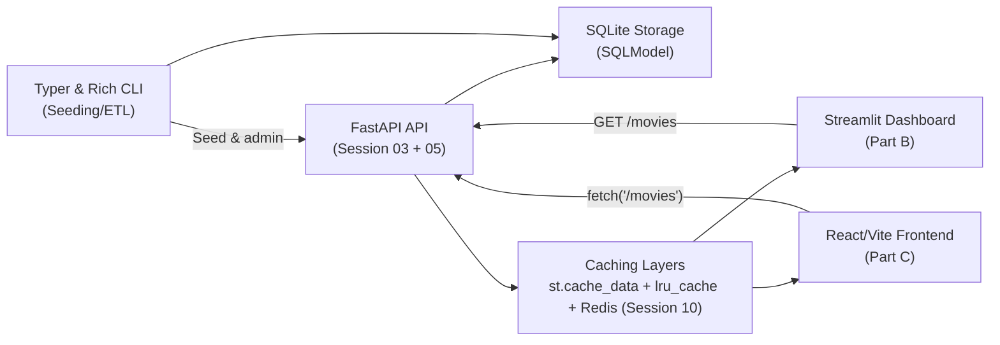

# Session 06 – Movie Dashboards with Streamlit & React Bridges

- **Date:** Monday, Dec 8, 2025
- **Theme:** Stand up a Streamlit dashboard for quick insights, sketch the React alternative, and add developer user experience (UX) niceties (Typer helpers, rich progress bars, caching).

## Learning Objectives
- Consume the FastAPI backend from Streamlit using typed client functions and local caching against the application programming interface (API).
- Prototype a React front end (or extend Streamlit) that respects API contracts and trace identifiers (IDs).
- Add Typer command-line interface (CLI) commands and Rich progress bars for data seeding/extract-transform-load (ETL) tasks.
- Organize assets and dependency installs with `uv` so Exercise 2 (EX2) teams can choose Streamlit **or** React confidently.

## Before Class – Frontend Preflight (Just-in-Time Teaching, JiTT)
- Install dashboard tooling:
  ```bash
  uv add "streamlit==1.*" "rich==13.*" "typer==0.*" "httpx==0.*"
  ```
- Clone the Exercise 2 (EX2) starter repo (link on the Learning Management System (LMS)) or copy the provided `frontend/` skeleton into your project.
- Run the micro demo “Typer: hello --name Alice” to warm up on command-line interface (CLI) user experience (UX).
- Optional: install Node 20 + pnpm if you plan to attempt the React stretch during class.

## Agenda
| Segment | Duration | Format | Focus |
| --- | --- | --- | --- |
| Recap & intent | 7 min | Discussion | Backlog highlights from Exercise 1 (EX1), expectations for Exercise 2 (EX2) choices. |
| Streamlit + API primer | 18 min | Talk + live coding | How Streamlit hits FastAPI, session state, caching, trace identifiers (IDs). |
| Micro demo: Typer hello | 3 min | Live demo (≤120 s) | `uv run python -m scripts.cli hello --name Alice`. |
| React overview & contract discipline | 17 min | Talk + slides | When to choose React, component/service split, Cross-Origin Resource Sharing (CORS), rate limiting reminder. |
| **Part B – Lab 1** | **45 min** | **Guided coding** | **Streamlit dashboard + cached API calls + Rich progress.** |
| Break | 10 min | — | Launch the shared [10-minute timer](https://e.ggtimer.com/10minutes). |
| **Part C – Lab 2** | **45 min** | **Guided build** | **React (or Streamlit extension) + end-to-end checks + Typer seeding.** |
| Wrap-up & EX2 launch | 10 min | Questions and Answers (Q&A) | Deliverables, testing expectations, backlog (pagination, charts). |

## Part A – Theory Highlights
1. **Architecture sketch:** Streamlit client → FastAPI `/movies` → SQLite. Emphasize consistency with the Representational State Transfer (REST) contract built in Sessions 02–05.
2. **Caching patterns:** Use `functools.lru_cache` or Streamlit’s `@st.cache_data` to avoid redundant API calls; handle invalidation when data changes.
3. **Cross-Origin Resource Sharing (CORS) and rate limiting:** Remind students the API must support front-end origins; preview `slowapi` from Session 10 for rate limiting.
4. **Developer UX:** Typer commands orchestrate seeding tasks; Rich progress bars give visual feedback during longer extract-transform-load (ETL) operations.



### FastAPI CORS configuration (copy/paste before class)
Add this middleware near the top of `app/main.py` so both Streamlit and Vite development servers can reach the API:
```python
from fastapi.middleware.cors import CORSMiddleware

app = FastAPI(title="Movie Service", version="0.2.0")

app.add_middleware(
    CORSMiddleware,
    allow_origins=[
        "http://localhost:8501",  # Streamlit
        "http://localhost:5173",  # Vite (default)
    ],
    allow_credentials=True,
    allow_methods=["*"],
    allow_headers=["*"],
)
```
Encourage students to add their own dev origin if they change ports or hostnames.

## Part B – Hands-on Lab 1 (45 Minutes)

### Lab timeline
- **Minutes 0–5** – Confirm API is running with CORS middleware.
- **Minutes 5–20** – Implement the typed `httpx` client and caching helper.
- **Minutes 20–35** – Build the Streamlit dashboard, add Rich progress, celebrate quick win.
- **Minutes 35–45** – Experiment with caching invalidation and plan user interface (UI) backlog items.

### 1. Build typed API client (`frontend/client.py`)
```python
from __future__ import annotations

from functools import lru_cache
from typing import Any

import httpx

API_BASE_URL = "http://localhost:8000"


@lru_cache(maxsize=1)
def _client() -> httpx.Client:
    return httpx.Client(base_url=API_BASE_URL, timeout=5.0)


def list_movies() -> list[dict[str, Any]]:
    response = _client().get("/movies", headers={"X-Trace-Id": "ui-streamlit"})
    response.raise_for_status()
    return response.json()
```

### 2. Streamlit dashboard (`frontend/dashboard.py`)
```python
import streamlit as st
from rich.progress import track

from client import list_movies

st.set_page_config(page_title="Movie Pulse", layout="wide")
st.title("Movie Service Dashboard")

with st.spinner("Fetching movies..."):
    movies = list_movies()

if not movies:
    st.info("No movies yet. Add some via the API or the seeding CLI.")
else:
    st.metric("Total movies", len(movies))
    for movie in track(movies, description="Rendering cards"):
        with st.expander(f"{movie['title']} ({movie['year']})"):
            st.write(movie)
```
Run `uv run streamlit run frontend/dashboard.py` and show the live dashboard. Point out how Rich progress pairs with Streamlit (console + UI spinner).

> 🎉 **Quick win:** When the dashboard renders `Total movies`, the full stack (FastAPI → SQLite → Streamlit) is talking end-to-end.

### 3. Discuss caching + invalidation
- Modify one movie via API, rerun Streamlit, and talk about cache busting (`st.cache_data.clear()`) vs. background refresh.
- Note: for React we’ll implement caching with React Query or stale-while-revalidate (SWR); capture this as backlog.

## Part C – Lab 2 (45 Minutes)
Pick the path that matches your students:

### Lab timeline
- **Minutes 0–10** – Scaffold Vite (or identify Streamlit extension path).
- **Minutes 10–20** – Build `services/movies.ts` and verify fetch in browser.
- **Minutes 20–35** – Layer UI components, handle error states, and run `pnpm dev`.
- **Minutes 35–45** – Implement Typer seeding CLI and document usage.

### Option A – React focus (group work)
1. Scaffold (if using pnpm):
   ```bash
   pnpm create vite frontend-react --template react-ts
   cd frontend-react
   pnpm add axios
   ```
2. Configure `.env.local` with `VITE_API_BASE_URL=http://localhost:8000`.
3. Create `src/services/movies.ts`:
   ```typescript
   import axios from "axios";

   const client = axios.create({
     baseURL: import.meta.env.VITE_API_BASE_URL,
     headers: { "X-Trace-Id": "ui-react" },
   });

   export async function listMovies() {
     const response = await client.get("/movies");
     return response.data;
   }
   ```
4. Replace `src/App.tsx` with a quick dashboard:
   ```tsx
   import { useEffect, useState } from "react";
   import { listMovies } from "./services/movies";

   type Movie = {
     id: number;
     title: string;
     year: number;
     genre: string;
   };

   export default function App() {
     const [movies, setMovies] = useState<Movie[]>([]);
     const [error, setError] = useState<string | null>(null);

     useEffect(() => {
       listMovies()
         .then(setMovies)
         .catch((err) => setError(err.message));
     }, []);

     if (error) {
       return <p role="alert">Failed to load movies: {error}</p>;
     }

     return (
       <main>
         <h1>Movie Pulse</h1>
         <p>Total movies: {movies.length}</p>
         <ul>
           {movies.map((movie) => (
             <li key={movie.id}>
               {movie.title} ({movie.year}) – {movie.genre}
             </li>
           ))}
         </ul>
       </main>
     );
   }
   ```
   Run `pnpm dev` and confirm the Vite dev server displays your API data. Suggest **Vitest** (Vite’s built-in JavaScript test runner) or **Playwright** (browser automation for end-to-end checks) as stretch testing goals so frontend coverage keeps pace with the backend.

### Option B – Streamlit extensions
- Add filters (genre/year) with `st.multiselect`; call `/movies?genre=Sci-Fi` once backend supports it.
- Plot ratings distribution using `pandas` + `st.bar_chart`.
- Add “create movie” form that `POST`s to the API (include validation + trace ID headers).

### Dev UX Enhancements (all teams)
1. Update Typer CLI to seed movies/ratings with Rich progress:
   ```python
   import random
   from rich.progress import track
   import typer

   from app.dependencies import get_repository

   app = typer.Typer(help="Admin utilities")


   @app.command()
   def seed(sample: int = 5) -> None:
     repo = next(get_repository())
     for _ in track(range(sample), description="Seeding movies"):
         repo.create(title=f"Sample {_}", year=2000 + _, genre="sci-fi")
     typer.echo("Seed complete")


   if __name__ == "__main__":
       app()
   ```
   Run `uv run python scripts/admin.py seed --sample 3` and confirm movies appear in the dashboard.
   > 🎉 **Quick win:** When the CLI reports “Seed complete,” refresh Streamlit/React to see instant content with no manual data entry.
2. Document CLI usage in README and remind students to log artificial intelligence (AI) assistance.

## Wrap-up & EX2 Launch
- Exercise 2 (EX2) – Friendly Interface assigned today, due **Tue Dec 23**. Choose Streamlit or a Typer CLI for the required deliverable; React remains an optional stretch path for teams who want browser UI practice.
- Checklist: API integration with trace identifiers (IDs), caching strategy, Typer admin tooling, README updates, optional Streamlit/React testing harness.
- Backlog ideas: pagination controls, comma-separated values (CSV) export button (Session 10), feature flags to toggle beta UI, embed OpenAPI responses for doc parity.
- Full rubric lives in [docs/exercises.md](../exercises.md#ex2--friendly-interface). Review the “must have” vs. “stretch” criteria before students pick their stack.

### Common pitfalls
- **CORS still blocked** – verify the exact origin (including port) matches `allow_origins`. For quick testing, temporarily set `allow_origins=["*"]` then tighten again.
- **Streamlit stuck on old data** – call `st.cache_data.clear()` after POST/DELETE requests or add a “Refresh” button that invalidates cache.
- **pnpm dev fails** – ensure Node ≥ 20 and run `corepack enable`; on macOS, install via `brew install node`.
- **Rich progress bar not visible** – confirm you run Streamlit via `uv run`; standard `streamlit run` may not pick up your uv-managed dependencies.

## Troubleshooting
- **CORS errors** → ensure FastAPI enables CORS (`from fastapi.middleware.cors import CORSMiddleware`) with allowed origins covering Streamlit/React hosts.
- **Streamlit caching stale** → call `st.cache_data.clear()` after mutations or pass unique keys.
- **pnpm install issues** → check Node version (>=20) and run `corepack enable`.

## Student Success Criteria

By the end of Session 06, every student should be able to:

- [ ] Display live movie data in Streamlit using a typed API client with caching.
- [ ] Scaffold a Vite/React app that loads movies via an `axios` service and handles error states.
- [ ] Use a Typer CLI to seed sample data while tracking progress with Rich.

**If a student misses any box, book a pairing session before Session 07 to keep EX2 on track.**

## AI Prompt Seeds
- “Write a Streamlit dashboard that calls a FastAPI `/movies` endpoint and displays metrics.”
- “Produce a React service module that adds `X-Trace-Id` headers to outgoing requests.”
- “Draft a Typer CLI command that seeds sample data with a Rich progress bar.”
