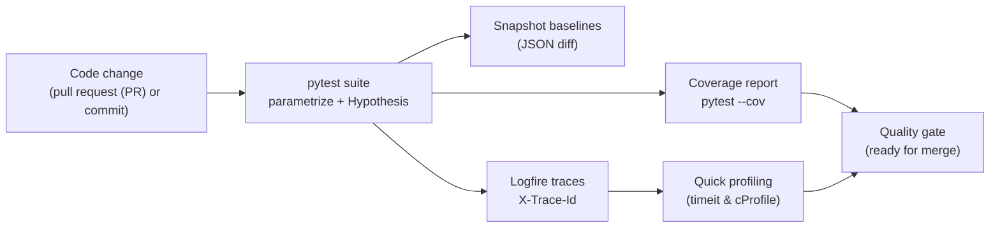

# Session 07 – Testing, Logging, and Profiling Foundations

- **Date:** Monday, Dec 15, 2025
- **Theme:** Deepen reliability by expanding the test suite, capturing structured telemetry (Logfire + trace identifiers (IDs)), and measuring performance.

## Learning Objectives
- Use pytest fixtures and Hypothesis to cover happy, sad, and edge cases with minimal duplication.
- Instrument FastAPI with Pydantic Logfire to capture timings, errors, and trace identifiers (IDs) without drowning in logs.
- Generate coverage reports (`pytest --cov`), snapshot JavaScript Object Notation (JSON) responses, and gate pull requests on quality metrics.
- Run quick performance probes (`timeit`, `cProfile`) to catch regressions before Exercise 2 (EX2) demos.

## Before Class – Quality Preflight (Just-in-Time Teaching, JiTT)
- Install testing/observability tools:
  ```bash
  uv add "pytest-cov==5.*" "hypothesis==6.*" "logfire==0.*"
  ```
- Ensure `pytest` succeeds locally (`uv run pytest -q`) before class so we focus on improvements, not broken baselines.
- Skim the Logfire quickstart (link in the Learning Management System (LMS)) and note one question about dashboards or retention.
- Verify Exercise 1 (EX1) test suite still passes after your latest refactor (`uv run pytest -q`).

## Agenda
| Segment | Duration | Format | Focus |
| --- | --- | --- | --- |
| Warm-up & bug stories | 8 min | Discussion | Share one bug caught by tests since Session 05; Logfire expectations. |
| Testing depth tour | 17 min | Talk + whiteboard | Fixtures, parametrization, Hypothesis, snapshot testing strategy. |
| Micro demo: Logfire in 60s | 3 min | Live demo (≤120 s) | Capture one FastAPI request in Logfire dashboard. |
| Observability patterns | 17 min | Talk + code walkthrough | Structured logs, trace identifiers (IDs), error capture, log levels. |
| **Part B – Lab 1** | **45 min** | **Guided testing** | **Fixtures, parametrized tests, Hypothesis property checks.** |
| Break | 10 min | — | Launch the shared [10-minute timer](https://e.ggtimer.com/10minutes). |
| **Part C – Lab 2** | **45 min** | **Guided observability** | **Logfire integration, coverage reports, lightweight profiling.** |
| Wrap-up & EX2 sprint | 10 min | Questions and Answers (Q&A) | Game plan for Exercise 2 (EX2) demos, coverage gates, open office hours.

## Part A – Theory Highlights
1. **Pytest architecture:** fixtures (function vs session scope), parametrization (`@pytest.mark.parametrize`), factories for realistic payloads.
2. **Property-based testing:** use Hypothesis to generate inputs for validators and ensure invariants hold.
3. **Snapshot testing:** capture JavaScript Object Notation (JSON) responses (store under `tests/snapshots/`) and enforce stable contracts.
4. **Observability levels:** application logs (FastAPI + Logfire—Pydantic’s structured logging and tracing service), metrics later (Session 09/10), tracing with trace identifiers (IDs).
5. **Performance probes:** run `time.perf_counter()` or `uv run python -m cProfile` as a quick sanity check; mention `py-spy` for offline analysis.



## Part B – Hands-on Lab 1 (45 Minutes)

### Lab timeline
- **Minutes 0–10** – Wire autouse fixtures and dependency overrides.
- **Minutes 10–25** – Add parametrized tests covering happy/sad paths.
- **Minutes 25–35** – Introduce Hypothesis property checks.
- **Minutes 35–45** – Capture snapshots and review failures via Logfire.
### 1. Enhance fixtures (`tests/conftest.py`)
```python
from collections.abc import Generator
from pathlib import Path
from typing import Any, Callable

import pytest
from sqlmodel import Session, SQLModel, create_engine

from app.dependencies import get_repository
from app.main import app
from app.repository import MovieRepository

TEST_DB = "sqlite:///./test_movies.db"
engine = create_engine(TEST_DB, connect_args={"check_same_thread": False})


@pytest.fixture(autouse=True)
def _reset_db(tmp_path: Path) -> Generator[None, None, None]:
    SQLModel.metadata.create_all(engine)
    yield
    SQLModel.metadata.drop_all(engine)


@pytest.fixture
def repo(monkeypatch: pytest.MonkeyPatch) -> Generator[MovieRepository, None, None]:
    def _override_repo() -> Generator[MovieRepository, None, None]:
        with Session(engine) as session:
            yield MovieRepository(session)

    monkeypatch.setattr("app.dependencies.get_repository", _override_repo)
    with Session(engine) as session:
        yield MovieRepository(session)


@pytest.fixture
def client(repo: MovieRepository) -> Generator[Any, None, None]:
    from fastapi.testclient import TestClient

    with TestClient(app) as test_client:
        yield test_client
```
Explain how autouse fixture guarantees clean state and why we override the dependency for deterministic tests.

### 2. Parametrized & property-based tests (`tests/test_movies.py`)
Remember the generic parametrization pattern:
```python
import pytest

@pytest.mark.parametrize(
    ("a", "b", "expected"),
    [
        (2, 2, 4),
        (0, 5, 5),
        (-1, 1, 0),
    ],
)
def test_addition(a: int, b: int, expected: int) -> None:
    assert a + b == expected
```
Reuse the structure below for FastAPI payloads.
```python
import pytest
from hypothesis import given, strategies as st


def test_create_movie_variants(client):
    payloads = [
        {"title": "Arrival", "year": 2016, "genre": "sci-fi"},
        {"title": "Dune", "year": 2021, "genre": "Sci-Fi"},
    ]
    for payload in payloads:
        response = client.post("/movies", json=payload, headers={"X-Trace-Id": "test"})
        assert response.status_code == 201
        assert response.json()["genre"].istitle()


@pytest.mark.parametrize(
    "bad_year",
    [1800, 2150],
)
def test_create_movie_rejects_out_of_range_year(client, bad_year):
    response = client.post(
        "/movies",
        json={"title": "Bad Year", "year": bad_year, "genre": "Sci-Fi"},
    )
    assert response.status_code == 422


@given(st.text(min_size=1, max_size=40))
def test_title_is_preserved_round_trip(client, title):
    response = client.post(
        "/movies",
        json={"title": title, "year": 2000, "genre": "Drama"},
    )
    if response.status_code == 201:
        movie_id = response.json()["id"]
        fetched = client.get(f"/movies/{movie_id}").json()
        assert fetched["title"] == title
```
Highlight that Hypothesis automatically explores edge characters; log failures for easier debugging.

### 3. Snapshot JSON responses
Use `pytest-datadir` or simple fixture:
```python
from pathlib import Path

SNAPSHOT_DIR = Path("tests/snapshots")
SNAPSHOT_DIR.mkdir(parents=True, exist_ok=True)


def test_movies_list_snapshot(client):
    # Seed two movies first or reuse previous helper
    client.post("/movies", json={"title": "Interstellar", "year": 2014, "genre": "Sci-Fi"})
    client.post("/movies", json={"title": "Blade Runner", "year": 1982, "genre": "Sci-Fi"})

    response = client.get("/movies")
    assert response.status_code == 200

    snapshot_path = SNAPSHOT_DIR / "movies_list.json"
    if not snapshot_path.exists():
        snapshot_path.write_text(response.text)
    assert response.text == snapshot_path.read_text()
```
Explain review process: snapshot updates require human approval.

## Part C – Hands-on Lab 2 (45 Minutes)

### Lab timeline
- **Minutes 0–10** – Instrument FastAPI with Logfire.
- **Minutes 10–25** – Run coverage reports and address gaps.
- **Minutes 25–35** – Collect profiling data (`timeit`, `cProfile`).
- **Minutes 35–45** – Correlate Logfire traces with Hypothesis failures.
### 1. Wire Logfire into FastAPI
Install (already done) and configure `logfire` in `app/observability.py`:
```python
import logfire
from fastapi import FastAPI


def init_app(app: FastAPI) -> None:
    logfire.configure(
        service_name="movie-service",
        send_to_logfire=True,  # set False for offline demos
    )
    logfire.instrument_fastapi_app(app)
```
In `app/main.py`:
```python
from . import observability

observability.init_app(app)
```
Add structured logging inside routes (replace previous `logger.info` if desired):
```python
from logfire import log

log.info("movie.created", movie_id=movie.id, trace_id=request.state.trace_id)
```
Run the micro demo: `uv run uvicorn app.main:app --reload` → make a request → open the Logfire web UI to visualize traces.

### 2. Coverage gates
```bash
uv run pytest --cov=app --cov-report=term-missing
```
Interpret missing lines, add tests, rerun. Document how to wire into GitHub Actions (Session 10).

> 🎉 **Quick win:** Hitting 80%+ coverage with a clean report means EX2 submissions can ship with confidence—screenshot the terminal for your README.

### 3. Lightweight profiling
- Wrap a repository call with `time.perf_counter()` before/after; log duration.
- Optional: `uv run python -m cProfile -o profile.out app/scripts/seed.py` and open with `snakeviz` (install if desired).

### 4. Observability + testing synergy
- Show that trace IDs appear in Logfire, Docker logs, and test headers.
- Capture failing Hypothesis example and review the correlated Logfire event.

## Wrap-up & EX2 Sprint
- ✅ Fixtures, parametrization, Hypothesis, snapshots, Logfire instrumentation, coverage.
- Between now and Session 08: finish EX2 UI features, enforce `pytest --cov` in CI, snapshot any critical responses, and log outstanding performance questions.

## Troubleshooting
- **Hypothesis health check warnings** → adjust strategies or increase `deadline=None` for slower tests.
- **Logfire authentication** → ensure environment variable `LOGFIRE_API_KEY` is set; fall back to `send_to_logfire=False` for offline demo.
- **Coverage missing modules** → check `__init__.py` files and ensure tests import the modules under test.

### Common pitfalls
- **Flaky Hypothesis tests** – cap `max_examples` temporarily and log failing seeds for deterministic reruns.
- **Snapshot drift** – update snapshots only after code review; commit baseline fixtures alongside code.
- **Logfire noise** – set `send_to_logfire=False` during load testing to avoid rate limits, then re-enable for demos.

## Student Success Criteria

By the end of Session 07, every student should be able to:

- [ ] Use parametrized and property-based tests to exercise FastAPI endpoints.
- [ ] Generate coverage reports and interpret missing-line output.
- [ ] Instrument the app with Logfire, correlating trace IDs across logs and tests.

**If a box is unchecked, host a testing tune-up before Session 08.**

## AI Prompt Seeds
- “Write pytest fixtures that override FastAPI dependencies with a temporary SQLite database.”
- “Generate property-based tests using Hypothesis for a FastAPI endpoint that normalizes genres.”
- “Instrument FastAPI with Pydantic Logfire to record request timings and trace IDs.”
