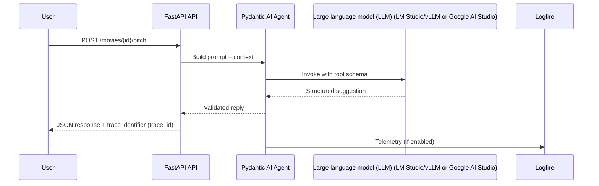

# Session 08 – Working with AI Coding Assistants (LM Studio, vLLM, or Google AI Studio)

- **Date:** Monday, Dec 22, 2025
- **Theme:** Pair program with artificial intelligence (AI) safely—prompt with intent, review outputs critically, wire agents to your FastAPI backend using Pydantic AI (typed agent framework), and experiment with DSPy for declarative LLM orchestration.

## Learning Objectives
- Apply spec-first and tests-first prompting patterns to extend the movie service while keeping humans in charge.
- Wrap the FastAPI application programming interface (API) behind a Pydantic AI tool-call function that validates inputs/outputs and emits Logfire telemetry.
- Call a large language model (LLM) endpoint (local LM Studio/vLLM or hosted Google AI Studio) and evaluate responses automatically with tests.
- Prototype a DSPy `Signature` + `Predict` pair to feel the ergonomics of declarative prompting before adding guardrails.
- Document artificial intelligence (AI) assistance and toggle telemetry/privacy settings responsibly.

### Prerequisite snapshot (Sessions 01–07 recap)
You already shipped a FastAPI backend with uv, added Postgres, and experimented with Streamlit + Vite/React. Session 08 only stacks two new ideas on top of that foundation:
- **LLM as another HTTP service.** Treat LM Studio/vLLM/Google Gemini exactly like the REST APIs you have already called—base URL + API key + JSON in/out.
- **Typed agent helpers.** Pydantic AI/DSPy extend the Pydantic models and pytest habits you already know; no new web framework knowledge is required.
- **Tooling mindset.** Docker, `uv`, Typer, pytest, and React stay the same—this session just shows how to bolt an AI assistant onto those familiar tools.

## Before Class – AI Preflight (Just-in-Time Teaching, JiTT)
- Install agent tooling:
  ```bash
  uv add pydantic-ai httpx
  ```
- Optional but encouraged: add DSPy so you can run the micro-lab offline.
  ```bash
  uv add dspy-ai
  ```
- Ensure LM Studio (desktop app for hosting local models) or vLLM (open-source high-performance inference server) is running locally—or know how to start the Docker image shared in the Learning Management System (LMS). Note the base URL.
- If local GPU/CPU options aren’t possible, create a Google AI Studio (Gemini 2.x) API key at <https://aistudio.google.com/app/apikey> so you can tap the managed Google Gemini API (high-scale LLM endpoint with API keys). Then wire it into the repo:
  ```bash
  export GOOGLE_API_KEY="paste-your-ai-studio-key"
  export GOOGLE_GEMINI_MODEL="gemini-2.0-flash"
  uv add "pydantic-ai[google]" google-genai
  ```
  These settings let `GoogleModel` talk to the same spec-first tools as your local runtimes.
- Prefer vLLM (Versatile Large Language Model)? Pull and run TinyLlama ahead of time:
  ```bash
  docker run --rm -p 8000:8000 \
    -v ~/.cache/huggingface:/root/.cache/huggingface \
    vllm/vllm-openai:latest \
    --model TinyLlama/TinyLlama-1.1B-Chat-v1.0

  curl http://localhost:8000/v1/models  # confirm the endpoint is live
  ```
- No GUI budget? Students can install llama.cpp plus the Gemma 3 270M Instruct weights during JiTT. The three commands (install, run, curl) are listed later in [Local llama.cpp fallback](#local-llamacpp-fallback-gemma-3-270m).
- Update your Exercise 2 (EX2) README with AI usage to date; bring one prompt you felt proud of and one that failed.
- Optional: skim the Model Context Protocol (MCP) primer to prepare for Session 12’s tool-friendly APIs.

### Google Gemini (AI Studio) track
As of late 2025, Google AI Studio (`https://aistudio.google.com`) runs Gemini 2.x (Flash, Pro, Nano) as a managed service backed by production Google Cloud quotas—no local GPU required. Every API key is minted in the AI Studio console (⚙️ *Develop → API Keys*) and maps to the HTTPS endpoint `https://generativelanguage.googleapis.com/v1beta/models/{model}:generateContent`.

#### Why instructors care
- **Free sandbox, enforceable caps.** Each new account gets an unpaid/free tier that comfortably covers student prototypes. Quotas are enforced via requests-per-minute/day plus token-per-minute ceilings, so you immediately see when a classroom pushes too hard.
- **API-first workflow.** Prompts that you prototype inside the web UI can be exported via the **“Get code”** button (Python, Node, curl) and pasted straight into labs.
- **Scale when needed.** If you expect EX3 demos to spike usage, request higher limits or attach billing on the instructor account while students keep their keys throttled.

#### 4-step setup (done once per laptop)
1. **Mint a key + pick a model.** Use the AI Studio UI to create a key and note the exact model identifier (e.g., `gemini-2.5-flash`, `gemini-1.5-pro-exp`). Billing/quota are enforced per Google account, so students stay within the generous free tier while instructors can request higher limits ahead of time.
2. **Export env vars (per shell):**
   ```bash
   export GOOGLE_API_KEY="paste-ai-studio-key"
   export GOOGLE_GEMINI_MODEL="gemini-2.0-flash"
   ```
3. **Health check the endpoint before class:**
   ```bash
   curl -sS -X POST \
     "https://generativelanguage.googleapis.com/v1beta/models/${GOOGLE_GEMINI_MODEL}:generateContent" \
     -H "Content-Type: application/json" \
     -H "x-goog-api-key: ${GOOGLE_API_KEY}" \
     -d '{ "contents": [{ "parts": [{ "text": "Ping from Session 08 setup." }]}] }'
   ```
   A JSON response with `candidates[0].content.parts[0].text` confirms the AI Studio plumbing is live.
4. **Wire it into Pydantic AI exactly like the LiteLLM client:**
   ```python
   import os
   from pydantic_ai.models.google import GoogleModel

   lm = GoogleModel(
       model=os.environ.get("GOOGLE_GEMINI_MODEL", "gemini-2.0-flash"),
       api_key=os.environ["GOOGLE_API_KEY"],
   )
   ```
   The rest of the agent/tool code stays unchanged; AI Studio handles scaling, so classroom laptops only need network access.

#### Minimal standalone example (students can run outside Pydantic AI)
```python
# pip install -U google-genai
import os
from google import genai

client = genai.Client(api_key=os.environ["GOOGLE_API_KEY"])
response = client.models.generate_content(
    model=os.environ.get("GOOGLE_GEMINI_MODEL", "gemini-2.5-flash"),
    contents="Explain JSON in two sentences with an example."
)
print(response.text)
```
This solo script helps students feel the difference between remote Gemini (AI Studio) and local vLLM/LM Studio before they plug the same key into the Session 08 agent stack.

#### Local vs. remote LLM cheat sheet
| Track | Where it runs | Setup (besides this repo) | When to pick it |
| --- | --- | --- | --- |
| LM Studio desktop app | Your laptop (GUI) | Install LM Studio, load a model, copy base URL `http://localhost:1234/v1`, export dummy key | You want a point-and-click setup with streaming logs on the same machine. |
| vLLM Docker image | Your laptop (Docker) | `docker run -p 8000:8000 vllm/vllm-openai:latest --model TinyLlama/...` | You prefer a reproducible CLI path or need higher throughput on a workstation. |
| llama.cpp HTTP server | Your laptop (CLI) | `brew install llama.cpp`, download Gemma weights, run `llama-server` | Machines without GUI support or when you only need a lightweight CPU model. |
| Google AI Studio (Gemini) | Google-managed cloud | Create API key in AI Studio, export `GOOGLE_API_KEY` + `GOOGLE_GEMINI_MODEL` | Local resources are scarce, you want consistent latency, or you’re teaching on Chromebooks. |

## Agenda
| Segment | Duration | Format | Focus |
| --- | --- | --- | --- |
| EX2 gallery walk | 15 min | Student demos | Quick UI walkthroughs + trace identifier (ID) check. |
| Policy & prompting refresh | 15 min | Talk | Course policy, attribution, spec/tests-first prompts. |
| Micro demo: prompt → test | 5 min | Live demo | Ask AI for tests first, implement after verifying. |
| Pydantic AI tool-calling | 20 min | Talk + live coding | Define schema, validate input/output (I/O), send telemetry, guardrails. |
| **Part B – Lab 1** | **45 min** | **Guided pairing** | **Extend API with AI help, evaluate via pytest.** |
| Break | 10 min | — | Launch the shared [10-minute timer](https://e.ggtimer.com/10minutes). |
| **Part C – Lab 2** | **45 min** | **Guided agent** | **Connect LM Studio/vLLM or Google AI Studio through Pydantic AI + automated evaluation.** |
| MCP microservice hop | 15 min | Live demo + pairing | Reuse a catalog MCP server (DuckDuckGo search) as a typed microservice + LLM analysis (Google AI Studio or local vLLM). |
| Retrospective & next steps | 10 min | Discussion | Share effective prompts, log outstanding risks.

## Part A – Guardrails & Patterns
1. **Policy recap:** You may use artificial intelligence (AI) but must understand every line, document assistance, and keep specs/tests in repo. Never paste confidential data.
2. **Prompting templates:**
   - Spec-first (“Given this spec, draft code”)
   - Tests-first (“Write pytest for ... before implementation”)
   - Refactor (“Here is existing code; keep behavior, improve structure”)
3. **Micro demo:** Use ChatGPT/Claude to generate pytest cases for a new `/movies/{id}/ratings` endpoint, implement manually, rerun tests.
4. **Telemetry toggles:** Show how to run Pydantic AI with `logfire` instrumentation turned on/off (privacy) and how to scrub tokens before logging.
5. **Attribution:** Update README changelog or pull request (PR) template with “AI-assisted sections” including prompt summary.

### DSPy micro-lab
- **Why here?** DSPy (https://dspy.ai/) complements Pydantic AI by giving you declarative signatures + optimizers that remove the need for hand-tuned prompts.
- **Install ahead of time:** `uv add dspy-ai` (keeps parity with the course `uv` workflow).
- **Hello world (5 min):**

```python
import dspy

# setup
dspy.configure(lm=dspy.OpenAI(model="gpt-4o-mini"))

# define task
class Hello(dspy.Signature):
    """Say hello to someone."""
    name: str = dspy.InputField()
    greeting: str = dspy.OutputField()

# make module
hello = dspy.Predict(Hello)

# run
print(hello(name="Alice").greeting)
```

Output (typical):

```
Hello, Alice!
```

- **Bring-back takeaway:** One-liner summary—DSPy lets you declare a task (`Signature`) and run it through an LLM module (`Predict`) with zero hand-crafted prompts, so you can slot Pydantic AI tools or FastAPI endpoints behind the scenes without rewriting specs. Capture at least one observation (latency, determinism, optimizer effect) in your lab notes.

### DSPy + Pydantic AI mini-PoC (20–25 min)
Take DSPy past “hello world” by wiring it to the same Pydantic AI tool you build later in Part C. Students can finish this sequence entirely on laptops—no cloud accounts required.

1. **Scaffold the FastAPI tool (reuse from Part C):**
   ```python
   # agents/movies.py
   from pydantic import BaseModel
   from typing import Optional
   import httpx
   from pydantic_ai import Tool
   from app.config import Settings

   class PitchRequest(BaseModel):
       title: str
       mood: str = "optimistic"

   class PitchResponse(BaseModel):
       title: str
       hook: str

   def pitch_tool(settings: Settings, client: Optional[httpx.Client] = None) -> Tool:
       session = client or httpx.Client(base_url=settings.api_base_url, timeout=10)

       @Tool
       def craft_pitch(payload: PitchRequest) -> PitchResponse:
           resp = session.post("/tool/movie-pitch", json=payload.model_dump())
           resp.raise_for_status()
           return PitchResponse.model_validate(resp.json()["data"])

       return craft_pitch
   ```

2. **Define a DSPy signature + module that wraps the tool call:**
   ```python
   # labs/dspy_pitch.py
   import dspy
   from agents.movies import pitch_tool
   from app.config import Settings

   class PitchMovie(dspy.Signature):
       """Return a compelling hook for a given movie title."""
       title: str = dspy.InputField()
       hook: str = dspy.OutputField()

   def build_predictor():
       dspy.configure(lm=dspy.OpenAI(model="gpt-4o-mini"))
       predictor = dspy.Predict(PitchMovie)
       settings = Settings()
       predictor.use(pitch_tool(settings))  # bridge to typed tool
       return predictor
   ```

3. **Run + evaluate (stores everything locally):**
   ```python
   if __name__ == "__main__":
       predictor = build_predictor()
       result = predictor(title="The Last Signal")
       print(result.hook)
   ```

4. **Stretch goal:** plug in `dspy.Evaluate` with two examples so you can see how tuning/optimizers affect tool usage.
   ```python
   examples = [
       dspy.Example(title="Orbit Shift", hook="A solar engineer hears music in cosmic rays."),
       dspy.Example(title="Dawn Protocol", hook="A grad student jailbreaks a weather AI."),
   ]
   evaluator = dspy.Evaluate(dspy_asserts=[lambda out: len(out.hook) < 140])
   evaluator(predictor=build_predictor(), devset=examples)
   ```

5. **Debrief questions (capture answers in lab notes):**
   - How did DSPy’s structured inputs feel compared to writing full prompts?
   - Where would you place guardrails—inside the `Signature`, the Pydantic schema, or both?
   - Could you swap DSPy out for direct Pydantic AI usage and keep the rest of the stack unchanged?



### DuckDuckGo MCP microservice lab (15 min)
Give students an end-to-end agentic path they can demo entirely offline: the DuckDuckGo MCP server on Docker Hub needs zero API keys, so everyone can search the open web and summarize hits with a local LLM.

> ☁️ **Hosted fallback:** When laptops can’t run LM Studio/vLLM, install `pydantic-ai[google]`, export `GOOGLE_API_KEY`, and instantiate `GoogleModel(model=os.environ.get("GOOGLE_GEMINI_MODEL", "gemini-2.0-flash"), api_key=os.environ["GOOGLE_API_KEY"])` so the agent calls the Google Gemini API (AI Studio’s high-scale endpoint) instead. The tool plumbing stays identical—only the model import changes.

1. **Pull the image once (Shell A).**
   ```bash
   docker pull mcp/duckduckgo:latest
   ```
   Keep the image cached so labs run smoothly on limited Wi-Fi.

2. **Install the agent deps (Shell B, repo root).**
   ```bash
   uv add "mcp[cli]" "pydantic-ai[litellm]"
   ```
   That keeps the CLI client (`stdio_client`, Inspector helpers) in sync with the code you ship in Session 12.

3. **Copy/paste a typed wrapper (use as-is or drop into `labs/duck_search_agent.py`).**
   ```python
   import asyncio
   import re
   from typing import List

   from mcp.client.session import ClientSession
   from mcp.client.stdio import StdioServerParameters, stdio_client
   from pydantic import BaseModel
   from pydantic_ai import Agent, Tool
   from pydantic_ai.models.litellm import LiteLLMCompletionModel

   MCP_IMAGE = "mcp/duckduckgo:latest"

   class DuckResult(BaseModel):
       title: str
       url: str
       snippet: str

   RESULT_LINE = re.compile(r"^(?P<rank>\d+)\. (?P<title>.+)$")

   def parse_duck_results(payload: str) -> List[DuckResult]:
       results: List[DuckResult] = []
       current: dict[str, str] | None = None
       for raw in payload.splitlines():
           line = raw.strip()
           if not line or line.startswith("Found "):
               continue
           match = RESULT_LINE.match(line)
           if match:
               if current:
                   results.append(DuckResult(**current))
               current = {"title": match.group("title"), "url": "", "snippet": ""}
               continue
           if line.startswith("URL:") and current is not None:
               current["url"] = line.split("URL:", 1)[1].strip()
               continue
           if line.startswith("Summary:") and current is not None:
               current["snippet"] = line.split("Summary:", 1)[1].strip()
       if current:
           results.append(DuckResult(**current))
       return results

   async def duck_search(query: str, limit: int = 3) -> List[DuckResult]:
       server = StdioServerParameters(
           command="docker",
           args=["run", "--rm", "-i", MCP_IMAGE],
       )
       async with stdio_client(server) as (read, write):
           async with ClientSession(read, write) as session:
               await session.initialize()
               resp = await session.call_tool("search", {"query": query, "max_results": limit})
               text = resp.content[0].text
               return parse_duck_results(text)[:limit]

   duck_tool = Tool(fn=duck_search, name="duck_search", description="Search DuckDuckGo via MCP")

   lm = LiteLLMCompletionModel(model="lmstudio-community/gemma-2b", base_url="http://127.0.0.1:1234/v1")

   agent = Agent[
       str
   ](
       prompt="Call duck_search to gather facts, then summarize in 3 bullet points.",
       model=lm,
       tools=[duck_tool],
   )

   async def run():
       response = await agent.run("What are the latest updates on WebGPU docs?", tool_choice="auto")
       print(response.data)

   if __name__ == "__main__":
       asyncio.run(run())
   ```
   - `StdioServerParameters` spawns the Docker container only when the tool runs; no long-lived services to babysit.
   - `parse_duck_results` turns the formatted string into structured `DuckResult` objects so your LLM prompt stays deterministic.
   - Swap the LLM endpoint for whichever provider is live (LM Studio, vLLM, llama.cpp HTTP server, or Google AI Studio via `pydantic_ai.models.google.GoogleModel`).

4. **Demo flow.**
   - Start LM Studio/vLLM/llama.cpp (or confirm Google AI Studio credentials) so the completion endpoint is ready.
   - Run `uv run python labs/duck_search_agent.py "Find upcoming ACM conferences"`.
   - Narrate the chain: Docker spins up, `duck_search` streams search output, the local LLM converts typed hits into bullets.
   - Briefly stop Docker to show the failure path—Pydantic raises a validation error when the tool output cannot be parsed.

5. **Mini-retro prompts (hand students sticky notes):**
   - How did using a catalog MCP server speed up your progress compared to building a bespoke REST microservice?
   - If you needed to cache DuckDuckGo results, where would you place the cache layer?
   - Which other zero-key servers from the catalog would plug into this harness with the fewest changes?

**Stretch:** chain the `fetch_content` tool for each top result, summarize the page locally, and forward sentiment scores to your FastAPI service to prove typed agents compose cleanly.

#### Docker Desktop MCP Toolkit mini-demo (5 min)
Validate the exact screenshots from Docker Desktop and give students a zero-friction, keyless path.

1. **Add the DuckDuckGo server from the catalog.** Open Docker Desktop → **MCP Toolkit (Beta)** → **Catalog** → **DuckDuckGo** → **Add**. No secrets needed. Docker Desktop pulls `mcp/duckduckgo:latest`, lists it under *My servers*, and manages lifecycle automatically.
2. **Explain the CLI equivalent** for folks without the GUI:
   - Use the Inspector in stdio mode so you can reuse the same commands everywhere:
     ```bash
     npx @modelcontextprotocol/inspector \
       --transport stdio \
       --stdio-command docker \
       --stdio-args "run --rm -i mcp/duckduckgo:latest"
     ```
   - The Inspector UI shows real-time tool logs and lets you fire `search`/`fetch_content` interactively.
3. **Confirm it is working:** `docker ps --filter ancestor=mcp/duckduckgo:latest` should show a container whenever Inspector or your agent connects. Stop the container from the Docker Desktop UI to demonstrate deterministic failure handling.
4. **Pair it with the Pydantic AI script.** Drop the code above into `labs/duck_search_agent.py`, run `uv run python labs/duck_search_agent.py "Track WebGPU docs changes"`, and show Docker Desktop logging the tool call. This mirrors the catalog → container → MCP tool → local LLM loop your screenshots highlight.
5. **Call out catalog reuse:** everything in the Docker MCP catalog (GitHub, Stripe, Neon, etc.) follows the same add → configure → call flow. Most servers are stdio-first, so `stdio_client` becomes the universal adapter.

#### DuckDuckGo + arXiv author lookup (10 min, CLI-first e2e)
Pair two catalog servers to show a research workflow with zero secrets: fetch the “Attention Is All You Need” paper via the arXiv MCP, then look up one author with DuckDuckGo, and let a local LLM summarize.

1. **Pull + cache the images.**
   ```bash
   docker pull mcp/duckduckgo:latest
   docker pull mcp/arxiv-mcp-server:latest
   mkdir -p .cache/arxiv-papers
   ```
2. **Smoke-test both servers with Inspector (two tabs).**
   - DuckDuckGo: `npx @modelcontextprotocol/inspector --transport stdio --stdio-command docker --stdio-args "run --rm -i mcp/duckduckgo:latest"`
   - arXiv: same command but add `-v $(pwd)/.cache/arxiv-papers:/app/papers mcp/arxiv-mcp-server:latest`. Inspector should list `search_papers`, `download_paper`, `list_papers`, and `read_paper`.
3. **Wire both servers into one lab script (paste anywhere, e.g., `labs/attention_lookup.py`).**
   ```python
   import asyncio
   import json
   import os
   import re
   from pathlib import Path
   from typing import List

   from mcp.client.session import ClientSession
   from mcp.client.stdio import StdioServerParameters, stdio_client
   from pydantic import BaseModel
   from pydantic_ai import Agent, Tool
   from pydantic_ai.models.litellm import LiteLLMCompletionModel

   MCP_DDG_IMAGE = "mcp/duckduckgo:latest"
   MCP_ARXIV_IMAGE = "mcp/arxiv-mcp-server:latest"
   ARXIV_CACHE = Path(os.getenv("ARXIV_CACHE", Path.cwd() / ".cache/arxiv-papers"))
   ARXIV_CACHE.mkdir(parents=True, exist_ok=True)

   class PaperDetails(BaseModel):
       paper_id: str
       title: str
       authors: List[str]
       abstract: str
       excerpt: str

   class AuthorFacts(BaseModel):
       author: str
       bullets: List[str]

   class DuckResult(BaseModel):
       title: str
       url: str
       snippet: str

   RESULT_LINE = re.compile(r"^(?P<rank>\\d+)\\. (?P<title>.+)$")

   def parse_duck_results(payload: str) -> List[DuckResult]:
       results: List[DuckResult] = []
       current: dict[str, str] | None = None
       for raw in payload.splitlines():
           line = raw.strip()
           if not line or line.startswith("Found "):
               continue
           match = RESULT_LINE.match(line)
           if match:
               if current:
                   results.append(DuckResult(**current))
               current = {"title": match.group("title"), "url": "", "snippet": ""}
               continue
           if line.startswith("URL:") and current is not None:
               current["url"] = line.split("URL:", 1)[1].strip()
               continue
           if line.startswith("Summary:") and current is not None:
               current["snippet"] = line.split("Summary:", 1)[1].strip()
       if current:
           results.append(DuckResult(**current))
       return results

   async def _call_duck(author: str) -> AuthorFacts:
       server = StdioServerParameters(
           command="docker",
           args=["run", "--rm", "-i", MCP_DDG_IMAGE],
       )
       async with stdio_client(server) as (read, write):
           async with ClientSession(read, write) as session:
               await session.initialize()
               resp = await session.call_tool(
                   "search",
                   {"query": f"{author} transformer paper interview", "max_results": 3},
               )
               hits = parse_duck_results(resp.content[0].text)
               bullets = [f"{hit.title}: {hit.url}" for hit in hits[:3]]
               return AuthorFacts(author=author, bullets=bullets)

   async def _call_arxiv(paper_id: str) -> PaperDetails:
       server = StdioServerParameters(
           command="docker",
           args=[
               "run", "--rm", "-i",
               "-v", f"{ARXIV_CACHE}:/app/papers",
               MCP_ARXIV_IMAGE,
           ],
       )
       async with stdio_client(server) as (read, write):
           async with ClientSession(read, write) as session:
               await session.initialize()
               search = await session.call_tool(
                   "search_papers", {"query": f"id:{paper_id}", "max_results": 1}
               )
               paper = json.loads(search.content[0].text)["papers"][0]
               await session.call_tool("download_paper", {"paper_id": paper_id})
               body = await session.call_tool("read_paper", {"paper_id": paper_id})
               excerpt = json.loads(body.content[0].text)["content"][:800]
               return PaperDetails(
                   paper_id=paper_id,
                   title=paper["title"],
                   authors=paper["authors"],
                   abstract=paper["abstract"],
                   excerpt=excerpt,
               )

   arxiv_tool = Tool(fn=_call_arxiv, name="fetch_arxiv_paper", description="Return metadata + excerpt for a paper id")
   duck_tool = Tool(fn=_call_duck, name="lookup_author_news", description="Search DuckDuckGo for recent info about an author")

   lm = LiteLLMCompletionModel(model="lmstudio-community/gemma-2b", base_url="http://127.0.0.1:1234/v1")

   agent = Agent[
       str
   ](
       prompt="Use fetch_arxiv_paper to understand the request, then lookup_author_news on one author. Report 3 concise bullets.",
       model=lm,
       tools=[arxiv_tool, duck_tool],
   )

   if __name__ == "__main__":
       paper = "1706.03762"  # Attention Is All You Need
       asyncio.run(agent.run(paper, tool_choice="auto"))
   ```

4. **Run the whole thing (Shell C):**
   ```bash
   uv run python labs/attention_lookup.py
   ```
   Watch the terminal: DuckDuckGo and arXiv containers spin up on demand, their logs stream through Docker Desktop, and your LLM (LM Studio/vLLM or Google AI Studio) prints the combined summary. Students can swap the paper ID or author without touching API keys.

5. **CLI verification recap:** everything stays copy/paste friendly—`docker pull`, `npx inspector --transport stdio ...`, and `uv run` cover the full workflow.
### Qdrant vector DB stretch (retrieval-ready prompts)
- **Why now?** Students already juggle FastAPI, Pydantic AI, and DSPy in Session 08. Dropping in Qdrant—a lightweight, production-grade vector database—shows how retrieval-augmented generation (RAG) sharpens agent responses without leaving laptops.
- **Packages:** stick with `uv` to keep parity with the rest of the course.
  ```bash
  uv add qdrant-client sentence-transformers
  ```
- **Launch the server (Shell A, Docker):** run Qdrant locally (ARM/Intel both work) before class so embeddings can be ingested quickly. Keep this terminal tab open because it owns the container logs. If you prefer, `docker compose up qdrant` works too—just map ports `6333/6334`.
  ```bash
  docker run --rm -p 6333:6333 -p 6334:6334 \
    -v ${HOME}/.qdrant:/qdrant/storage \
    qdrant/qdrant:latest
  ```
- **Seed script (`labs/qdrant_seed.py`):** reuse the movie dataset from earlier sessions, generate embeddings with `sentence-transformers`, and upsert them into a `movies` collection.
  ```python
  import uuid

  import numpy as np
  from qdrant_client import QdrantClient
  from qdrant_client.http import models
  from sentence_transformers import SentenceTransformer

  client = QdrantClient(host="localhost", port=6333)
  encoder = SentenceTransformer("sentence-transformers/all-MiniLM-L6-v2")

  movies = [
      {"id": 1, "title": "Arrival", "description": "A linguist decodes alien language to avert war."},
      {"id": 2, "title": "Blade Runner 2049", "description": "A replicant uncovers a secret with world-altering stakes."},
  ]

  client.recreate_collection(
      collection_name="movies",
      vectors_config=models.VectorParams(size=encoder.get_sentence_embedding_dimension(), distance=models.Distance.COSINE),
  )

  payloads = []
  vectors = []
  ids = []
  for movie in movies:
      payloads.append(movie)
      vectors.append(encoder.encode(movie["description"]))
      ids.append(uuid.uuid4().hex)

  client.upsert(
      collection_name="movies",
      points=models.Batch(ids=ids, vectors=np.stack(vectors).tolist(), payloads=payloads),
  )
  ```
- **Query helper (`labs/qdrant_query.py`, Shell C):** run searches from a separate terminal so students see the retrieval loop in isolation before wiring agents. This script prints the top matches and scores, making it easy to validate embeddings before touching FastAPI.
  ```python
  import argparse

  from qdrant_client import QdrantClient
  from sentence_transformers import SentenceTransformer


  def search(query: str, limit: int = 3) -> None:
      client = QdrantClient(host="localhost", port=6333)
      encoder = SentenceTransformer("sentence-transformers/all-MiniLM-L6-v2")
      hits = client.search(
          collection_name="movies",
          query_vector=encoder.encode(query),
          limit=limit,
          with_payload=True,
      )

      print(f"\nTop {len(hits)} matches for '{query}':")
      for hit in hits:
          title = hit.payload["title"]
          score = round(hit.score, 4)
          print(f"- {title} (score={score}) – {hit.payload['description']}")


  if __name__ == "__main__":
      parser = argparse.ArgumentParser()
      parser.add_argument("query", help="Natural-language search string")
      parser.add_argument("--limit", type=int, default=3)
      args = parser.parse_args()
      search(query=args.query, limit=args.limit)
  ```
- **Recommended shell choreography (three terminal tabs):**
  1. **Shell A:** run the Docker command above (Qdrant server).
  2. **Shell B:** seed data with `uv run python labs/qdrant_seed.py` (rerun whenever the dataset changes).
  3. **Shell C:** validate retrievals with `uv run python labs/qdrant_query.py "first contact sci-fi"` and capture the printed matches in lab notes.
- **Docker quick checks:** `docker ps --filter "ancestor=qdrant/qdrant"` confirms the container is still running; `docker logs <container_id> | tail` surfaces schema errors quickly. Stop cleanly with `docker stop <container_id>` when labs end so the volume stays intact.
- **Bridge to FastAPI/Pydantic AI:** expose `POST /tool/movie-search` that accepts a natural-language query, runs `client.search(collection_name="movies", query_vector=encoder.encode(query), limit=3)`, and returns the payloads as structured context for the agent chain. Students can then:
  1. Call the tool directly from Pydantic AI (Part C) to ground model responses.
  2. Wrap the same search call in a DSPy `Signature` so optimizers can choose when to hit Qdrant vs. rely on the base prompt.
- **Bring-back takeaway:** capture latency, relevance, and prompt-drift notes in the lab journal. Ask: *Did the retrieved snippets make LM Studio/vLLM/Google AI Studio outputs more accurate?* Encourage teams to recycle the pattern in Exercise 3 (EX3) if they pitch recommendations, FAQs, or troubleshooting guides.

## Part B – Lab 1 (45 Minutes)

### Lab timeline
- **Minutes 0–10** – Draft/collect specs before prompting.
- **Minutes 10–25** – Prompt the assistant for implementations (tests-first), review diffs, and run pytest.
- **Minutes 25–35** – Toggle telemetry flag and capture accepted AI suggestions in Logfire.
- **Minutes 35–45** – Document prompts in `docs/ai-usage.md` and prepare for agent integration.

### 1. Extend API with AI assistance
Suggested prompt (Cursor/Copilot/ChatGPT):
```
You are an assistant working on a FastAPI movie service.
Existing endpoints: GET /movies, POST /movies, GET /movies/{id}.
Add PUT /movies/{id} (partial updates allowed) and POST /movies/{id}/ratings.
Return structured error payloads (status, error, detail, trace_id) as defined in docs/contracts/http-errors.md.
Update pytest suite with tests for happy path + 404 + validation failure.
Show diffs and include brief rationale before each change.
```
Pair-program with the assistant: accept chunks you understand, reject anything unclear, and run `uv run pytest -q` after each step.

> 🎉 **Quick win:** When pytest goes green on AI-generated changes, you just validated that the assistant followed your spec—commit the diff with confidence.

### 2. Capture telemetry toggle
Add environment variable `AI_TELEMETRY_ENABLED=true|false` (default false) in settings. When true, log accepted suggestions via Logfire so you can audit AI contributions.

### 3. Document AI usage
Add a subsection in `README.md` or `docs/ai-usage.md` summarizing prompts used in class, including tool name and link to diff.

## Part C – Lab 2 (45 Minutes)

### Lab timeline
- **Minutes 0–10** – Configure LM Studio/vLLM endpoints or plug in Google AI Studio API keys/model IDs.
- **Minutes 10–20** – Build the Pydantic AI tool wrapper and validate schema enforcement.
- **Minutes 20–35** – Add automated tests (tool-only transport) and review telemetry.
- **Minutes 35–45** – Run local agent demo, discuss failure handling, capture takeaways.

### 1. Build a Pydantic AI tool wrapper (`agents/movies.py`)
```python
from __future__ import annotations

from pydantic import BaseModel
from typing import Optional

import httpx
from pydantic_ai import Agent, Tool

from app.config import Settings


class RecommendationRequest(BaseModel):
    user_id: int
    limit: int = 5


class RecommendationResponse(BaseModel):
    user_id: int
    recommendations: list[int]


def recommend_tool(settings: Settings, client: Optional[httpx.Client] = None) -> Tool:
    session = client or httpx.Client(base_url=settings.api_base_url, timeout=10.0)

    @Tool
    def recommend(payload: RecommendationRequest) -> RecommendationResponse:
        response = session.post(
            "/tool/recommend-movie",
            json={"payload": payload.model_dump()},
            headers={"X-Trace-Id": "agent-call"},
        )
        response.raise_for_status()
        data = RecommendationResponse.model_validate(response.json()["data"])
        return data

    return recommend
```

### 2. Assemble the agent (`agents/run.py`)
```python
import os

from pydantic_ai import Agent

from app.config import Settings
from agents.movies import recommend_tool

settings = Settings()
agent = Agent(model=os.environ.get("AI_MODEL", "gpt-4o-mini"))
agent.add_tool(recommend_tool(settings))

prompt = "Suggest top 3 movies for user 42 based on recent ratings."
response = agent.run(prompt)
print(response)
```
Explain how to switch `Agent` base URL/headers for LM Studio (`base_url="http://localhost:1234/v1"`, dummy key) or vLLM, or how to instantiate `GoogleModel(model="gemini-2.0-flash", api_key=os.environ["GOOGLE_API_KEY"])` when pointing at Google AI Studio. Reinforce that deterministic API responses make evaluation easier.

### 3. Automated evaluation
Add pytest that spins the agent in “tool-only” mode:
```python
import httpx
from httpx import Response, Request
from pydantic_ai import Agent

from agents.movies import RecommendationResponse, recommend_tool
from app.config import Settings


def test_agent_returns_recommendations():
    settings = Settings()

    def _mock_handler(request: Request) -> Response:
        return Response(
            status_code=200,
            json={
                "status": "ok",
                "data": RecommendationResponse(user_id=13, recommendations=[1, 2, 3]).model_dump(),
                "error": None,
            },
        )

    transport = httpx.MockTransport(_mock_handler)
    client = httpx.Client(transport=transport, base_url="https://fake")

    agent = Agent(model="noop", transport="tool-only")
    agent.add_tool(recommend_tool(settings, client=client))

    result = agent.run("Recommend movies for user 13")
    assert "recommendations" in result.content
```
Explain `transport="tool-only"` executes tools without calling an LLM—perfect for CI.

### 4. LM Studio / vLLM connection

> Prefer to stay fully hosted? Follow the earlier Google AI Studio note with `GoogleModel` and skip these local runtime steps—the rest of the agent code stays the same.
- LM Studio: configure `OPENAI_API_KEY=dummy`, `OPENAI_BASE_URL=http://localhost:1234/v1`, set model name to the loaded local model.
- vLLM Docker (from LMS script) listens on `http://localhost:8000/v1`; run `docker compose up vllm` to start.
- Use Logfire toggle to capture agent runs when telemetry enabled.

### Local llama.cpp fallback (Gemma 3 270M)
Add this lightweight option for students who prefer a CLI workflow or can’t install LM Studio.

1. **Install llama.cpp.**
   ```bash
   brew install llama.cpp
   ```
   Confirm `llama-server --help` works so everyone knows the binary is on `PATH`.
2. **Launch the Gemma 3 270M Instruct server.**
   ```bash
   llama-server \
     -hf ggml-org/gemma-3-270m-it-GGUF \
     --model gemma-3-270m-it \
     --port 8080 \
     --host 127.0.0.1 \
     --jinja \
     -c 4096
   ```
   - `-hf` pulls the GGUF file once (stored in `~/.cache/huggingface`).
   - `--jinja` keeps the chat prompt template aligned with Gemma 3.
   - Reuse port 8080 so examples stay consistent with LM Studio callouts.
3. **Test with curl before wiring agents.**
   ```bash
   curl http://127.0.0.1:8080/v1/chat/completions \
     -H "Content-Type: application/json" \
     -d '{
       "model": "gemma-3-270m-it",
       "messages": [
         { "role": "user", "content": "Say hello and tell me your parameter count." }
       ]
     }'
   ```
   Expect a short greeting confirming the 270M parameter count.
4. **Reuse the same environment variables as LM Studio.**
   - `OPENAI_BASE_URL=http://127.0.0.1:8080/v1`
   - `OPENAI_API_KEY=dummy` (header required even though llama.cpp ignores it)
   - `AI_MODEL=gemma-3-270m-it`
5. **In-class teaching idea:** Pair up—one student runs LM Studio, another runs `llama-server`. Swap `OPENAI_BASE_URL` values to prove tooling only depends on the OpenAI-compatible protocol, not the runtime.

> ✅ **Simple mental model:** LM Studio, vLLM, and llama.cpp all expose `/v1/chat/completions` with the same JSON contract. Once students know one, they can switch between them by editing three environment variables.

> 🎉 **Quick win:** Once `agent.run(...)` returns structured recommendations without touching an external API, you have a reproducible agent test harness ready for EX3 demos.

## Retrospective & Next Steps
- Share prompt wins/fails; compile a shared `prompts.md` with best practices.
- Action items: finalize EX2 deliverables, keep AI usage logs current, prep for Session 09 (async + reliability).

### Common pitfalls
- **LLM endpoint unreachable** – double check Docker port mapping (`-p 8000:8000`), and inspect container logs with `docker logs <id>`.
- **Telemetry swamping logs** – set `AI_TELEMETRY_ENABLED=false` when iterating quickly; re-enable before shipping to capture provenance.
- **Tool-only tests fail** – ensure mock transport returns `{"data": {...}}` matching the real API envelope.
- **Prompt drift** – remind students to pin prompts in `docs/ai-usage.md`; treat them like fixtures for future debugging.

## Troubleshooting
- **Agent import errors** → ensure `pydantic-ai` is installed and version pinned.
- **HTTP 401 from LM Studio** → check API key requirements; many local models accept dummy tokens but require the header.
- **Tool-only tests failing** → verify FastAPI endpoint returns deterministic structure and update schemas accordingly.

## Student Success Criteria

By the end of Session 08, every student should be able to:

- [ ] Pair with an AI assistant using spec/tests-first prompts and validate changes via pytest.
- [ ] Wrap a FastAPI endpoint in a Pydantic AI tool and exercise it with tool-only tests.
- [ ] Connect to an LLM endpoint (LM Studio, vLLM, or Google AI Studio) and capture telemetry for agent runs.

**If any item is unchecked, assign a follow-up pairing before Session 09 to keep EX2/EX3 on schedule.**

## AI Prompt Seeds
- “Act as a senior FastAPI reviewer. Given this diff, highlight risks before I accept it.”
- “Generate pytest tests first for a new `/movies/{id}/ratings` endpoint; do not write implementation yet.”
- “Draft a Pydantic AI tool that calls `POST /tool/recommend-movie` and validates the response schema.”
