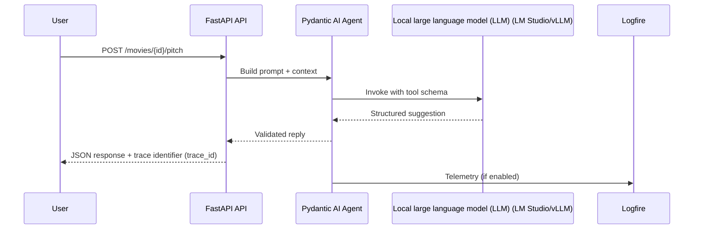

# Session 08 – Working with AI Coding Assistants (LM Studio or vLLM)

- **Date:** Monday, Dec 22, 2025
- **Theme:** Pair program with artificial intelligence (AI) safely—prompt with intent, review outputs critically, and wire agents to your FastAPI backend using Pydantic AI (a typed agent framework built by the Pydantic team).

## Learning Objectives
- Apply spec-first and tests-first prompting patterns to extend the movie service while keeping humans in charge.
- Wrap the FastAPI application programming interface (API) behind a Pydantic AI tool-call function that validates inputs/outputs and emits Logfire telemetry.
- Call a local large language model (LLM) endpoint (LM Studio or vLLM) and evaluate responses automatically with tests.
- Document artificial intelligence (AI) assistance and toggle telemetry/privacy settings responsibly.

## Before Class – AI Preflight (Just-in-Time Teaching, JiTT)
- Install agent tooling:
  ```bash
  uv add "pydantic-ai==0.*" "httpx==0.*"
  ```
- Ensure LM Studio (desktop app for hosting local models) or vLLM (open-source high-performance inference server) is running locally—or know how to start the Docker image shared in the Learning Management System (LMS). Note the base URL.
- Prefer vLLM (Versatile Large Language Model)? Pull and run TinyLlama ahead of time:
  ```bash
  docker run --rm -p 8000:8000 \
    -v ~/.cache/huggingface:/root/.cache/huggingface \
    vllm/vllm-openai:latest \
    --model TinyLlama/TinyLlama-1.1B-Chat-v1.0

  curl http://localhost:8000/v1/models  # confirm the endpoint is live
  ```
- Update your Exercise 2 (EX2) README with AI usage to date; bring one prompt you felt proud of and one that failed.
- Optional: skim the Model Context Protocol (MCP) primer to prepare for Session 12’s tool-friendly APIs.

## Agenda
| Segment | Duration | Format | Focus |
| --- | --- | --- | --- |
| EX2 gallery walk | 15 min | Student demos | Quick UI walkthroughs + trace identifier (ID) check. |
| Policy & prompting refresh | 15 min | Talk | Course policy, attribution, spec/tests-first prompts. |
| Micro demo: prompt → test | 5 min | Live demo | Ask AI for tests first, implement after verifying. |
| Pydantic AI tool-calling | 20 min | Talk + live coding | Define schema, validate input/output (I/O), send telemetry, guardrails. |
| **Part B – Lab 1** | **45 min** | **Guided pairing** | **Extend API with AI help, evaluate via pytest.** |
| Break | 10 min | — | Launch the shared [10-minute timer](https://e.ggtimer.com/10minutes). |
| **Part C – Lab 2** | **45 min** | **Guided agent** | **Connect LM Studio/vLLM through Pydantic AI + automated evaluation.** |
| Retrospective & next steps | 10 min | Discussion | Share effective prompts, log outstanding risks.

## Part A – Guardrails & Patterns
1. **Policy recap:** You may use artificial intelligence (AI) but must understand every line, document assistance, and keep specs/tests in repo. Never paste confidential data.
2. **Prompting templates:**
   - Spec-first (“Given this spec, draft code”)
   - Tests-first (“Write pytest for ... before implementation”)
   - Refactor (“Here is existing code; keep behavior, improve structure”)
3. **Micro demo:** Use ChatGPT/Claude to generate pytest cases for a new `/movies/{id}/ratings` endpoint, implement manually, rerun tests.
4. **Telemetry toggles:** Show how to run Pydantic AI with `logfire` instrumentation turned on/off (privacy) and how to scrub tokens before logging.
5. **Attribution:** Update README changelog or pull request (PR) template with “AI-assisted sections” including prompt summary.



## Part B – Lab 1 (45 Minutes)

### Lab timeline
- **Minutes 0–10** – Draft/collect specs before prompting.
- **Minutes 10–25** – Prompt the assistant for implementations (tests-first), review diffs, and run pytest.
- **Minutes 25–35** – Toggle telemetry flag and capture accepted AI suggestions in Logfire.
- **Minutes 35–45** – Document prompts in `docs/ai-usage.md` and prepare for agent integration.

### 1. Extend API with AI assistance
Suggested prompt (Cursor/Copilot/ChatGPT):
```
You are an assistant working on a FastAPI movie service.
Existing endpoints: GET /movies, POST /movies, GET /movies/{id}.
Add PUT /movies/{id} (partial updates allowed) and POST /movies/{id}/ratings.
Return structured error payloads (status, error, detail, trace_id) as defined in docs/contracts/http-errors.md.
Update pytest suite with tests for happy path + 404 + validation failure.
Show diffs and include brief rationale before each change.
```
Pair-program with the assistant: accept chunks you understand, reject anything unclear, and run `uv run pytest -q` after each step.

> 🎉 **Quick win:** When pytest goes green on AI-generated changes, you just validated that the assistant followed your spec—commit the diff with confidence.

### 2. Capture telemetry toggle
Add environment variable `AI_TELEMETRY_ENABLED=true|false` (default false) in settings. When true, log accepted suggestions via Logfire so you can audit AI contributions.

### 3. Document AI usage
Add a subsection in `README.md` or `docs/ai-usage.md` summarizing prompts used in class, including tool name and link to diff.

## Part C – Lab 2 (45 Minutes)

### Lab timeline
- **Minutes 0–10** – Configure LM Studio/vLLM endpoints and environment variables.
- **Minutes 10–20** – Build the Pydantic AI tool wrapper and validate schema enforcement.
- **Minutes 20–35** – Add automated tests (tool-only transport) and review telemetry.
- **Minutes 35–45** – Run local agent demo, discuss failure handling, capture takeaways.

### 1. Build a Pydantic AI tool wrapper (`agents/movies.py`)
```python
from __future__ import annotations

from pydantic import BaseModel
from typing import Optional

import httpx
from pydantic_ai import Agent, Tool

from app.config import Settings


class RecommendationRequest(BaseModel):
    user_id: int
    limit: int = 5


class RecommendationResponse(BaseModel):
    user_id: int
    recommendations: list[int]


def recommend_tool(settings: Settings, client: Optional[httpx.Client] = None) -> Tool:
    session = client or httpx.Client(base_url=settings.api_base_url, timeout=10.0)

    @Tool
    def recommend(payload: RecommendationRequest) -> RecommendationResponse:
        response = session.post(
            "/tool/recommend-movie",
            json={"payload": payload.model_dump()},
            headers={"X-Trace-Id": "agent-call"},
        )
        response.raise_for_status()
        data = RecommendationResponse.model_validate(response.json()["data"])
        return data

    return recommend
```

### 2. Assemble the agent (`agents/run.py`)
```python
import os

from pydantic_ai import Agent

from app.config import Settings
from agents.movies import recommend_tool

settings = Settings()
agent = Agent(model=os.environ.get("AI_MODEL", "gpt-4o-mini"))
agent.add_tool(recommend_tool(settings))

prompt = "Suggest top 3 movies for user 42 based on recent ratings."
response = agent.run(prompt)
print(response)
```
Explain how to switch `Agent` base URL/headers for LM Studio (`base_url="http://localhost:1234/v1"`, dummy key) or vLLM. Reinforce that deterministic API responses make evaluation easier.

### 3. Automated evaluation
Add pytest that spins the agent in “tool-only” mode:
```python
import httpx
from httpx import Response, Request
from pydantic_ai import Agent

from agents.movies import RecommendationResponse, recommend_tool
from app.config import Settings


def test_agent_returns_recommendations():
    settings = Settings()

    def _mock_handler(request: Request) -> Response:
        return Response(
            status_code=200,
            json={
                "status": "ok",
                "data": RecommendationResponse(user_id=13, recommendations=[1, 2, 3]).model_dump(),
                "error": None,
            },
        )

    transport = httpx.MockTransport(_mock_handler)
    client = httpx.Client(transport=transport, base_url="https://fake")

    agent = Agent(model="noop", transport="tool-only")
    agent.add_tool(recommend_tool(settings, client=client))

    result = agent.run("Recommend movies for user 13")
    assert "recommendations" in result.content
```
Explain `transport="tool-only"` executes tools without calling an LLM—perfect for CI.

### 4. LM Studio / vLLM connection
- LM Studio: configure `OPENAI_API_KEY=dummy`, `OPENAI_BASE_URL=http://localhost:1234/v1`, set model name to the loaded local model.
- vLLM Docker (from LMS script) listens on `http://localhost:8000/v1`; run `docker compose up vllm` to start.
- Use Logfire toggle to capture agent runs when telemetry enabled.

> 🎉 **Quick win:** Once `agent.run(...)` returns structured recommendations without touching an external API, you have a reproducible agent test harness ready for EX3 demos.

## Retrospective & Next Steps
- Share prompt wins/fails; compile a shared `prompts.md` with best practices.
- Action items: finalize EX2 deliverables, keep AI usage logs current, prep for Session 09 (async + reliability).

### Common pitfalls
- **LLM endpoint unreachable** – double check Docker port mapping (`-p 8000:8000`), and inspect container logs with `docker logs <id>`.
- **Telemetry swamping logs** – set `AI_TELEMETRY_ENABLED=false` when iterating quickly; re-enable before shipping to capture provenance.
- **Tool-only tests fail** – ensure mock transport returns `{"data": {...}}` matching the real API envelope.
- **Prompt drift** – remind students to pin prompts in `docs/ai-usage.md`; treat them like fixtures for future debugging.

## Troubleshooting
- **Agent import errors** → ensure `pydantic-ai` is installed and version pinned.
- **HTTP 401 from LM Studio** → check API key requirements; many local models accept dummy tokens but require the header.
- **Tool-only tests failing** → verify FastAPI endpoint returns deterministic structure and update schemas accordingly.

## Student Success Criteria

By the end of Session 08, every student should be able to:

- [ ] Pair with an AI assistant using spec/tests-first prompts and validate changes via pytest.
- [ ] Wrap a FastAPI endpoint in a Pydantic AI tool and exercise it with tool-only tests.
- [ ] Connect to a local LLM endpoint (LM Studio or vLLM) and capture telemetry for agent runs.

**If any item is unchecked, assign a follow-up pairing before Session 09 to keep EX2/EX3 on schedule.**

## AI Prompt Seeds
- “Act as a senior FastAPI reviewer. Given this diff, highlight risks before I accept it.”
- “Generate pytest tests first for a new `/movies/{id}/ratings` endpoint; do not write implementation yet.”
- “Draft a Pydantic AI tool that calls `POST /tool/recommend-movie` and validates the response schema.”
