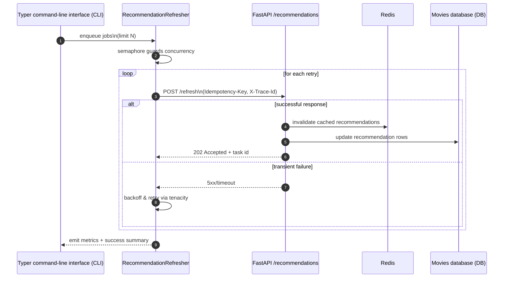

# Session 09 – Async Recommendation Refresh (EX3 Reliability Checkpoint)

- **Date:** Monday, Jan 5, 2026
- **Theme:** Move the recommendation refresh pipeline to asynchronous execution, add retries/backoff, and guard against duplicate work with idempotency keys so every EX3 project ships a proven background job + telemetry loop.

## Learning Objectives
- Call FastAPI endpoints with `httpx.AsyncClient` using Asynchronous Server Gateway Interface (ASGI) transport for in-process tests.
- Introduce bounded concurrency with `asyncio.Semaphore` and implement retry/backoff policies (`anyio`, `tenacity`).
- Add idempotency keys to POST requests to avoid double-processing and design resilience tests around them.
- Instrument async flows with trace identifiers (IDs) and metrics hooks for future observability.
- Produce the EX3-required `scripts/refresh.py` Typer command plus pytest coverage that proves the async path works end to end.

## Session Focus
1. Ship a bounded async refresher with retries/backoff and per-job idempotency keys.
2. Expose the refresher via `scripts/refresh.py` and cover it with at least one `pytest.mark.anyio` test that hits FastAPI through ASGI transport.
3. Capture a telemetry snippet (Logfire span or log excerpt) that proves `X-Trace-Id` + `Idempotency-Key` headers survive the full path and paste it into `docs/EX3-notes.md`.

## Before Class – Async Preflight (Just-in-Time Teaching, JiTT)
- Install async tooling:
  ```bash
  uv add httpx anyio tenacity
  ```
- Add telemetry + cache helpers you will lean on later:
  ```bash
  uv add logfire redis
  ```
- Review Python’s `asyncio` basics (Learning Management System (LMS) primer) and jot one question about concurrency hazards.
- Ensure Exercise 3 (EX3) materials are cloned and the local API/interface run cleanly; if you already support Docker Compose locally, make sure `docker compose up` succeeds so you can reuse the same stack for async drills.

> 🧭 **EX3 Deliverable:** By the end of this session every team must check in (1) `scripts/refresh.py` with bounded concurrency + retries, (2) at least one `pytest.mark.anyio` test that exercises the refresher against the FastAPI app via ASGI transport, and (3) a short log excerpt (paste into `docs/EX3-notes.md`) showing `Idempotency-Key` and `X-Trace-Id` headers working together. Later worker/Redis labs assume this script exists.

## Simple Demo – Async refresher + telemetry loop
1. Start the FastAPI app (`uv run uvicorn app.main:app --reload`) so the refresher has a live target.
2. Run `uv run python scripts/refresh.py run --limit 3` and watch each POST log its `X-Trace-Id` + `Idempotency-Key`.
3. Paste the snippet into `docs/EX3-notes.md` and rerun the command to confirm duplicate keys short-circuit instead of inserting twice.

## Agenda
| Segment | Duration | Format | Focus |
| --- | --- | --- | --- |
| Check-in & EX3 kickoff | 10 min | Discussion | Share Exercise 3 (EX3) project scope and reliability concerns. |
| Async primer | 18 min | Talk + whiteboard | Event loop, async/await, cooperative multitasking, pitfalls. |
| Micro demo: AsyncClient + ASGI transport | 5 min | Live demo | Call FastAPI without network via `httpx.ASGITransport`. |
| Reliability patterns | 12 min | Talk | Retries, circuit breakers, idempotency keys, tracing. |
| **Part B – Lab 1** | **45 min** | **Guided coding** | **Async recommendation job with bounded concurrency + retries.** |
| Break | 10 min | — | Launch the shared [10-minute timer](https://e.ggtimer.com/10minutes). |
| **Part C – Lab 2** | **45 min** | **Guided testing** | **Async tests, idempotency guarantees, instrumentation.** |
| Wrap-up | 10 min | Discussion | Next steps for Exercise 3 (EX3) milestone, logging notes, Redis preview.

## Part A – Theory Highlights
1. **Event loop refresher:** tasks share a thread, await input/output (I/O), avoid CPU-heavy work. Show `asyncio.create_task` (schedule work without blocking), `asyncio.gather` (wait for many coroutines at once), and `asyncio.Semaphore` (cap concurrency) so every student knows the building blocks.
2. **Retry/backoff:** exponential vs. jitter, idempotent vs. non-idempotent operations, using `tenacity` decorators.
3. **Idempotency keys:** Accept `Idempotency-Key` header, store processed keys (in-memory or Redis), and short-circuit duplicates.
4. **Instrumentation:** Keep `X-Trace-Id` consistent; plan to emit metrics using Prometheus/Redis.

### Motivating Micro Demos (5 minutes each)
Give students a quick taste of why we pair async work with Redis + Logfire before diving into the heavier lab steps.

1. **Redis quick win:**  
   ```bash
   docker run --rm -p 6379:6379 redis:7-alpine
   redis-cli set "recommend:pending" 2
   redis-cli decr "recommend:pending"
   redis-cli get "recommend:pending"
   ```
   Explain that the same counter powers your retry/idempotency checks once the async refresher fans out jobs. Seeing the number drop in real time makes the need for a shared cache tangible.

2. **Logfire heartbeat:** (reuse the existing project virtualenv)
   ```bash
   uv run python - <<'PY'
   import asyncio
   import logfire

   logfire.configure()

   async def demo_task(name: str):
       with logfire.span("demo.refresh", task=name):
           await asyncio.sleep(0.2)
           logfire.info("task-complete", task=name)

   asyncio.run(asyncio.gather(demo_task("a"), demo_task("b")))
   PY
   ```
   Point out the spans and structured logs in the console—Session 09’s refresher will emit the same telemetry so later exercises have trace data to reference.



## Part B – Lab 1 (45 Minutes)

### Lab timeline
- **Minutes 0–10** – Review refresher settings (`refresh_max_concurrency`, `trace_id`).
- **Minutes 10–25** – Implement async refresher with semaphore + retries.
- **Minutes 25–35** – Add idempotency keys and confirm with logs.
- **Minutes 35–45** – Trigger jobs via Typer CLI and inspect trace IDs.
### 1. Async recommendation service (`app/recommendation.py`)
```python
from __future__ import annotations

import asyncio
from dataclasses import dataclass
from typing import Iterable

import httpx
import logfire
from tenacity import AsyncRetrying, retry_if_exception_type, stop_after_attempt, wait_exponential_jitter

from app.config import Settings


@dataclass
class RecommendationJob:
    movie_id: int
    payload: dict[str, int]


class RecommendationRefresher:
    def __init__(self, settings: Settings) -> None:
        self.settings = settings
        self.client = httpx.AsyncClient(base_url=settings.api_base_url, timeout=10.0)
        self._semaphore = asyncio.Semaphore(settings.refresh_max_concurrency)
        self._logger = logfire.with_fields(component="recommendation_refresher")

    async def refresh(self, jobs: Iterable[RecommendationJob]) -> None:
        job_list = list(jobs)
        with self._logger.span("recommendation.refresh", jobs=len(job_list)):
            tasks = [self._bounded_refresh(job) for job in job_list]
            await asyncio.gather(*tasks)

    async def _bounded_refresh(self, job: RecommendationJob) -> None:
        async with self._semaphore:
            async for attempt in AsyncRetrying(
                stop=stop_after_attempt(3),
                wait=wait_exponential_jitter(initial=0.5, max=5.0),
                retry=retry_if_exception_type(httpx.HTTPError),
            ):
                with attempt:
                    await self._send_job(job)

    async def _send_job(self, job: RecommendationJob) -> None:
        idempotency_key = f"recommend:{job.movie_id}:{job.payload['user_id']}"
        with self._logger.span("recommendation.job", movie_id=job.movie_id):
            response = await self.client.post(
                "/recommendations/refresh",
                json=job.payload,
                headers={
                    "X-Trace-Id": self.settings.trace_id,
                    "Idempotency-Key": idempotency_key,
                },
            )
            response.raise_for_status()
            logfire.info(
                "refresh-complete",
                movie_id=job.movie_id,
                status=response.status_code,
                idempotency_key=idempotency_key,
            )
```
Track `refresh_max_concurrency` and `trace_id` via `Settings` (add defaults to config with environment overrides).

Update `app/config.py` (from Session 03) with async-specific settings:
```python
class Settings(BaseSettings):
    # existing fields...
    api_base_url: str = "http://localhost:8000"
    refresh_max_concurrency: int = 4
    trace_id: str = "recommend-refresh"
```
Call `logfire.configure()` once during app or CLI startup (Session 07 introduced this pattern) so the spans and counters above stream to your local console or configured backend.

### 2. Async CLI trigger (`scripts/refresh.py`)
```python
import asyncio
import typer

from app.config import Settings
from app.recommendation import RecommendationJob, RecommendationRefresher

app = typer.Typer(help="Async recommendation refresh")


@app.command()
def run(limit: int = 10) -> None:
    settings = Settings()
    jobs = [RecommendationJob(movie_id=i, payload={"movie_id": i, "user_id": 1}) for i in range(limit)]
    refresher = RecommendationRefresher(settings)
    asyncio.run(refresher.refresh(jobs))


if __name__ == "__main__":
    app()
```
Show logs with trace IDs and idempotency keys for each request.

> 🎉 **Quick win:** Running `uv run python scripts/refresh.py run --limit 3` without duplicate inserts proves your idempotency guard is effective.

## Part C – Lab 2 (45 Minutes)

### Lab timeline
- **Minutes 0–10** – Mock async client with `ASGITransport` for in-process testing.
- **Minutes 10–25** – Assert idempotency behavior and retry logic.
- **Minutes 25–35** – Add caching hooks (Redis) and metrics counters.
- **Minutes 35–45** – Inject failures, inspect Logfire counters, and document learnings.
### 1. Async tests with `ASGITransport`
```python
import asyncio

import httpx
import pytest

from app.main import app
from app.recommendation import RecommendationJob, RecommendationRefresher
from app.config import Settings


@pytest.mark.anyio
async def test_refresh_hits_endpoint(monkeypatch):
    transport = httpx.ASGITransport(app=app)
    client = httpx.AsyncClient(transport=transport, base_url="http://testserver")

    monkeypatch.setattr("app.recommendation.httpx.AsyncClient", lambda *args, **kwargs: client)

    settings = Settings(refresh_max_concurrency=2, api_base_url="http://testserver", trace_id="async-test")
    refresher = RecommendationRefresher(settings)

    job = RecommendationJob(movie_id=1, payload={"movie_id": 1, "user_id": 42})
    await refresher.refresh([job])
```
Explain `pytest.mark.anyio` and why we re-use ASGI transport to avoid network calls.

### 2. Idempotency guard test
Design FastAPI endpoint storing processed keys (in-memory for now). Write test to send duplicate job and assert second response returns 202 or similar without duplicate work.

### 3. Reliability metrics (stretch)
- Emit `logfire.counter("recommendation.retry", ...)` inside retry loop.
- Record durations with `logfire.timer()` context manager for future dashboards.

### 4. Failure injection
Use `pytest` to monkeypatch the endpoint and raise HTTP 500 on first attempt, confirm retry hits and eventual success.

### 5. Redis caching for recommendations
```python
import json
import os
import redis

r = redis.from_url(os.getenv("REDIS_URL", "redis://localhost:6379/0"))

def cache_recommendations(user_id: int, recs: list[int]) -> None:
    key = f"recs:{user_id}"
    r.setex(key, 3600, json.dumps(recs))

def get_cached_recommendations(user_id: int) -> list[int] | None:
    key = f"recs:{user_id}"
    data = r.get(key)
    return json.loads(data) if data else None

@app.get("/recommendations/{user_id}")
async def recommend(user_id: int) -> dict[str, object]:
    if cached := get_cached_recommendations(user_id):
        return {"source": "cache", "recommendations": cached}

    recs = await generate_recommendations(user_id)
    cache_recommendations(user_id, recs)
    return {"source": "fresh", "recommendations": recs}
```
Discuss time to live (TTL) strategy (one hour here) and note how a Redis deployment makes this production-ready.

## Wrap-up & Next Steps
- ✅ Async refresher, retries with jitter, idempotency keys, async tests.
- Capture a Logfire screenshot or log excerpt plus Redis counter snippet in `docs/EX3-notes.md` so graders can trace your background jobs later.
- Confirm Redis is installed locally (`brew install redis` or `docker run redis`) so caching/idempotency checks are easy to repeat.

## Troubleshooting
- **`RuntimeError: Event loop is closed`** → avoid nested `asyncio.run`; use `pytest.mark.anyio` and `asyncio.get_event_loop_policy().new_event_loop()` if needed.
- **Idempotency store resets** → persist keys in Redis or file for long-running jobs.
- **Un-awaited coroutine warnings** → ensure every async call is awaited; use `pytest.raises` with async context for exceptions.

### Common pitfalls
- **Semaphore never releases** – wrap critical sections in `async with` to guarantee release even when exceptions occur.
- **Idempotency keys collide** – include both `movie_id` and `user_id` (or timestamp bucket) to avoid overwriting legitimate requests.
- **Redis connection refused** – ensure local Redis is running (`brew services start redis` or Docker container) before enabling caching.

## Student Success Criteria

By the end of Session 09, every student should be able to:

- [ ] Refresh recommendations asynchronously with bounded concurrency and retries.
- [ ] Write async pytest suites using `httpx.ASGITransport`/`pytest.mark.anyio`.
- [ ] Cache recommendation results in Redis with idempotency keys to prevent duplicate work.
- [ ] Emit Logfire spans/counters that prove when refresh jobs run and succeed (screenshot or log excerpt stored in `docs/EX3-notes.md`).

**If any box stays unchecked, book an async lab session soon after this one.**

## AI Prompt Seeds
- “Write an async refresher that batches POST requests with bounded concurrency and retries using tenacity.”
- “Show how to use `httpx.AsyncClient` with `ASGITransport` in tests.”
- “Design an idempotency key strategy for POST `/recommendations/refresh` with sample tests.”
- “Instrument the refresher with Logfire spans and counters so each job logs status + idempotency key.”
