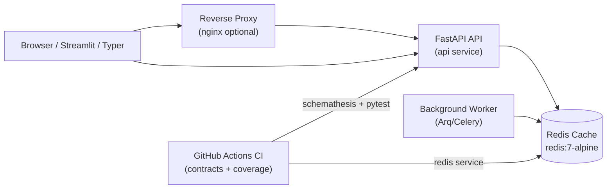

# Session 10 – Docker Compose, Redis, and Service Contracts (EX3 Runbook Core)

- **Date:** Monday, Jan 12, 2026
- **Theme:** Run the movie API with Redis and worker services via Docker Compose, enforce service contracts, and introduce rate limiting/background jobs so the EX3 stack has a single `docker compose up` story plus CI gates.

## Learning Objectives
- Model multi-service environments with Docker Compose (application programming interface (API), Redis, worker, proxy) and treat the compose file as the default EX3 launch command.
- Use Redis for caching, idempotency tracking, and rate limiting (`slowapi`) while wiring Session 09’s async refresher into a background worker.
- Harden API contracts with Schemathesis (from Session 02 stretch) and document expectations in `docs/service-contract.md`.
- Wire coverage + contract tests into GitHub Actions for continuous integration (CI) confidence and capture the exact steps inside `docs/runbooks/compose.md`.

## Session Focus
1. Maintain a single `docker compose up` workflow that boots the API, Redis, and async worker with healthchecks.
2. Use Redis for rate limiting + caching (reusing Session 09’s refresher) and explain the behavior inside `docs/service-contract.md`.
3. Lock in contract/CI coverage by showing how Schemathesis, pytest (with coverage), and the Compose runbook all tie together.

## Before Class – Compose Preflight (Just-in-Time Teaching, JiTT)
- Install Redis locally or ensure Docker Desktop can pull `redis:7-alpine`:
  ```bash
  docker pull redis:7-alpine
  ```
- For hands-on Compose drills, open Docker Desktop and launch a **Labspace** from the left navigation (blue beaker icon). The **Building agentic apps with Docker** and **Container-supported development** lab cards mirror Session 10’s multi-service stack, so you can rehearse Compose + Redis workflows even if your laptop cannot run the full stack.
- Review the provided Compose primer (Learning Management System (LMS)) and list one question about networking or environment variables.
- Run `uv run schemathesis run docs/contracts/openapi.json --checks status_code_conformance --dry-run` to confirm tooling works.
- Copy Session 09’s `scripts/refresh.py` into your repo (if you coded along elsewhere); Session 10 extends it into the worker container.

> 🧭 **EX3 Deliverable:** Ship a working `compose.yaml` with services for API, Redis, and the async worker plus CI instructions (`docs/runbooks/compose.md`) that describe `docker compose up`, contract testing, and how to view rate-limit headers. Instructors will grade EX3 by running these exact commands.

## Simple Demo – Compose stack in one command
1. From the repo root, run `docker compose up --build` and wait until API, worker, and Redis report `healthy`.
2. In another terminal, hit `curl -i http://localhost:8000/movies` twice—confirm the first response returns JSON plus `X-RateLimit-*` headers and the second hits Redis cache (latency drop in logs).
3. Run `redis-cli -u redis://localhost:6379/0 keys 'rate:*'` (or `docker exec` if using Compose) to prove rate-limit counters exist, then stop the stack with `Ctrl+C`.

## Agenda
| Segment | Duration | Format | Focus |
| --- | --- | --- | --- |
| Recap & async wins | 10 min | Discussion | Share Session 09 takeaways, identify bottlenecks. |
| Compose architecture | 18 min | Talk + diagram | api + redis + worker + proxy, networks, volumes. |
| Micro demo: redis cache hit | 5 min | Live demo | Use `redis-cli` to show cache set/get vs API latency. |
| Contract testing refresher | 12 min | Talk | Schemathesis, JSON schema examples, service obligations. |
| **Part B – Lab 1** | **45 min** | **Guided build** | **Docker Compose stack with FastAPI, Redis, background worker.** |
| Break | 10 min | — | Launch the shared [10-minute timer](https://e.ggtimer.com/10minutes). |
| **Part C – Lab 2** | **45 min** | **Guided validation** | **Rate limiting, contract tests, GitHub Actions CI pipeline.** |
| Wrap-up | 10 min | Questions and Answers (Q&A) | Exercise 3 (EX3) milestone reminder, deployment prep.

## Part A – Theory Highlights
1. **Compose structure:** `services` block, named volumes, networks, environment variables, healthchecks (`depends_on` with `service_healthy`).
2. **Redis roles:** caching (movie list), rate limiting tokens, job queue backend—make sure students know Redis is an in-memory key-value datastore that excels at fast counters and lists.
3. **Background jobs:** choose one lightweight runner (Arq or Celery). For class we’ll show Arq because it rides on asyncio.
4. **Contracts:** `docs/service-contract.md` documents request/response shapes; Schemathesis enforces them alongside integration tests.
5. **Continuous integration (CI) pipeline:** Compose for local dev, GitHub Actions for CI (use services job with `services.redis`, run `uv sync --frozen`, `pytest --cov`, `schemathesis`).



## Part B – Hands-on Lab 1 (45 Minutes)

### Lab timeline
- **Minutes 0–10** – Scaffold `compose.yaml` and review service relationships.
- **Minutes 10–25** – Add cache + rate limit environment variables and healthchecks.
- **Minutes 25–35** – Launch the stack (`docker compose up`) and verify health endpoints.
- **Minutes 35–45** – Wire Arq worker + caching helper and explore logs.
### 1. Compose file (`compose.yaml`)
```yaml
services:
  api:
    build: .
    command: uv run uvicorn app.main:app --host 0.0.0.0 --port 8000
    ports:
      - "8000:8000"
    environment:
      - MOVIE_REDIS_URL=redis://redis:6379/0
      - MOVIE_RATE_LIMIT_PER_MINUTE=20
    depends_on:
      redis:
        condition: service_healthy
    healthcheck:
      test: ["CMD", "curl", "-f", "http://localhost:8000/health"]
      interval: 30s
      timeout: 5s
      retries: 3

  worker:
    build: .
    command: uv run arq app.worker.WorkerSettings
    environment:
      - MOVIE_REDIS_URL=redis://redis:6379/0
    depends_on:
      redis:
        condition: service_healthy

  redis:
    image: redis:7-alpine
    ports:
      - "6379:6379"
    healthcheck:
      test: ["CMD", "redis-cli", "ping"]
      interval: 10s
      timeout: 3s
      retries: 5
```
Explain networks (default) and volumes (add later for persistence if needed).

Spin everything up:
```bash
docker compose up --build
```
Keep the stack running while you exercise the API and worker.

> 🎉 **Quick win:** When `docker compose ps` shows healthy API/worker/redis services, you’re operating a multi-service stack locally.

### 2. Redis client helper (`app/cache.py`)
```python
from functools import lru_cache

import redis.asyncio as redis

from app.config import Settings


@lru_cache(maxsize=1)
def get_redis(settings: Settings) -> redis.Redis:
    return redis.from_url(settings.redis_url, decode_responses=True)
```
Extend `Settings` with `redis_url: str` and `rate_limit_per_minute: int`.

### 3. Rate limiting middleware (`app/rate_limit.py`)
```python
import time

from fastapi import HTTPException, Request

from app.cache import get_redis
from app.config import Settings


async def rate_limit(request: Request, call_next):
    settings = Settings()
    redis_client = get_redis(settings)
    key = f"rate:{request.client.host}:{request.url.path}"
    window = 60
    max_requests = settings.rate_limit_per_minute

    current = await redis_client.incr(key)
    if current == 1:
        await redis_client.expire(key, window)

    if current > max_requests:
        raise HTTPException(status_code=429, detail="Too many requests")

    response = await call_next(request)
    response.headers["X-RateLimit-Limit"] = str(max_requests)
    response.headers["X-RateLimit-Remaining"] = str(max_requests - current)
    return response
```
Mount middleware in `app/main.py` before routes.

### 4. Background worker (`app/worker.py`)
```python
from arq import cron
from arq.connections import RedisSettings

from app.config import Settings


class WorkerSettings:
    redis_settings = RedisSettings.from_url(Settings().redis_url)

    async def startup(self, ctx):
        ctx["settings"] = Settings()

    async def shutdown(self, ctx):
        ctx.pop("settings", None)

    async def refresh_recommendations(self, ctx, user_id: int) -> None:
        settings: Settings = ctx["settings"]
        # call async refresher from Session 09

    functions = [refresh_recommendations]
    cron_jobs = [cron(refresh_recommendations, cron_string="0 * * * *", kwargs={"user_id": 42})]
```
Explain Arq’s simplicity: it is a lightweight task queue that reuses `async def` functions and the same Redis instance, so students do not need to learn a new worker process model. Contrast it briefly with **Celery**, the older, feature-rich queue that supports multiple brokers (Redis/RabbitMQ) but demands more setup—point out when the heavier tool is worth the trade-off.

### 5. Caching `GET /movies`
Wrap the list route in `app/main.py`:
```python
import json

from fastapi import Depends

from app.cache import get_redis


@app.get("/movies", response_model=list[Movie])
async def list_movies(repository: RepositoryDep, settings: SettingsDep) -> list[Movie]:
    redis_client = get_redis(settings)
    cache_key = "movies:list"
    cached = await redis_client.get(cache_key)
    if cached:
        return json.loads(cached)

    result = [movie for movie in repository.list()]
    await redis_client.setex(cache_key, 60, json.dumps([movie.model_dump() for movie in result]))
    return result
```
Remember to invalidate cache in POST/PUT/DELETE handlers.

## Part C – Lab 2 (45 Minutes)

### Lab timeline
- **Minutes 0–10** – Run Schemathesis against the live Compose stack.
- **Minutes 10–25** – Add GitHub Actions job steps for tests + contract checks.
- **Minutes 25–35** – Implement rate limiting tests (429) and headers.
- **Minutes 35–45** – Update service contract docs and capture artifacts for EX3.
### 1. Contract tests with Schemathesis
```bash
uv run schemathesis run http://localhost:8000/openapi.json --checks status_code_conformance --workers 2
```
Address failures immediately; update docs if behavior changes. Store command in `Makefile` or `scripts/check_contract.sh`.

### 2. GitHub Actions pipeline
`.github/workflows/ci.yaml` (excerpt):
```yaml
jobs:
  test:
    runs-on: ubuntu-latest
    services:
      redis:
        image: redis:7-alpine
        ports:
          - 6379:6379
    steps:
      - uses: actions/checkout@v4
      - uses: astral-sh/setup-uv@v1
      - run: uv sync --frozen
      - run: uv run pytest --cov=app --cov-report=term-missing
      - run: uv run schemathesis run http://localhost:8000/openapi.json --checks status_code_conformance --dry-run
```
Explain how to swap the dry run for real execution once you can boot the API inside CI (Compose + `uvicorn` background run).

### 3. Rate limiting test (429)
```python
def test_rate_limit(client):
    for _ in range(Settings().rate_limit_per_minute):
        assert client.get("/movies").status_code == 200

    response = client.get("/movies")
    assert response.status_code == 429
    assert response.json()["detail"] == "Too many requests"
```
Use `freezegun` or monkeypatch time if the window needs reset.

### 4. Contract documentation
Update `docs/service-contract.md` with:
- Rate limit headers and expected values.
- Cache invalidation rules.
- Background job service level agreement (SLA) (refresh runs every hour; immediate manual trigger via CLI).

## Wrap-up & Next Steps
- ✅ Compose stack, Redis cache + rate limiting, background worker, contract testing, CI pipeline outline.
- Audit secrets, rotate tokens, and create `.env.example` entries for Redis auth if enabled.
- Point teams to the EX3 brief in [docs/exercises.md](../exercises.md#ex3--capstone-polish-kiss) so they align infrastructure deliverables with the milestone.

## Troubleshooting
- **Redis connection refused** → confirm Compose network is up or local Redis running; check `redis_url` env.
- **Slow Schemathesis runs** → narrow to critical endpoints with `--endpoint` filter or run in CI nightly.
- **Arq import error** → install `uv add arq`; ensure worker service uses same image/tag as API.

### Common pitfalls
- **Compose race conditions** – use `depends_on` with `condition: service_healthy` to avoid worker failures when Redis isn’t ready.
- **Environment drift** – keep `.env` defaults aligned with `compose.yaml` to prevent mismatched URLs locally vs. CI.
- **Schemathesis hitting old schema** – regenerate `openapi.json` after code changes or mount the live URL instead of static file.

## Student Success Criteria

By the end of Session 10, every student should be able to:

- [ ] Run the FastAPI API, Redis, worker, and proxy together via Docker Compose.
- [ ] Enforce rate limits and cache hits backed by Redis inside the stack.
- [ ] Execute contract tests (Schemathesis) and CI-ready pipelines covering the multi-service environment.

**If any item lags, assign a small-group infra session to close the gap.**

## AI Prompt Seeds
- “Draft a docker-compose.yml with FastAPI, Redis, and an Arq worker including healthchecks.”
- “Write FastAPI middleware that rate limits requests using Redis tokens.”
- “Generate a GitHub Actions workflow that runs pytest with coverage and Schemathesis contract tests.”
