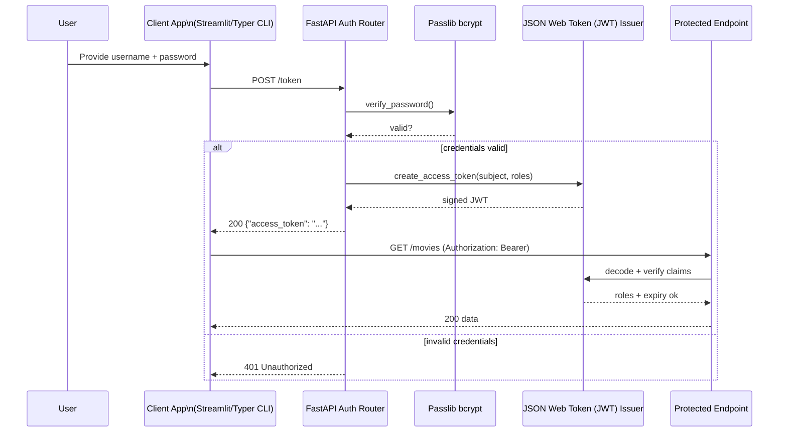

# Session 11 – Security Foundations

- **Date:** Monday, Jan 19, 2026
- **Theme:** Secure the movie service with proper authentication (auth), secrets hygiene, and threat modeling.

## Learning Objectives
- Hash passwords with `passlib[bcrypt]`, issue JSON Web Tokens (JWTs) (`pyjwt`) with expiration, issuer, and audience claims.
- Apply Open Worldwide Application Security Project (OWASP) API Top 3 mitigations: authentication, input validation, secret management.
- Audit `.env.example`, rotate keys, and document secure defaults for Docker/Compose.
- Write security-focused tests (401/403 paths, JWT expiry, secret exposure checks).

## Before Class – Security Preflight (Just-in-Time Teaching, JiTT)
- Install dependencies:
  ```bash
  uv add "passlib[bcrypt]" "pyjwt==2.*"
  ```
- Rotate any hard-coded secrets in your repo; ensure `.env` is gitignored and `.env.example` is up to date.
- Review OWASP API Security Top 10 summary (Learning Management System (LMS)) and bring one question.
- Optional: scan your repo with `trufflehog filesystem --exclude .git` to confirm secrets hygiene.

## Agenda
| Segment | Duration | Format | Focus |
| --- | --- | --- | --- |
| Threat model warm-up | 10 min | Discussion | Identify assets, attackers, entry points. |
| Authentication (AuthN)/authorization (AuthZ) walkthrough | 18 min | Talk + code | Password hashing, JWT issuance, role-based access. |
| Micro demo: JWT decode | 5 min | Live demo | `uv run python -m jwt decode` and explain claims. |
| Secrets hygiene & OWASP | 12 min | Talk | .env discipline, least privilege, input validation, logging redaction. |
| **Part B – Lab 1** | **45 min** | **Guided coding** | **Add password hashing, login endpoint, JWT tokens.** |
| Break | 10 min | — | Launch the shared [10-minute timer](https://e.ggtimer.com/10minutes). |
| **Part C – Lab 2** | **45 min** | **Guided hardening** | **Role-based guards, security tests, secret scanning.** |
| Wrap-up | 10 min | Questions and Answers (Q&A) | Prep for Session 12 (tool-friendly APIs), confirm Exercise 3 (EX3) security tasks.

## Part A – Theory Highlights
1. **Threat modeling:** assets (user data, movie catalog), adversaries (students, bots), attack surface (login, recommendations, admin endpoints).
2. **Password storage:** never store plaintext; use `passlib.hash.bcrypt`. Clarify that a **salt** is a unique random string stored alongside each password hash to stop rainbow-table attacks, while a **pepper** is a separate secret kept outside the database so a stolen dump is still unusable. Close the loop with password policies students can adopt immediately.
3. **JSON Web Token (JWT) anatomy:** header, payload, signature; include `exp`, `iat`, `iss`, `aud`, `roles`. Keep tokens short-lived.
4. **Secrets hygiene:** `.env` vs `.env.example`, `docker compose` secrets, GitHub Actions secrets, never log tokens.
5. **OWASP highlights:** Broken auth, excessive data exposure, lack of rate limiting (already addressed). Tie back to previous sessions.



## Part B – Lab 1 (45 Minutes)

### Lab timeline
- **Minutes 0–10** – Wire bcrypt hashing and verify by logging a hashed password.
- **Minutes 10–25** – Implement `/token` endpoint, ensure fake user logins succeed.
- **Minutes 25–35** – Issue JWTs with roles/expiry and add settings entries.
- **Minutes 35–45** – Protect one endpoint with `require_role` and smoke-test with curl.

### 1. User model & hashing (`app/security.py`)
```python
from datetime import datetime, timedelta
from typing import Optional

import jwt
from passlib.context import CryptContext

from app.config import Settings

pwd_context = CryptContext(schemes=["bcrypt"], deprecated="auto")


def hash_password(password: str) -> str:
    return pwd_context.hash(password)


def verify_password(plain_password: str, hashed: str) -> bool:
    return pwd_context.verify(plain_password, hashed)


def create_access_token(
    *,
    subject: str,
    settings: Settings,
    expires_delta: Optional[timedelta] = None,
    roles: Optional[list[str]] = None,
) -> str:
    now = datetime.utcnow()
    expire = now + (expires_delta or timedelta(minutes=30))
    payload = {
        "sub": subject,
        "iat": now.timestamp(),
        "exp": expire.timestamp(),
        "iss": settings.jwt_issuer,
        "aud": settings.jwt_audience,
        "roles": roles or ["student"],
    }
    return jwt.encode(payload, settings.jwt_secret, algorithm="HS256")
```
Add new settings (JWT secret, issuer, audience, token expiry). Store defaults in `.env.example` and populate `.env` locally.

Update `app/config.py`:
```python
class Settings(BaseSettings):
    # existing fields...
    jwt_secret: str = "change-me"
    jwt_issuer: str = "movie-service"
    jwt_audience: str = "movie-clients"
    jwt_expiry_minutes: int = 30
```

### 2. Auth router (`app/routes/auth.py`)
```python
from datetime import timedelta

from fastapi import APIRouter, Depends, HTTPException, status
from fastapi.security import OAuth2PasswordRequestForm

from app.config import Settings
from app.security import create_access_token, verify_password

router = APIRouter(prefix="/token", tags=["auth"])

_FAKE_USERS = {
    "teacher": {
        "username": "teacher",
        "hashed_password": hash_password("classroom"),
        "roles": ["editor"],
    }
}


def authenticate(username: str, password: str):
    record = _FAKE_USERS.get(username)
    if not record or not verify_password(password, record["hashed_password"]):
        return None
    return record


@router.post("", response_model=dict)
def login(
    form: OAuth2PasswordRequestForm = Depends(),
    settings: Settings = Depends(),
) -> dict[str, str]:
    user = authenticate(form.username, form.password)
    if not user:
        raise HTTPException(status_code=status.HTTP_401_UNAUTHORIZED, detail="Invalid credentials")

    access_token = create_access_token(
        subject=user["username"],
        roles=user["roles"],
        settings=settings,
        expires_delta=timedelta(minutes=settings.jwt_expiry_minutes),
    )
    return {"access_token": access_token, "token_type": "bearer"}
```
Mount router in `app/main.py` and guard protected endpoints.

> 🎉 **Quick win:** When `uv run pytest tests/test_security.py::test_login_returns_token -q` returns a green dot, you’ve confirmed hashing + JWT issuance work together.

### 3. Dependency for protected routes
```python
from fastapi import Depends, HTTPException, Security, status
from fastapi.security import OAuth2PasswordBearer

from app.config import Settings

oauth2_scheme = OAuth2PasswordBearer(tokenUrl="/token")


def require_role(*allowed_roles: str):
    def _inner(token: str = Security(oauth2_scheme), settings: Settings = Depends()):
        try:
            payload = jwt.decode(
                token,
                settings.jwt_secret,
                algorithms=["HS256"],
                audience=settings.jwt_audience,
                issuer=settings.jwt_issuer,
            )
        except jwt.PyJWTError as exc:
            raise HTTPException(status_code=status.HTTP_401_UNAUTHORIZED, detail="Invalid token") from exc

        roles = set(payload.get("roles", []))
        if not roles.intersection(allowed_roles):
            raise HTTPException(status_code=status.HTTP_403_FORBIDDEN, detail="Insufficient permissions")
        return payload

    return _inner
```
Apply `require_role("editor")` to sensitive routes (e.g., recommendation tools, admin updates).

## Part C – Lab 2 (45 Minutes)

### Lab timeline
- **Minutes 0–10** – Write security-focused tests for login and protected endpoints.
- **Minutes 10–25** – Add token expiry checks and role guard coverage.
- **Minutes 25–35** – Run secret scanners; update `docs/security-checklist.md`.
- **Minutes 35–45** – Demonstrate curl workflow (with/without token) and document remediation steps.
### 1. Security tests (`tests/test_security.py`)
```python
from fastapi.testclient import TestClient

from app.main import app

client = TestClient(app)


def test_login_returns_token():
    response = client.post(
        "/token",
        data={"username": "teacher", "password": "classroom"},
        headers={"Content-Type": "application/x-www-form-urlencoded"},
    )
    assert response.status_code == 200
    assert "access_token" in response.json()


def test_protected_endpoint_requires_token():
    response = client.post("/tool/recommend-movie", json={"payload": {"user_id": 1}})
    assert response.status_code == 401


def test_token_expiry(monkeypatch):
    settings = Settings(jwt_expiry_minutes=0)
    token = create_access_token(subject="user", settings=settings, expires_delta=timedelta(seconds=1))
    time.sleep(2)
    response = client.get("/movies", headers={"Authorization": f"Bearer {token}"})
    assert response.status_code in (401, 403)
```
(Remember to import missing modules in actual test file—`time`, `timedelta`, `Settings`, etc.)

### 2. Secret scanning
- Run `trufflehog filesystem --exclude .git .` or `gitleaks detect` and screenshot findings (should be clean).
- Add `make secrets-scan` target for CI.

### 3. OWASP checklist
Update `docs/security-checklist.md` with:
- Authentication enforced on admin endpoints.
- Input validation references (Pydantic validators from Sessions 03/05).
- Rate limiting (Session 10), logging redaction (avoid tokens).
- Secrets: `.env` variables, GitHub Action secrets, Docker secrets.

### 4. Optional stretch – refresh tokens
Create `/token/refresh` endpoint issuing new tokens if refresh token valid; store refresh tokens hashed in Redis.

### Verify tokens with curl (demo script)
```bash
# Step 1: Fetch a token
TOKEN=$(curl -s -X POST http://localhost:8000/token \
  -H "Content-Type: application/x-www-form-urlencoded" \
  -d "username=teacher&password=classroom" \
  | jq -r '.access_token')

# Step 2: Call a protected endpoint
curl -H "Authorization: Bearer $TOKEN" \
  http://localhost:8000/movies

# Step 3: Confirm unauthorized request fails
curl -i http://localhost:8000/movies
```
Encourage students to add the script to `scripts/security-smoke.sh` so QA teams can reuse it.

## Wrap-up & Next Steps
- ✅ Password hashing, JWT issuance, role guards, security tests, secret scanning.
- Prep for Session 12: finalize documentation, tool-friendly API design, publish `docs/service-contract.md` updates, and gather all EX3 deliverables.

## Troubleshooting
- **`bcrypt` missing build prerequisites** → ensure `rust`/`gcc` installed or use prebuilt wheels (should work on macOS/Linux). On Windows/WSL, install `build-essential`.
- **Invalid JWT** → verify `aud`/`iss` match; align Settings across services (worker, API, CLI).
- **Token not accepted by Swagger UI** → set OAuth2 config in FastAPI app: `app = FastAPI(swagger_ui_init_oauth={"clientId": "web"})` if needed.

### Common pitfalls
- **Clock skew causing “token expired” errors** – sync host clocks or inject fixed datetimes during tests (e.g., via `freezegun`).
- **Secrets checked into git** – run `trufflehog` before commits and rotate anything flagged immediately.
- **Role mismatch** – log decoded payload roles locally (strip in production) and ensure `_FAKE_USERS` entries match `require_role` guards.

## Student Success Criteria

By the end of Session 11, every student should be able to:

- [ ] Hash and verify passwords with `passlib[bcrypt]` instead of storing plaintext credentials.
- [ ] Issue and validate JWTs (with `iss`, `aud`, `exp`, and roles) that gate at least one endpoint.
- [ ] Run security smoke tests (pytest + curl) and share clean secret-scan results.

**If a student cannot check a box, schedule a security-focused pairing before Session 12.**

## AI Prompt Seeds
- “Generate FastAPI login endpoint that hashes passwords with passlib, returns JWT with exp/iss/aud claims.”
- “Write pytest tests for 401/403 scenarios against a JWT-protected endpoint.”
- “Create a security checklist covering OWASP API Top 3 for a FastAPI service.”
