# Session 12 – Tool-Friendly APIs and Final Prep

- **Date:** Monday, Jan 26, 2026
- **Theme:** Polish the application programming interface (API) for external tools—make it Model Context Protocol (MCP)-friendly (MCP is the open standard that lets tools talk to language models), lock in documentation/testing pipelines, and prep Exercise 3 (EX3) final presentations.

## Learning Objectives
- Expose tool-friendly endpoints with deterministic request/response models and OpenAPI examples (happy + sad paths).
- Add finishing touches: entity tag (ETag)/`If-None-Match`, pagination, feature flags, comma-separated values (CSV) export endpoint.
- Automate documentation + quality gates (MkDocs/pdocs, Ruff, mypy, pre-commit, changelog).
- Plan a release checklist for Exercise 3 (EX3), including deployment commands and verification steps.

## Before Class – Final Prep (Just-in-Time Teaching, JiTT)
- Ensure Exercise 3 (EX3) repos are up to date, local run scripts succeed end to end, and tests pass with coverage + Schemathesis. (If you are exploring optional Compose/Redis extensions, double-check that stack too.)
- Install doc tooling if not already:
  ```bash
  uv add mkdocs-material pdocs ruff mypy pre-commit
  ```
- Draft a release checklist outline (who, what, when) for your EX3 team.

## Agenda
| Segment | Duration | Format | Focus |
| --- | --- | --- | --- |
| EX3 dry run | 20 min | Student demos | Show the local run script/interface, tool-friendly endpoint, and any optional observability dashboards. |
| Tool-friendly design | 15 min | Talk | Deterministic schemas, pagination strategy, entity tags (ETags), versioning. |
| Micro demo: ETag handshake | 5 min | Live demo | `curl` with `If-None-Match` to show 304 responses. |
| FastMCP bridge POC | 12 min | Live coding | Stand up a FastMCP server + probe so EX3 endpoints are callable by AI assistants. |
| Release hygiene | 15 min | Talk | Pre-commit, Ruff, mypy, docs generation, changelog management. |
| **Part B – Lab 1** | **45 min** | **Guided polish** | **Add pagination, ETags, CSV export, OpenAPI examples.** |
| Break | 10 min | — | Launch the shared [10-minute timer](https://e.ggtimer.com/10minutes). |
| **Part C – Lab 2** | **45 min** | **Guided automation** | **Docs build, pre-commit hooks, release checklist rehearsal.** |
| Closing circle | 10 min | Discussion | Reflect on growth, commit to next steps, celebrate wins.

## Part A – Theory Highlights
1. **Tool readiness:** consistent schema, explicit examples, stable identifiers (IDs) (Universally Unique Lexicographically Sortable Identifiers (ULIDs) vs ints). For now keep ints but document transition plan.
2. **Pagination + filtering conventions:** `?page=1&page_size=20`, `X-Total-Count` header, link relations.
3. **ETag caching:** Return `ETag` for list endpoints, support conditional GET to reduce load.
4. **Docs automation:** MkDocs or pdocs to publish API docs; pre-commit ensures formatting/lint before commits; changelog via Conventional Commits.
5. **Release checklist:** version bump, `uv sync --frozen`, run the documented local demo, capture smoke evidence, tag release, update docs.

```mermaid
flowchart LR
    Backlog["Backlog review\n(feature flags + scope)"]
    Feature["Implement polish\n(pagination + ETag + CSV)"]
    Tests["pytest + schemathesis\ncoverage"]
    Quality["pre-commit hooks\nruff + mypy"]
    Docs["Docs build\nMkDocs + pdocs"]
    Package["Package prep\nuv sync --frozen"]
    Release["Release checklist\n(tag + changelog + demo)"]
    Tooling["Tool clients\n(MCP + HTTP)"]

    Backlog --> Feature --> Tests --> Quality --> Docs --> Package --> Release --> Tooling
```



### FastMCP bridge mini-lab (12 min)

Tie the polish work to tool clients by shipping a local FastMCP proof-of-concept (POC). Students see that the same `/movies` contracts they hardened all semester can now power MCP-aware assistants.

**1. Setup (2 min)**
```bash
cd ~/repos/hello-uv
uv add "mcp[cli]>=1.1.0"
mkdir -p app scripts
touch app/mcp_movies.py scripts/mcp_probe.py
```

**2. FastMCP server (`app/mcp_movies.py`) — mirrors REST vocabulary**
```python
from __future__ import annotations

import random
from typing import Any

from mcp.server.fastmcp import FastMCP

mcp = FastMCP("io.eass.session12.movies")

MOVIES: dict[str, dict[str, Any]] = {
    "alien": {"id": 1, "title": "Alien", "year": 1979, "genre": "sci-fi"},
    "totoro": {"id": 2, "title": "My Neighbor Totoro", "year": 1988, "genre": "family"},
    "dune": {"id": 3, "title": "Dune", "year": 2021, "genre": "adventure"},
}


def _slug(name: str) -> str:
    return name.strip().lower()


@mcp.tool(name="lookup-movie")
async def lookup_movie(title: str) -> dict[str, Any]:
    """Mirror GET /movies/{title} but through MCP."""
    movie = MOVIES.get(_slug(title))
    if not movie:
        return {
            "status": 404,
            "error": "resource_not_found",
            "detail": f"{title} missing from catalog",
        }
    return {"status": 200, "movie": movie}


@mcp.tool(name="pick-tonight")
async def pick_tonight(genre: str | None = None) -> dict[str, Any]:
    """Equivalent to GET /movies?genre= — return one curated pick."""
    pool = [m for m in MOVIES.values() if not genre or m["genre"] == genre.lower()]
    if not pool:
        return {"status": 204, "detail": f"No matches for genre={genre!r}"}
    choice = random.choice(pool)
    return {
        "status": 200,
        "detail": f"Queue up {choice['title']} ({choice['year']})",
        "movie": choice,
    }


if __name__ == "__main__":
    mcp.run(transport="stdio")
```

**3. Local stdio probe (`scripts/mcp_probe.py`)**
```python
from __future__ import annotations

import asyncio
from mcp import ClientSession, StdioServerParameters, stdio_client


async def main() -> None:
    params = StdioServerParameters(command="python", args=["-m", "app.mcp_movies"])
    async with stdio_client(params) as (read, write):
        async with ClientSession(read, write) as session:
            await session.initialize()
            tools = await session.list_tools()
            print("TOOLS:", [tool.name for tool in tools.tools])

            lookup = await session.call_tool("lookup-movie", {"title": "Alien"})
            print("LOOKUP:", lookup.content[0].text)

            tonight = await session.call_tool("pick-tonight", {"genre": "sci-fi"})
            print("PICK:", tonight.content[0].text)


asyncio.run(main())
```

**4. Run + debrief (5 min)**
```bash
uv run --python 3.12 python scripts/mcp_probe.py
```

What to call out while the output streams:
- `lookup-movie` reuses the exact error envelope students already wrote for 404s.
- `pick-tonight` shows how deterministic responses keep MCP tools predictable.
- Stdio client ⇄ FastMCP server mirrors the Typer ⇄ FastAPI flow—same trace IDs, same nouns, different transport.

Optional stretch if time allows: Run `npx @modelcontextprotocol/inspector` and point it at `python -m app.mcp_movies` to visualize the tool schemas the same way VS Code’s REST Client visualizes HTTP requests.

#### Package the FastMCP server as a reusable container

The Docker MCP catalog expects an OCI image. Containerizing the FastMCP script keeps the runtime + dependencies identical wherever you run it.

**1. Dockerfile (`Dockerfile.fastmcp`).**

```dockerfile
# syntax=docker/dockerfile:1
FROM python:3.12-slim

ENV PYTHONUNBUFFERED=1
WORKDIR /app

# Install FastMCP + CLI helpers without polluting global pip cache
RUN pip install --no-cache-dir "mcp[cli]>=1.1.0"

# Copy only the FastMCP code (reuse existing app package)
COPY app app

# `FastMCP.run(transport="stdio")` is the entry point expected by the Toolkit
ENTRYPOINT ["python", "-m", "app.mcp_movies", "--transport=stdio"]
```

**2. Build + push the image.** Substitute your own registry (GHCR, ECR, Docker Hub, etc.).

```bash
docker build -f Dockerfile.fastmcp -t ghcr.io/<org>/session12-fastmcp:latest .
docker push ghcr.io/<org>/session12-fastmcp:latest
```

**3. Smoke-test the container with Inspector or the stdio probe.**

```bash
# Option A – Inspector speaks MCP stdio to the containerized server
npx @modelcontextprotocol/inspector --stdio \
  "docker run --rm -i ghcr.io/<org>/session12-fastmcp:latest"
```

```python
# Option B – Point scripts/mcp_probe.py at the docker image
params = StdioServerParameters(
    command="docker",
    args=["run", "--rm", "-i", "ghcr.io/<org>/session12-fastmcp:latest"],
)
```

Once the container responds correctly over stdio, it’s ready to be referenced by a catalog entry and served by `docker mcp gateway`.

#### Add your FastMCP server to a Docker MCP catalog

Students inevitably ask, “Can Docker MCP Toolkit run the FastMCP server we just built even though it’s not in the official catalog?” Yes—treat it like any other server entry by creating a tiny catalog file and pointing the gateway at it.

**1. Describe the server in YAML (`session12-movies.yaml`).** The entry references the container image you built for this lab (or any OCI image that wraps `python -m app.mcp_movies` with `mcp.run(transport="stdio")`). Adjust `image` and metadata to fit your registry.

```yaml
name: dev-fastmcp
displayName: "Session 12 FastMCP catalog"
registry:
  session12-movies:
    title: "Session 12 Movies"
    description: "FastMCP bridge for the /movies demo"
    type: "server"
    image: "ghcr.io/<org>/session12-fastmcp:latest"
    command:
      - "--transport=stdio"
    tools:
      - name: "lookup-movie"
      - name: "pick-tonight"
```

**2. Load the catalog into Docker MCP Toolkit.** This mirrors the forum answer that solved the “out-of-catalog” question.

```bash
# Create a personal catalog and add the FastMCP entry
docker mcp catalog create dev-fastmcp
docker mcp catalog add dev-fastmcp session12-movies ./session12-movies.yaml --force

# Point the gateway (or Docker Desktop Toolkit) at the new catalog
docker mcp gateway run --catalog dev-fastmcp --servers session12-movies

# Verify the gateway sees the FastMCP tools
docker mcp tools ls --catalog dev-fastmcp
docker mcp tools call pick-tonight genre="sci-fi"
```

If the gateway logs `invalid message version tag ""; expected "2.0"`, the FastMCP process is not speaking MCP/JSON-RPC 2.0 yet—fix the server (usually by ensuring `FastMCP(...).run(transport="stdio")` is the entry point) before retrying.

**3. Keep these references handy when publishing private catalogs:**
1. Official Docker docs – Catalog + Toolkit overview, “Get started with MCP Toolkit,” and the gateway flags reference.
2. Custom catalogs & private servers – Docker blog post *Your Org, Your Tools: Building a Custom MCP Catalog* plus the `docker/mcp-gateway` repo for CLI deep dives.
3. MCP correctness – Model Context Protocol spec + Anthropic’s “Introducing MCP” article so your server always speaks JSON-RPC 2.0.
4. Practical tutorials – NetworkChuck’s `docker-mcp-tutorial` repo, Ajeet Raina’s Toolkit+LM Studio walkthrough, and the Medium article *Run Any MCP Server Locally with Docker’s MCP Catalog and Toolkit*.
5. Publishing / ecosystem – `modelcontextprotocol/registry` + GitHub MCP Registry docs for when you want team discovery beyond your laptop.

## Part B – Lab 1 (45 Minutes)

### Lab timeline
- **Minutes 0–10** – Add pagination helper + headers.
- **Minutes 10–25** – Implement ETag logic with conditional GET.
- **Minutes 25–35** – Build CSV export endpoint and verify streaming.
- **Minutes 35–45** – Document OpenAPI examples + feature flags.

### 1. Pagination helpers (`app/pagination.py`)
```python
# filepath: app/pagination.py
from math import ceil
from typing import Any, Sequence

from fastapi import Query


def paginate(
    items: Sequence[Any],
    page: int = Query(1, ge=1),
    page_size: int = Query(20, ge=1, le=100),
) -> tuple[Sequence[Any], dict[str, int]]:
    """Paginate a sequence and return items + metadata."""
    total = len(items)
    pages = ceil(total / page_size) if page_size else 1
    start = (page - 1) * page_size
    end = start + page_size
    return items[start:end], {
        "page": page,
        "page_size": page_size,
        "total": total,
        "pages": pages,
    }
```

Update `/movies` route:
```python
# filepath: app/main.py (or wherever your routes live)
import hashlib
import json
from fastapi import Request, Response, status
from app.pagination import paginate


@app.get(
    "/movies",
    response_model=list[Movie],
    openapi_extra={
        "responses": {
            200: {
                "description": "List movies with pagination",
                "headers": {
                    "X-Total-Count": {"description": "Total number of items"},
                    "X-Total-Pages": {"description": "Total number of pages"},
                    "ETag": {"description": "Entity tag for cache validation"},
                    "Cache-Control": {"description": "Cache directives"},
                },
                "content": {
                    "application/json": {
                        "examples": {
                            "default": {
                                "summary": "First page",
                                "value": [
                                    {
                                        "id": 1,
                                        "title": "Arrival",
                                        "year": 2016,
                                        "genre": "Sci-Fi",
                                    }
                                ],
                            }
                        }
                    }
                },
            },
            304: {"description": "Not Modified - resource unchanged"},
        }
    },
)
async def list_movies(
    request: Request,
    response: Response,
    repository: RepositoryDep,
    settings: SettingsDep,
    page: int = Query(1, ge=1),
    page_size: int = Query(20, ge=1, le=100),
) -> list[Movie]:
    """List movies with pagination, ETag caching, and conditional GET support."""
    movies = list(repository.list())
    page_items, meta = paginate(movies, page, page_size)

    # Set pagination headers
    response.headers["X-Total-Count"] = str(meta["total"])
    response.headers["X-Total-Pages"] = str(meta["pages"])

    # Compute ETag from canonical JSON
    payload = json.dumps(
        [movie.model_dump() for movie in page_items], sort_keys=True
    )
    etag = hashlib.sha256(payload.encode("utf-8")).hexdigest()

    # Check conditional GET
    if request.headers.get("If-None-Match") == etag:
        return Response(status_code=status.HTTP_304_NOT_MODIFIED, headers=response.headers)

    # Set cache headers
    response.headers["ETag"] = etag
    response.headers["Cache-Control"] = "public, max-age=60"

    return page_items
```

**Test the ETag flow:**
```python
# filepath: tests/test_movies_etag.py
def test_movies_etag_caching(client):
    """Verify ETag and conditional GET behavior."""
    # First request gets 200 with ETag
    response1 = client.get("/movies?page=1&page_size=10")
    assert response1.status_code == 200
    etag = response1.headers.get("ETag")
    assert etag is not None

    # Second request with If-None-Match gets 304
    response2 = client.get(
        "/movies?page=1&page_size=10", headers={"If-None-Match": etag}
    )
    assert response2.status_code == 304

    # Different page gets new ETag
    response3 = client.get("/movies?page=2&page_size=10")
    assert response3.status_code == 200
    assert response3.headers.get("ETag") != etag
```

> 🎉 **Quick win:** When a second `curl` with `If-None-Match` returns `304`, you've implemented production-grade caching in under ten minutes.

### 2. Tool schema validation (`embed=True` pattern)
Use nested models so FastAPI validates MCP-compatible payloads before they hit business logic:
```python
# filepath: app/tools.py
from pydantic import BaseModel, Field


class ToolPayload(BaseModel):
    """Inner payload for tool endpoints - enforces strict validation."""

    user_id: int = Field(..., ge=1, description="User ID must be positive")
    limit: int = Field(5, ge=1, le=20, description="Number of recommendations")


class ToolRequest(BaseModel):
    """Wrapper for tool requests - allows future metadata expansion."""

    payload: ToolPayload


class ToolResponse(BaseModel):
    """Standardized tool response envelope."""

    status: str
    data: dict[str, object] | None = None
    error: str | None = None


@app.post("/tool/recommend-movie", response_model=ToolResponse)
async def recommend_tool(request: ToolRequest, repository: RepositoryDep) -> ToolResponse:
    """MCP-compatible recommendation endpoint with deterministic responses."""
    try:
        recs = await generate_recommendations(
            user_id=request.payload.user_id,
            limit=request.payload.limit,
            repository=repository,
        )
        return ToolResponse(
            status="ok",
            data={"recommendations": recs},
            error=None,
        )
    except Exception as exc:
        return ToolResponse(
            status="error",
            data=None,
            error=str(exc),
        )
```

### 3. CSV export endpoint
```python
# filepath: app/main.py
import csv
import io
from fastapi.responses import StreamingResponse


@app.get("/movies/export.csv")
async def export_movies_csv(repository: RepositoryDep) -> StreamingResponse:
    """Export all movies as CSV with proper escaping."""

    def generate():
        """Generator that yields CSV rows."""
        output = io.StringIO()
        writer = csv.writer(output)

        # Write header
        writer.writerow(["id", "title", "year", "genre"])
        yield output.getvalue()
        output.seek(0)
        output.truncate(0)

        # Write data rows
        for movie in repository.list():
            writer.writerow([movie.id, movie.title, movie.year, movie.genre])
            yield output.getvalue()
            output.seek(0)
            output.truncate(0)

    return StreamingResponse(
        generate(),
        media_type="text/csv",
        headers={"Content-Disposition": "attachment; filename=movies.csv"},
    )
```

**Test CSV export:**
```python
# filepath: tests/test_csv_export.py
def test_csv_export(client):
    """Verify CSV export format and content."""
    response = client.get("/movies/export.csv")
    assert response.status_code == 200
    assert response.headers["content-type"] == "text/csv; charset=utf-8"
    assert "Content-Disposition" in response.headers

    lines = response.text.strip().split("\n")
    assert lines[0] == "id,title,year,genre"
    assert len(lines) > 1  # At least header + one row
```

### 4. Feature flags (config driven)
```python
# filepath: app/config.py
from pydantic_settings import BaseSettings, SettingsConfigDict


class Settings(BaseSettings):
    """Application settings with feature flags."""

    model_config = SettingsConfigDict(env_file=".env", extra="ignore")

    # ...existing settings...

    # Feature flags
    feature_preview_csv_export: bool = False
    feature_preview_mcp_tools: bool = False
    feature_preview_recommendations: bool = False


# filepath: app/main.py
@app.get("/movies/export.csv")
async def export_movies_csv(
    repository: RepositoryDep, settings: SettingsDep
) -> StreamingResponse:
    """Export all movies as CSV (gated by feature flag)."""
    if not settings.feature_preview_csv_export:
        raise HTTPException(
            status_code=status.HTTP_404_NOT_FOUND,
            detail="Feature not enabled",
        )
    # ...existing code...
```

Document in README:
```markdown
# filepath: README.md
## Feature Flags

Control experimental features via environment variables:

- `FEATURE_PREVIEW_CSV_EXPORT=true` - Enable `/movies/export.csv` endpoint
- `FEATURE_PREVIEW_MCP_TOOLS=true` - Enable MCP-compatible tool endpoints
- `FEATURE_PREVIEW_RECOMMENDATIONS=true` - Enable recommendation engine
```

## Part C – Lab 2 (45 Minutes)

### Lab timeline
- **Minutes 0–10** – Generate docs (MkDocs/pdocs) and publish OpenAPI updates.
- **Minutes 10–25** – Configure pre-commit hooks (Ruff + mypy) and run all files.
- **Minutes 25–35** – Draft release checklist with automated tests + Docker builds.
- **Minutes 35–45** – Rehearse MCP tool endpoint and capture deliverables for EX3.
### 1. Documentation build
- Generate API docs: `uv run --python 3.12 pdocs serve app` or `uv run --python 3.12 mkdocs serve` (choose one per team).
- Publish `docs/service-contract.md` updates with OpenAPI examples, rate limiting info, and agent endpoints.

### 2. Pre-commit + lint/type checks
```yaml
# filepath: .pre-commit-config.yaml
repos:
  - repo: https://github.com/astral-sh/ruff-pre-commit
    rev: v0.8.4
    hooks:
      - id: ruff
        args: [--fix]
      - id: ruff-format
  - repo: https://github.com/pre-commit/mirrors-mypy
    rev: v1.11.0
    hooks:
      - id: mypy
        additional_dependencies: [pydantic, fastapi]
        args: [--strict, --ignore-missing-imports]
```

```bash
# Install and run
pre-commit install
pre-commit run --all-files
```

Add to CI:
```yaml
# filepath: .github/workflows/ci.yml (example)
# ...existing code...
    - name: Run pre-commit
      run: |
        uv run --python 3.12 pre-commit run --all-files
```

> 🎉 **Quick win:** Seeing "All files pass" from `pre-commit run --all-files` means your release checklist can focus on features, not formatting.

### 3. Changelog & release checklist
```markdown
# filepath: docs/RELEASE_CHECKLIST.md
# EX3 Release Checklist

## Pre-Release (Development Complete)
- [ ] All features implemented per EX3 requirements
- [ ] Feature flags documented in README
- [ ] All tests passing: `uv run --python 3.12 pytest --cov`
- [ ] Schemathesis validation: `uv run --python 3.12 pytest tests/test_schemathesis.py`
- [ ] Linting clean: `uv run --python 3.12 ruff check .`
- [ ] Type checking clean: `uv run --python 3.12 mypy app`
- [ ] Pre-commit hooks passing: `pre-commit run --all-files`

## Documentation
- [ ] README updated with setup instructions
- [ ] API documentation current: `uv run --python 3.12 mkdocs build`
- [ ] OpenAPI spec includes examples for happy/sad paths
- [ ] Service contract documented in `docs/service-contract.md`
- [ ] Changelog updated with feature summary

## Local Demo Validation
- [ ] Run documented demo script: `uv run --python 3.12 python scripts/demo.py`
- [ ] Verify all endpoints respond correctly
- [ ] Test pagination, ETags, CSV export manually
- [ ] Capture smoke evidence (screenshots/CLI output)

## Release
- [ ] Version bump in `pyproject.toml`
- [ ] Lock dependencies: `uv sync --frozen`
- [ ] Create git tag: `git tag -a v0.3.0 -m "EASS EX3 Submission"`
- [ ] Push tag: `git push origin v0.3.0`
- [ ] Generate release notes from changelog
- [ ] Deploy documentation: `uv run --python 3.12 mkdocs gh-deploy`

## Submission
- [ ] Repository link provided
- [ ] Smoke evidence attached (screenshots/video)
- [ ] Team reflection document completed
- [ ] Deliverables match EX3 requirements
```

## Closing Circle
- Share one capability you can now ship with confidence (e.g., async pipelines, secure auth, containers).
- Commit to final EX3 deliverable timeline.
- Celebrate wins—this wraps the 12-week reboot!

## Troubleshooting
- **ETag mismatches** → ensure `ETag` computed on canonical JSON (sorted keys). Consider `json.dumps(..., sort_keys=True)`.
- **Pre-commit slow** → use `--hook-stage manual` for heavy hooks, or run `uv run --python 3.12 ruff --watch` during dev.
- **CSV export encoding issues** → use Python's `csv` module instead of manual string formatting to handle commas in titles.

### Common pitfalls
- **Pagination math bugs** – test edge cases: empty list, single item, last page. Verify `X-Total-Pages` calculation with `math.ceil`.
- **ETag not matching on identical content** – ensure `json.dumps(..., sort_keys=True)` for canonical representation.
- **CSV encoding issues** – use Python's `csv` module instead of manual string formatting to handle commas in titles.
- **Pre-commit not running** – each team member must run `pre-commit install` after cloning.
- **Feature flag logic inverted** – test both `true` and `false` states explicitly.
- **Missing type hints break mypy** – add `-> None` to all test functions, use `dict[str, Any]` for flexible dictionaries.

## Student Success Criteria

By the end of Session 12, every student should be able to:

- [ ] Serve paginated endpoints with conditional GET/ETag support and CSV export.
- [ ] Validate MCP tool payloads with nested Pydantic models ready for Session 12 agents.
- [ ] Automate docs, linting, typing, and release checklists for EX3 handoff.

**Incomplete item? Schedule a release rehearsal before EX3 demos.**

## AI Prompt Seeds
- “Add pagination, total count headers, and OpenAPI examples to a FastAPI list endpoint.”
- “Implement conditional GET with ETag/If-None-Match for a JSON response.”
- “Generate a release checklist covering tests, Docker build, documentation, and tagging.”
