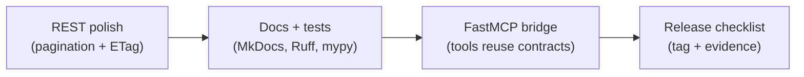

# Session 12 – Tool-Friendly APIs & FastMCP Finish Line

- **Date:** Monday, Jan 26, 2026
- **Theme:** Lock down the EX3 release by polishing every externally facing surface—pagination, ETags, docs, automation—and show how the same contracts plug into FastMCP so tools can call your API hands-free.

## Learning Objectives
- Publish deterministic REST responses with pagination, CSV export, and OpenAPI examples that mirror your clients.
- Return caching-friendly metadata (ETag + `If-None-Match`) and document the contract inside `docs/service-contract.md`.
- Automate quality gates (MkDocs/pdocs, Ruff, mypy, pre-commit, changelog) so releases are repeatable.
- Bridge the API to FastMCP by exposing at least one MCP tool that reuses the `/movies` vocabulary.

## Before Class – Final Prep
- Pull latest EX3 code, confirm `docker compose up`, `pytest --cov`, and Schemathesis dry runs pass.
- Install doc + lint tooling if missing: `uv add mkdocs-material pdocs ruff mypy pre-commit`.
- Draft `docs/release-checklist.md` with owner, trigger command, and smoke verification steps.

> 🧭 **EX3 Deliverable:** Pagination + ETag on one list endpoint, CSV export, OpenAPI examples, MkDocs/pdocs + Ruff + mypy + pre-commit automation, a FastMCP probe that replays the same contracts, and an updated release checklist.

## Agenda
| Segment | Duration | Format | Focus |
| --- | --- | --- | --- |
| EX3 dry run | 10 min | Demos | Walk through local run + contracts. |
| Tool-friendly patterns | 15 min | Talk | Pagination, deterministic responses, CSV notes. |
| FastMCP spotlight | 10 min | Live demo | One REST verb mirrored as an MCP tool. |
| Release hygiene | 10 min | Talk | Docs, lint, tests, changelog. |
| **Lab B – Polish** | 45 min | Guided build | Pagination, ETag, CSV export, OpenAPI examples. |
| **Lab C – Automation** | 45 min | Guided runbook | Docs build, `pre-commit run --all-files`, release checklist rehearsal. |
| Closing circle | 5 min | Discussion | Commitments for EX3 showcase. |

## Part A – Core Moves
1. **Deterministic responses:** Add `page`, `page_size`, `X-Total-Count`, and CSV output so every client/tool gets predictable slices.
2. **Cache hints:** Compute an ETag (hash of response payload) and honor `If-None-Match` to return `304 Not Modified` when possible.
3. **Contract-first docs:** Keep OpenAPI examples in sync with docs; run `uv run mkdocs build` or `pdocs` before merging.
4. **Automation:** Run Ruff, mypy, pytest, Schemathesis, and pre-commit inside CI plus your local release checklist.
5. **FastMCP bridge:** Mirror nouns/verbs from REST when building MCP tools so AI assistants can reason about the same schema.



## FastMCP Lightning Lab
- **Goal:** prove the API vocabulary works over FastMCP (Model Context Protocol) so assistants can call EX3 data safely.
- **Steps:**
  1. Install FastMCP locally: `uv add "mcp[cli]>=1.1.0"`.
  2. Write a tiny server that wraps existing logic:
     ```python
     from mcp.server.fastmcp import FastMCP

     mcp = FastMCP("io.eass.movies")

     @mcp.tool(name="lookup-movie")
     async def lookup_movie(movie_id: int) -> dict:
         movie = await fetch_movie(movie_id)  # reuse FastAPI repo
         return {"status": 200, "movie": movie}

     if __name__ == "__main__":
         mcp.run(transport="stdio")
     ```
  3. Probe it with a stdio client or Inspector: `uv run python scripts/mcp_probe.py`.
  4. Document how to launch the server (CLI or container) inside the release checklist.
- **Why it matters:** same schema + error envelope + trace IDs become tool-friendly without inventing new contracts.

## Labs Snapshot
- **Lab B – Polish:** ship pagination helpers, ETag middleware, CSV export route, and OpenAPI example blocks; verify with curl + pytest.
- **Lab C – Automation:** wire MkDocs/pdocs command into CI, enforce Ruff+mypy via pre-commit, capture release steps plus FastMCP probe in `docs/release-checklist.md`.

## Success Checklist
- `docker compose up --build` succeeds with new CSV + ETag routes documented.
- `pre-commit run --all-files` and `uv run mkdocs build` both pass.
- FastMCP probe returns the same payloads/errors as REST and is referenced in the runbook.
- Release checklist rehearsed with screenshots or logs ready for graders.
