# Session 12 – Tool-Friendly APIs and Final Prep

- **Date:** Monday, Jan 26, 2026
- **Theme:** Polish the application programming interface (API) for external tools—make it Model Context Protocol (MCP)-friendly (MCP is the open standard that lets tools talk to language models), lock in documentation/testing pipelines, and prep Exercise 3 (EX3) final presentations.

## Learning Objectives
- Expose tool-friendly endpoints with deterministic request/response models and OpenAPI examples (happy + sad paths).
- Add finishing touches: entity tag (ETag)/`If-None-Match`, pagination, feature flags, comma-separated values (CSV) export endpoint.
- Automate documentation + quality gates (MkDocs/pdocs, Ruff, mypy, pre-commit, changelog).
- Plan a release checklist for Exercise 3 (EX3), including deployment commands and verification steps.

## Before Class – Final Prep (Just-in-Time Teaching, JiTT)
- Ensure Exercise 3 (EX3) repos are up to date, local run scripts succeed end to end, and tests pass with coverage + Schemathesis. (If you are exploring optional Compose/Redis extensions, double-check that stack too.)
- Install doc tooling if not already:
  ```bash
  uv add "mkdocs-material==9.*" "pdocs==1.*" "ruff==0.*" "mypy==1.*" "pre-commit==3.*"
  ```
- Draft a release checklist outline (who, what, when) for your EX3 team.

## Agenda
| Segment | Duration | Format | Focus |
| --- | --- | --- | --- |
| EX3 dry run | 20 min | Student demos | Show the local run script/interface, tool-friendly endpoint, and any optional observability dashboards. |
| Tool-friendly design | 15 min | Talk | Deterministic schemas, pagination strategy, entity tags (ETags), versioning. |
| Micro demo: ETag handshake | 5 min | Live demo | `curl` with `If-None-Match` to show 304 responses. |
| Release hygiene | 15 min | Talk | Pre-commit, Ruff, mypy, docs generation, changelog management. |
| **Part B – Lab 1** | **45 min** | **Guided polish** | **Add pagination, ETags, CSV export, OpenAPI examples.** |
| Break | 10 min | — | Launch the shared [10-minute timer](https://e.ggtimer.com/10minutes). |
| **Part C – Lab 2** | **45 min** | **Guided automation** | **Docs build, pre-commit hooks, release checklist rehearsal.** |
| Closing circle | 10 min | Discussion | Reflect on growth, commit to next steps, celebrate wins.

## Part A – Theory Highlights
1. **Tool readiness:** consistent schema, explicit examples, stable identifiers (IDs) (Universally Unique Lexicographically Sortable Identifiers (ULIDs) vs ints). For now keep ints but document transition plan.
2. **Pagination + filtering conventions:** `?page=1&page_size=20`, `X-Total-Count` header, link relations.
3. **ETag caching:** Return `ETag` for list endpoints, support conditional GET to reduce load.
4. **Docs automation:** MkDocs or pdocs to publish API docs; pre-commit ensures formatting/lint before commits; changelog via Conventional Commits.
5. **Release checklist:** version bump, `uv sync --frozen`, run the documented local demo, capture smoke evidence, tag release, update docs.

```mermaid
flowchart LR
    Backlog["Backlog review\n(feature flags + scope)"]
    Feature["Implement polish\n(pagination + ETag + CSV)"]
    Tests["pytest + schemathesis\ncoverage"]
    Quality["pre-commit hooks\nruff + mypy"]
    Docs["Docs build\nMkDocs + pdocs"]
    Package["Package prep\nuv sync --frozen"]
    Release["Release checklist\n(tag + changelog + demo)"]
    Tooling["Tool clients\n(MCP + HTTP)"]

    Backlog --> Feature --> Tests --> Quality --> Docs --> Package --> Release --> Tooling
```



## Part B – Lab 1 (45 Minutes)

### Lab timeline
- **Minutes 0–10** – Add pagination helper + headers.
- **Minutes 10–25** – Implement ETag logic with conditional GET.
- **Minutes 25–35** – Build CSV export endpoint and verify streaming.
- **Minutes 35–45** – Document OpenAPI examples + feature flags.
### 1. Pagination helpers (`app/pagination.py`)
```python
from math import ceil
from typing import Sequence

from fastapi import Query


def paginate(items: Sequence, page: int = Query(1, ge=1), page_size: int = Query(20, ge=1, le=100)):
    total = len(items)
    pages = ceil(total / page_size) if page_size else 1
    start = (page - 1) * page_size
    end = start + page_size
    return items[start:end], {"page": page, "page_size": page_size, "total": total, "pages": pages}
```
Update `/movies` route:
```python
from fastapi import Response
from app.pagination import paginate


@app.get("/movies", response_model=list[Movie], openapi_extra={
    "responses": {
        200: {
            "description": "List movies",
            "content": {
                "application/json": {
                    "examples": {
                        "default": {
                            "summary": "First page",
                            "value": [{"id": 1, "title": "Arrival", "year": 2016, "genre": "Sci-Fi"}],
                        }
                    }
                }
            },
        }
    }
})
async def list_movies(response: Response, repository: RepositoryDep, settings: SettingsDep, page: int = 1, page_size: int = 20) -> list[Movie]:
    movies = [movie for movie in repository.list()]
    page_items, meta = paginate(movies, page, page_size)
    response.headers["X-Total-Count"] = str(meta["total"])
    response.headers["X-Total-Pages"] = str(meta["pages"])
    return page_items
```

### 2. ETag support
```python
import hashlib
import json
from fastapi import Request, Response, status


def compute_etag(payload: str) -> str:
    return hashlib.sha256(payload.encode("utf-8")).hexdigest()


@app.get("/movies", response_model=list[Movie], ...)
async def list_movies(
    request: Request,
    response: Response,
    repository: RepositoryDep,
    settings: SettingsDep,
    page: int = 1,
    page_size: int = 20,
) -> list[Movie]:
    movies = [movie for movie in repository.list()]
    page_items, meta = paginate(movies, page, page_size)
    response.headers["X-Total-Count"] = str(meta["total"])
    response.headers["X-Total-Pages"] = str(meta["pages"])

    payload = json.dumps([movie.model_dump() for movie in page_items], sort_keys=True)
    etag = compute_etag(payload)
    if request.headers.get("If-None-Match") == etag:
        return Response(status_code=status.HTTP_304_NOT_MODIFIED)

    response.headers["ETag"] = etag
    response.headers["Cache-Control"] = "public, max-age=60"
    return page_items
```
Ensure tests cover 200 + 304 paths.

> 🎉 **Quick win:** When a second `curl` with `If-None-Match` returns `304`, you’ve implemented production-grade caching in under ten minutes.

### Tool schema validation (`embed=True` pattern)
Use nested models so FastAPI validates MCP-compatible payloads before they hit business logic:
```python
from pydantic import BaseModel, Field


class ToolPayload(BaseModel):
    user_id: int = Field(..., ge=1, description="User ID must be positive")
    limit: int = Field(5, ge=1, le=20, description="Number of recommendations")


class ToolRequest(BaseModel):
    payload: ToolPayload


@app.post("/tool/recommend-movie")
async def recommend_tool(request: ToolRequest) -> dict[str, object]:
    recs = await generate_recommendations(
        user_id=request.payload.user_id,
        limit=request.payload.limit,
    )
    return {
        "status": "ok",
        "data": {"recommendations": recs},
        "error": None,
    }
```
FastAPI’s `embed=True` defaults keep the MCP contract deterministic while still enforcing inner validation.

### 3. CSV export endpoint
```python
from fastapi.responses import StreamingResponse


@app.get("/movies/export.csv")
async def export_movies_csv(repository: RepositoryDep) -> StreamingResponse:
    def generate():
        yield "id,title,year,genre\n"
        for movie in repository.list():
            yield f"{movie.id},{movie.title},{movie.year},{movie.genre}\n"

    return StreamingResponse(generate(), media_type="text/csv")
```
Add tests verifying content type, header, sample rows.

### 4. Feature flags (config driven)
Use `Settings.feature_preview` to gate experimental endpoints (toggle via `.env`). Document in README.

## Part C – Lab 2 (45 Minutes)

### Lab timeline
- **Minutes 0–10** – Generate docs (MkDocs/pdocs) and publish OpenAPI updates.
- **Minutes 10–25** – Configure pre-commit hooks (Ruff + mypy) and run all files.
- **Minutes 25–35** – Draft release checklist with automated tests + Docker builds.
- **Minutes 35–45** – Rehearse MCP tool endpoint and capture deliverables for EX3.
### 1. Documentation build
- Generate API docs: `uv run pdocs serve app` or `uv run mkdocs serve` (choose one per team).
- Publish `docs/service-contract.md` updates with OpenAPI examples, rate limiting info, and agent endpoints.

### 2. Pre-commit + lint/type checks
```bash
cat <<'CFG' > .pre-commit-config.yaml
repos:
  - repo: https://github.com/astral-sh/ruff-pre-commit
    rev: v0.6.0
    hooks:
      - id: ruff
      - id: ruff-format
  - repo: https://github.com/pre-commit/mirrors-mypy
    rev: v1.10.0
    hooks:
      - id: mypy
CFG

pre-commit install
pre-commit run --all-files
```
Add `uv run ruff check .` and `uv run mypy app` to CI.

> 🎉 **Quick win:** Seeing “All files pass” from `pre-commit run --all-files` means your release checklist can focus on features, not formatting.

### 3. Changelog & release checklist
- Adopt Conventional Commits (`feat:`, `fix:`, `docs:`) or equivalent; generate changelog with `git cliff` or manual notes.
- Final release checklist example:
  1. Run `uv run pytest --cov` + `schemathesis` + `ruff` + `mypy`.
  2. Execute the documented local demo script (`uv run python -m app.demo` or the command listed in `docs/EX3-notes.md`) to prove the interface and API work together.
  3. Capture smoke evidence (screenshots, short clip, or CLI transcript) that graders can reference alongside the README.
  4. Tag release (`git tag -a v0.3.0 -m "EASS EX3"`).
  5. Publish docs (`uv run mkdocs build && netlify deploy` or similar).
- Map each checklist line to the [EX3 requirements](../exercises.md#ex3--capstone-polish-kiss) so teams know which artifacts to submit.

### 4. MCP teaser
Preview how today’s deterministic responses feed directly into the optional MCP workshop (tool endpoints for agents). Encourage teams to read `sessions/optional/mcp.md` before elective session.

## Closing Circle
- Share one capability you can now ship with confidence (e.g., async pipelines, secure auth, containers).
- Commit to final EX3 deliverable timeline.
- Celebrate wins—this wraps the 12-week reboot!

## Troubleshooting
- **ETag mismatches** → ensure `ETag` computed on canonical JSON (sorted keys). Consider `json.dumps(..., sort_keys=True)`.
- **Pre-commit slow** → use `--hook-stage manual` for heavy hooks, or run `uv run ruff --watch` during dev.
- **CSV export encoding issues** → enforce UTF-8 and escape commas if titles contain them (use `csv` module if needed).

### Common pitfalls
- **Pagination math bugs** – test last page scenarios manually to confirm `X-Total-Pages` stays accurate.
- **ETag ignoring embed payload** – be sure to serialize nested models the same way the API response does (`model_dump`).
- **Pre-commit not running** – remind teams to run `pre-commit install` in each clone (containers included).

## Student Success Criteria

By the end of Session 12, every student should be able to:

- [ ] Serve paginated endpoints with conditional GET/ETag support and CSV export.
- [ ] Validate MCP tool payloads with nested Pydantic models ready for Session 12 agents.
- [ ] Automate docs, linting, typing, and release checklists for EX3 handoff.

**Incomplete item? Schedule a release rehearsal before EX3 demos.**

## AI Prompt Seeds
- “Add pagination, total count headers, and OpenAPI examples to a FastAPI list endpoint.”
- “Implement conditional GET with ETag/If-None-Match for a JSON response.”
- “Generate a release checklist covering tests, Docker build, documentation, and tagging.”
