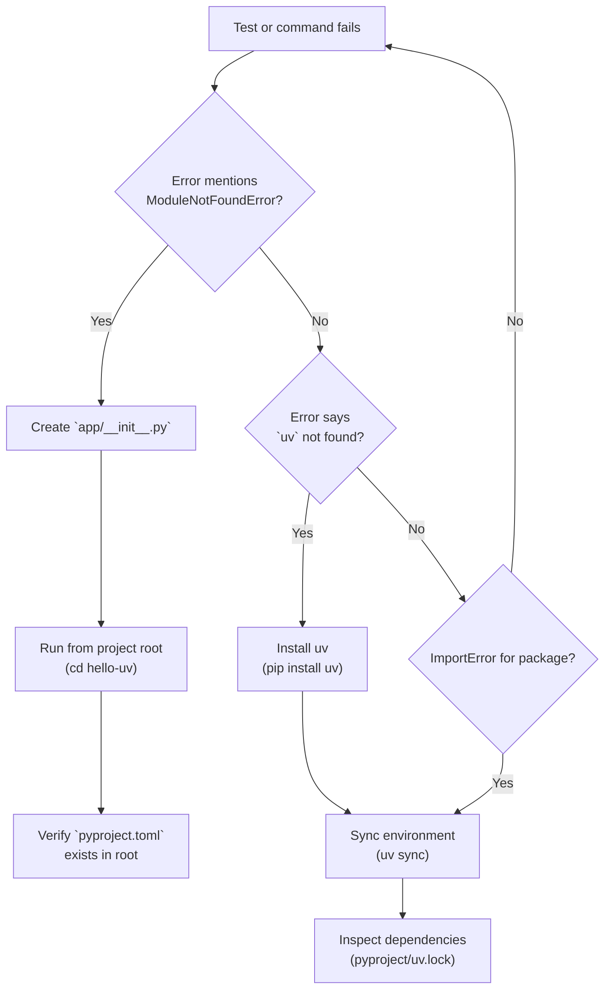

# EASS Course Troubleshooting Guide

## General Environment & Setup



### "ModuleNotFoundError: No module named 'app'"

**Symptoms:**
```
Traceback (most recent call last):
  File "tests/test_movies.py", line 3, in <module>
    from app.main import app
ModuleNotFoundError: No module named 'app'
```

**Causes:**
1. Missing `app/__init__.py` (package marker)
2. Running tests from wrong directory
3. Project root missing `pyproject.toml`

**Fixes:**
```bash
# Ensure app/__init__.py exists (can be empty)
touch app/__init__.py

# Run tests from project root (where pyproject.toml is)
cd /path/to/hello-uv
uv run pytest tests/

# Verify project structure
ls -la | grep -E "(pyproject.toml|app|tests)"
```

---

### "uv command not found"

**Fixes:**
```bash
# Install uv globally
pip install uv

# Or use Python module syntax
python -m uv --version

# Check installation
which uv
```

---

### Dependencies not installing

**Symptoms:**
- `ImportError: No module named 'fastapi'`
- `ModuleNotFoundError: No module named 'sqlmodel'`

**Fixes:**
```bash
# Sync dependencies
uv sync

# Add missing package
uv add fastapi

# Check installed packages
uv pip list

# Verify pyproject.toml has dependencies
cat pyproject.toml | grep -A 20 "dependencies"
```

---

## Docker Issues

### "Docker command not found"

**Fixes:**
- Install Docker Desktop for macOS or Windows
- On WSL, ensure Docker Desktop is running: `docker ps`

---

### "Cannot connect to Docker daemon"

**On macOS/Windows:**
```bash
# Open Docker Desktop application, wait for whale icon to settle
open -a Docker

# Then retry
docker ps
```

**On WSL:**
```bash
# Ensure Docker Desktop is running on Windows host
# Then in WSL terminal:
docker ps
```

---

### "docker compose up fails" or "command not found: docker-compose"

**Modern fix (Docker >= 2.3):**
```bash
# Use new syntax (not dash)
docker compose up

# NOT: docker-compose up (old)
```

**If you have old Docker:**
```bash
# Install compose plugin
docker plugin install compose

# Or upgrade Docker Desktop
```

---

### vLLM on macOS is very slow or fails to pull

**Context:** vLLM’s official image (`vllm/vllm-openai:latest`) targets Linux/amd64 and is GPU-optimized. On Apple Silicon it runs under emulation without GPU and can be slow.

**Fixes / Tips:**
```bash
# Force amd64 platform and use a tiny model to reduce memory/CPU load
docker run --rm -it \
  --platform=linux/amd64 \
  -p 8000:8000 \
  vllm/vllm-openai:latest \
  --host 0.0.0.0 --port 8000 \
  --model TinyLlama/TinyLlama-1.1B-Chat-v1.0
```
- Prefer LM Studio for Apple Silicon if you only need a local test endpoint.
- If the image pull is too large for the network, skip vLLM for the lab and use LM Studio instead (Session 08).
- For gated models, set `-e HF_TOKEN=...` and mount `~/.cache/huggingface` into the container to avoid repeat downloads.

---

### "Error: database is locked"

**Symptom:** SQLite file locked during concurrent access

**Cause:** Multiple processes accessing `movies.db` simultaneously

**Fixes:**
```bash
# Option 1: Stop all competing processes
pkill -f uvicorn
pkill -f pytest
sleep 1

# Option 2: Use in-memory SQLite for tests (Session 07 conftest.py)
# Change DATABASE_URL to sqlite:///:memory:

# Option 3: Delete and regenerate
rm movies.db
uv run uvicorn app.main:app --reload
```

---

### "Port 8000 already in use"

**Symptoms:**
```
OSError: [Errno 48] Address already in use
```

**Fixes:**
```bash
# Find and kill process using port 8000
lsof -i :8000

# Kill the process (replace PID with actual number)
kill -9 <PID>

# Or use a different port
uv run uvicorn app.main:app --reload --port 8001
```

---

### "CORS error: Origin not allowed"

**Symptoms:**
- React/Streamlit frontend gets CORS error in browser console
- Error message mentions "Access-Control-Allow-Origin"

**Fixes:**
```python
# In app/main.py, ensure CORS middleware is added (Session 06)
from fastapi.middleware.cors import CORSMiddleware

app.add_middleware(
    CORSMiddleware,
    allow_origins=[
        "http://localhost",
        "http://localhost:3000",      # React
        "http://localhost:5173",       # Vite dev
        "http://localhost:8501",       # Streamlit
    ],
    allow_credentials=True,
    allow_methods=["*"],
    allow_headers=["*"],
)
```

Restart the API after changes:
```bash
# Stop (Ctrl+C) and restart
uv run uvicorn app.main:app --reload
```

---

## Database Issues

### "No such table: movierow"

**Symptoms:**
```
sqlalchemy.exc.OperationalError: (sqlite3.OperationalError) no such table: movierow
```

**Cause:** Database hasn't been initialized (tables not created)

**Fixes:**
```python
# In app/main.py, ensure startup event runs (Session 05)
from app.db import init_db
from app import repository

@app.on_event("startup")
def startup() -> None:
    init_db(seed_fn=repository.seed_movies)
```

Then restart the app:
```bash
uv run uvicorn app.main:app --reload
```

---

### "Foreign key constraint failed"

**Symptom:**
```
sqlalchemy.exc.IntegrityError: (sqlite3.IntegrityError) FOREIGN KEY constraint failed
```

**Cause:** Trying to add a rating for a movie that doesn't exist

**Fixes:**
```bash
# Check movies exist
curl http://localhost:8000/movies

# Only add ratings for existing movie IDs
curl -X POST http://localhost:8000/ratings \
  -H "Content-Type: application/json" \
  -d '{"movie_id": 1, "user_id": 42, "score": 5}'
```

---

## Testing Issues

### "pytest: command not found"

**Fixes:**
```bash
# Use uv to run pytest
uv run pytest tests/

# Or install pytest globally
pip install pytest
```

---

### "Tests pass locally but fail in Docker"

**Causes:**
- Different database state (Docker uses fresh container)
- Missing dependencies in Docker

**Fixes:**
```bash
# Rebuild image with latest deps
docker build --no-cache -t movie-app .

# Or inspect test logs
docker run --rm movie-app uv run pytest -v
```

---

### "FixtureNotFound: conftest.py"

**Symptom:**
```
ERROR: Missing fixture 'temporary_db'
```

**Cause:** `conftest.py` not in tests/ directory or `conftest.py` is empty

**Fixes:**
```bash
# Verify conftest.py exists (Session 07)
ls tests/conftest.py

# Copy from Session 07 docs if missing:
# See docs/sessions/session-07.md for conftest.py template
```

---

## FastAPI & uvicorn Issues

### "GET /docs returns 404"

**Symptom:** Visiting `http://localhost:8000/docs` returns "Not Found"

**Cause:** FastAPI app not initialized or error during startup

**Fixes:**
```bash
# Check console output for startup errors
uv run uvicorn app.main:app --reload

# If error during @app.on_event("startup"), check:
# 1. Database file path
# 2. seed_fn exists
# 3. Models defined before startup runs
```

---

### "422 Unprocessable Entity"

**Symptoms:**
```json
{
  "detail": [
    {
      "loc": ["body", "payload"],
      "msg": "field required",
      "type": "value_error.missing"
    }
  ]
}
```

**Causes:**
- Missing required fields in JSON
- Wrong field type
- Using `embed=True` requires wrapping in a key

**Fixes for Session 12 tool endpoint:**
```bash
# WRONG (missing "payload" wrapper)
curl -X POST http://localhost:8000/tool/recommend-movie \
  -H "Content-Type: application/json" \
  -d '{"user_id": 42, "limit": 5}'

# CORRECT (with "payload" wrapper, because embed=True)
curl -X POST http://localhost:8000/tool/recommend-movie \
  -H "Content-Type: application/json" \
  -d '{"payload": {"user_id": 42, "limit": 5}}'
```

---

## Authentication & JWT Issues

### "401 Unauthorized"

**Symptom:**
```json
{"detail": "Could not validate credentials"}
```

**Causes:**
1. Missing `Authorization` header
2. Invalid token format (not `Bearer <token>`)
3. Token expired

**Fixes:**
```bash
# 1. Get fresh token
TOKEN=$(curl -X POST http://localhost:8000/token \
  -H "Content-Type: application/x-www-form-urlencoded" \
  -d "username=teacher&password=classroom" \
  | jq -r '.access_token')

# 2. Use correct header format
curl -X POST http://localhost:8000/movies \
  -H "Authorization: Bearer $TOKEN" \
  -H "Content-Type: application/json" \
  -d '{"title": "Test", "year": 2024, "genre": "Drama"}'
```

---

### "403 Forbidden"

**Symptom:**
```json
{"detail": "Forbidden"}
```

**Cause:** User role too low (need "editor", have "viewer")

**Fixes:**
```bash
# Login with editor role (teacher)
TOKEN=$(curl -X POST http://localhost:8000/token \
  -H "Content-Type: application/x-www-form-urlencoded" \
  -d "username=teacher&password=classroom" \
  | jq -r '.access_token')

# Now request should work
curl -X POST http://localhost:8000/movies \
  -H "Authorization: Bearer $TOKEN" \
  -H "Content-Type: application/json" \
  -d '{"title": "Allowed", "year": 2024, "genre": "Drama"}'
```

---

## Frontend Issues (Streamlit & React)

### Streamlit "Failed to load movies"

**Symptoms:**
- Streamlit app shows error: "Failed to load movies: HTTPError"
- App cannot reach backend

**Fixes:**
```bash
# 1. Verify backend is running on port 8000
curl http://localhost:8000/health

# 2. Check API_URL in ui/app.py points to correct port
# Should be: API_URL = "http://localhost:8000"

# 3. Ensure CORS middleware is added to FastAPI (Session 06)

# 4. Restart Streamlit
uv run streamlit run ui/app.py
```

---

### React app stuck loading

**Symptoms:**
- Page shows "Loading movies..." forever
- No error in browser console

**Fixes:**
```bash
# 1. Open browser DevTools (F12) → Network tab
# Check if GET /movies is pending/failing

# 2. Verify CORS allows localhost:5173 (Vite dev server)

# 3. Check Vite is running
npm run dev

# 4. Restart Vite dev server
# Press 'q' in npm terminal, then npm run dev again
```

---

## Git & Version Control

### "fatal: not a git repository"

**Fixes:**
```bash
git init
git config user.name "Your Name"
git config user.email "your@email.com"
git add .
git commit -m "Initial commit"
```

---

### ".env accidentally committed"

**Recovery:**
```bash
# Remove from Git history (careful!)
git rm --cached .env
git commit --amend --no-edit

# Regenerate secrets
openssl rand -hex 32
# Update .env with new SECRET_KEY
```

---

## WSL (Windows Subsystem for Linux)

### "Cannot find Docker"

**Symptom:**
```bash
$ docker ps
Command 'docker' not found
```

**Fix:**
- Ensure Docker Desktop is running on Windows host
- In WSL, it will auto-detect

---

### Files slow to access

**Cause:** Storing project on Windows filesystem (C: drive) instead of WSL filesystem

**Fix:**
```bash
# Use WSL filesystem for speed
cd /home/your_username/projects
git clone <repo>
cd eass-8-episode
```

---

## When All Else Fails

1. **Check logs carefully:**
   ```bash
   uv run uvicorn app.main:app --reload 2>&1 | tee app.log
   ```

2. **Post in Discord #helpdesk** with:
   - Error message (full traceback)
   - Command you ran
   - OS (macOS/Windows/WSL)
   - Steps to reproduce

3. **Schedule office hours** if issue persists

---

## Session-Specific Troubleshooting

Detailed troubleshooting for each session is included in the session docs:
- Session 05: Database issues
- Session 06: CORS and frontend connectivity
- Session 07: Test fixtures and pytest
- Session 09: Background task status
- Session 10: Docker Compose multi-service
- Session 11: JWT token expiration
- Session 12: Tool endpoint schema validation
